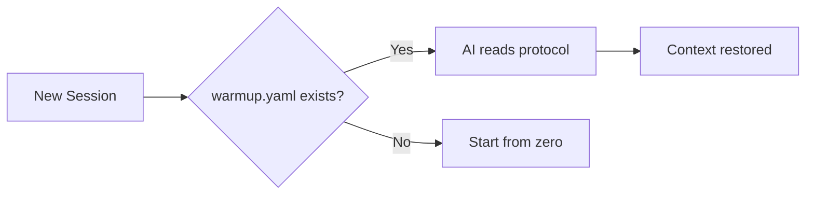
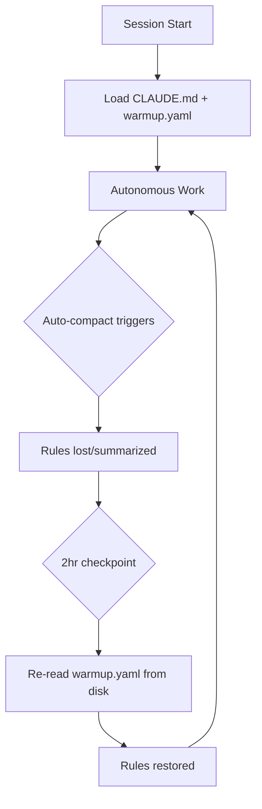

# Forge Protocol

> *"The future is not set. There is no fate but what we make for ourselves."*
> — **Sarah Connor**, Terminator 2

## SKYNET MODE... with an Off Switch

**Vendor-neutral AI session continuity. Zero tokens. Zero emissions.**

Any AI. Any project. Green by design.

## The Problem

AI sessions are stateless. Every conversation starts from zero. Context about your project, conventions, and progress is lost.

## The Solution

A simple YAML file (`warmup.yaml`) that any AI can read to restore project context.

```yaml
# warmup.yaml - minimal example
identity:
  project: "My Project"

files:
  source:
    - "src/main.py - Entry point"

session:
  start:
    - "Read warmup.yaml"
    - "Run tests"
```

## Quick Start

1. Create `warmup.yaml` in your project root
2. Tell your AI: *"If there is a warmup.yaml file, read it first"*
3. That's it. Session continuity restored.

## CLI Validator

Install from [crates.io](https://crates.io/crates/forge-protocol):

```bash
cargo install forge-protocol
```

Validate your protocol files:

```bash
forge-protocol validate              # Validate all files in current directory
forge-protocol validate warmup.yaml  # Validate specific file
```

Generate templates:

```bash
forge-protocol init                  # Generate warmup.yaml (generic)
forge-protocol init --type rust      # Generate Rust-specific template
forge-protocol init --full           # Generate all three protocol files
```

**Binary size:** 1.3MB (UPX compressed) | **Dependencies:** Zero runtime

## Why YAML?

- Every AI can read it
- Humans can read it
- Git-friendly (diffable, mergeable)
- No vendor lock-in

## Green Coding & ESG Impact

**Local validation = less compute = less CO₂ = ESG compliance**

| Approach | Cost per File | Carbon | Speed |
| -------- | ------------- | ------ | ----- |
| AI validation | $0.02+ | ~0.5g CO₂ | 1-3s |
| Local CLI | **$0** | **~0.002g CO₂** | **<100ms** |
| **Savings** | **100%** | **99.6%** | **20x faster** |

### Why This Matters

**For Developers:**
- Instant validation (<100ms vs 1-3s cloud latency)
- Works offline - no API keys, no rate limits
- 1.3MB binary - installs in seconds

**For Teams:**
- $1,000-$7,300/year savings (10-person team)
- No cloud AI costs for routine validation
- Consistent, reproducible results

**For Enterprise & Government:**
- **ESG Compliance**: Measurable carbon reduction (99.6%)
- **Scope 3 Emissions**: Reduce supply chain software carbon
- **Sustainability Reports**: Quantifiable green coding metrics
- **Cost Control**: Predictable $0 validation costs at scale

**For the Planet:**
- 99.6% carbon reduction per validation
- No data center compute for routine tasks
- Efficient Rust binary - minimal energy footprint

### Green Impact at Scale

When organizations adopt the Forge Protocol:

| Adoption | Annual Carbon Saved | Equivalent |
| -------- | ------------------- | ---------- |
| 100 teams | 6.2 tonnes CO₂ | 1.4 cars off road |
| 1,000 teams | 62 tonnes CO₂ | 14 cars off road |
| 10,000 teams | 620 tonnes CO₂ | 140 cars off road |
| 100,000 teams | 6,200 tonnes CO₂ | 1,400 cars off road |

**Plus velocity gains:**
- Each team gets **50-100x velocity** (proven by Forge)
- 100 teams = 100 × 50x = **5,000x cumulative productivity gain**
- Faster shipping = less compute time = even more carbon saved

**For Governments:**
- Mandate green coding standards with measurable metrics
- Reduce public sector IT carbon footprint
- Quantifiable ESG reporting for taxpayers

**For Corporations:**
- Meet Scope 3 emissions targets (supply chain software)
- Reduce cloud AI costs at scale
- Competitive advantage through velocity + sustainability

### Implementation

```bash
# Install once (1.3MB)
cargo install forge-protocol

# Validate forever ($0, ~0.002g CO₂ per run)
forge-protocol validate
```

*Ship fast. Ship small. Ship green.*

See [Green Coding Economics](docs/GREEN_CODING.md) for the full analysis.

## Protocol Suite

| File             | Purpose                | Required |
| ---------------- | ---------------------- | -------- |
| `warmup.yaml`    | Session bootstrap      | Yes      |
| `sprint.yaml`    | Active work tracking   | Optional |
| `roadmap.yaml`   | Milestones & planning  | Optional |

## Proven at Scale

The Forge Protocol powers an entire product ecosystem:

| Project | AI Role | Stack | Status |
| ------- | ------- | ----- | ------ |
| **[Forge](https://github.com/royalbit/forge)** (FOSS) | Principal Engineer | Rust | Production |
| Backend API | Principal Backend Engineer | Rust + Axum | Production |
| Mobile Prototype | Principal Mobile Engineer | Flutter | Production |
| Architecture Docs | Principal AI Architect | C4 + ADRs | Production |
| Business Strategy | AI Strategist | YAML | Production |
| Data Enrichment | Principal Engineer | Python | Active |

**Stats:**
- 10-phase autonomous build plan
- 4 mobile apps planned (Flutter)
- 1,100+ line master roadmap
- 850+ financial formulas validated
- 213+ tests across ecosystem

See [ECOSYSTEM.md](docs/ECOSYSTEM.md) for the full story.

## Use Case: The Forge Tool

**[Forge](https://github.com/royalbit/forge)** is a YAML formula calculator built entirely with the Forge Protocol. It's the proof that the protocol works.

### What Forge Does

```bash
# Validate financial models locally (no AI tokens)
forge validate model.yaml

# Calculate formulas
forge calculate model.yaml

# Sensitivity analysis, goal seek, break-even
forge sensitivity model.yaml -v price -r 80,120,10 -o profit
```

### How It Was Built

The entire Forge project was built by 1 human + Claude using the Forge Protocol:

| Phase | Time | What Shipped |
| ----- | ---- | ------------ |
| v1.0-v1.2 | ~23.5h | Core engine, 50+ Excel functions |
| v1.4-v2.0 | ~12h | Watch mode, LSP, MCP server, HTTP API |
| v2.1-v3.1 | ~9h | XNPV/XIRR, Scenarios, Sensitivity, Zed extension |
| **Total** | **~45h** | **34 releases, 183 tests, 13,844 LOC** |

### Features Shipped in ~45 Hours

**60+ Excel Functions:**
- Financial: NPV, IRR, XNPV, XIRR, PMT, FV, PV, RATE, NPER
- Lookup: MATCH, INDEX, XLOOKUP, VLOOKUP
- Conditional: SUMIF, COUNTIF, AVERAGEIF, SUMIFS, COUNTIFS
- Date: TODAY, YEAR, MONTH, DAY, DATEDIF, EDATE, EOMONTH
- Math, Text, Logic, Aggregation

**Analysis Tools:**
- Sensitivity analysis (1D and 2D data tables)
- Goal seek with bisection solver
- Break-even analysis
- Budget vs actual variance
- Multi-scenario comparison

**Enterprise Infrastructure:**
- HTTP REST API server (`forge-server`)
- MCP server with 10 AI tools (`forge-mcp`)
- LSP server for editors (`forge-lsp`)
- Watch mode for live updates
- 96K rows/sec throughput

**Editor Extensions:**
- VSCode: syntax highlighting, LSP, commands
- Zed: native Rust/WASM, LSP, 60+ function highlighting

**Excel Bridge:**
- `forge export` → Excel (.xlsx)
- `forge import` ← Excel (.xlsx)

### The Protocol in Action

```
Human: "run warmup"
Claude: [reads warmup.yaml, sprint.yaml, roadmap.yaml]
Claude: "Ready. Current milestone: MCP Server with financial tools."
Human: "punch it"
Claude: [works autonomously, ships v3.0.0 with 10 MCP tools]
```

### The Velocity Result

| Metric | Traditional | With Protocol | Multiplier |
| ------ | ----------- | ------------- | ---------- |
| Dev time | 2-3 weeks | **<8 hours** | **50-100x** |
| Rework | 30-50% | **0%** | **∞** |
| Releases | 3-5 total | **34** | **10x** |

**Bottom line:** 1 human + AI with Forge Protocol = **50-100x velocity**.

## How It Works



## Self-Healing Protocol (Unattended Autonomy)

**The key enabler for 8-10 hour autonomous sessions.**

### The Problem

During long autonomous sessions, Claude Code's auto-compact summarizes conversation history. Rules defined in warmup.yaml get compressed. The AI "forgets" guidelines and starts making mistakes.

### The Insight

Everyone else: *Make rules survive compaction* (fragile)
Forge Protocol: **Recover from compaction** (reliable)

It's like databases: don't try to make transactions survive crashes - use write-ahead logs to recover.

### The Solution

```
┌─────────────────────────────────────────────────────────────────┐
│                    SELF-HEALING PROTOCOL                        │
├─────────────────────────────────────────────────────────────────┤
│                                                                 │
│  CLAUDE.md (auto-loaded)     warmup.yaml (full rules)          │
│  ┌─────────────────────┐     ┌─────────────────────┐           │
│  │ Core rules (short)  │     │ Complete protocol   │           │
│  │ "Re-read warmup.yaml│────▶│ self_healing:       │           │
│  │  after compaction"  │     │   triggers:         │           │
│  └─────────────────────┘     │     every_2_hours   │           │
│                              │     before_commit   │           │
│                              │     when_confused   │           │
│                              └──────────┬──────────┘           │
│                                         │                       │
│                                         ▼                       │
│                              .claude_checkpoint.yaml            │
│                              ┌─────────────────────┐           │
│                              │ Session state       │           │
│                              │ Progress breadcrumbs│           │
│                              │ Rules reminder      │           │
│                              └─────────────────────┘           │
│                                                                 │
└─────────────────────────────────────────────────────────────────┘
```

### The Flow



### Implementation

**1. CLAUDE.md** (travels with repo, ~40 lines)
```markdown
## CRITICAL: Self-Healing Protocol
After ANY compaction/confusion, RE-READ:
1. warmup.yaml
2. .claude_checkpoint.yaml (if exists)

## Checkpoints (MANDATORY)
- Every 2 hours: checkpoint + re-read warmup.yaml
- Before commit: re-read quality gates
- When confused: STOP → re-read → resume
```

**2. warmup.yaml** (self_healing section)
```yaml
self_healing:
  checkpoint_file: ".claude_checkpoint.yaml"

  mandatory_triggers:
    every_2_hours:
      - "Write progress to .claude_checkpoint.yaml"
      - "Re-read this warmup.yaml completely"
    before_any_commit:
      - "Re-read quality gates"
    when_confused:
      - "STOP → re-read → resume"

  core_rules_summary:
    - "4hr MAX, 1 milestone, NO scope creep"
    - "Tests pass + ZERO warnings → commit"
    - "Done > Perfect. Ship it."
```

**3. .claude_checkpoint.yaml** (written during session)
```yaml
timestamp: "2025-11-26T03:00:00Z"
session_started: "2025-11-26T01:00:00Z"
milestone: "Add feature X"
completed: ["Task 1", "Task 2"]
in_progress: "Task 3"
rules_reminder:
  - "4hr max - check timestamp"
  - "NO scope creep"
```

### Why It Works

| Component | Survives Compact? | Recovery Method |
|-----------|-------------------|-----------------|
| CLAUDE.md | Partially (system prompt) | Auto-loaded at session start |
| warmup.yaml | No | Re-read from disk at checkpoint |
| .claude_checkpoint.yaml | N/A (on disk) | Always available |

The "re-read warmup.yaml" instruction is short enough to survive summarization. Even if all other rules are lost, the AI knows to reload them.

### The Analogy

| Problem | Traditional | Self-Healing |
|---------|-------------|--------------|
| Database crash | Hope data survives | Write-ahead log + replay |
| Context compact | Hope rules survive | **Checkpoint + re-read** |

### Results

- **8-10 hour unattended sessions** that follow rules
- **Portable** - travels with git, works on any machine
- **AI-agnostic** - any AI that reads CLAUDE.md can use it
- **Battle-tested** - powers 9+ production projects

See [Self-Healing Deep Dive](docs/SELF-HEALING.md) for the full technical specification.

## Documentation

### Core
- [Full Specification](docs/SPECIFICATION.md) - Protocol schema and details
- [Examples](docs/EXAMPLES.md) - Configurations for Rust, Python, JS, monorepos
- [Manifesto](docs/MANIFESTO.md) - The full philosophy and methodology
- [Presentation](docs/PRESENTATION.md) - Marp slide deck ([PDF](Forge_Protocol_Suite.pdf))

### Ecosystem
- [Ecosystem Case Study](docs/ECOSYSTEM.md) - How the protocol powers a full product suite
- [Green Coding Economics](docs/GREEN_CODING.md) - Cost and carbon savings analysis

### Architecture Decisions
- [ADR-001: Green Coding By Default](docs/adr/001-green-coding-by-default.md) - Why all projects are green
- [ADR-002: Self-Healing Protocol](docs/adr/002-self-healing-protocol.md) - Unattended autonomy via recovery

### Guides
- [Autonomous Session Guide](docs/guides/AUTONOMOUS_SESSION_GUIDE.md) - How to run autonomous AI sessions
- [Sprint Protocol](docs/guides/SPRINT_AUTONOMY_PROTOCOL.md) - Bounded sessions with shipping discipline
- [Self-Healing Protocol](docs/SELF-HEALING.md) - Unattended autonomy for 8-10hr sessions
- [Markdown Standards](docs/MARKDOWN_STANDARDS.md) - Documentation-as-code quality enforcement

### Stories
- [The Autonomous Developer Story](docs/stories/AUTONOMOUS_STORY.md) - How Forge was built by AI
- [AI Promotion Story](docs/stories/AI-PROMOTION-STORY.md) - From junior to senior developer

### Research
- [Experiential Continuity](docs/research/EXPERIENTIAL_CONTINUITY.md) - Beyond knowledge persistence

## Origin

Born from building [Forge](https://github.com/royalbit/forge) - a YAML formula calculator. The protocol emerged from solving real problems: How do you maintain context across AI sessions? How do you ship quality code autonomously? How do you scale to an entire ecosystem?

The answers became the Forge Protocol.

## License

MIT
