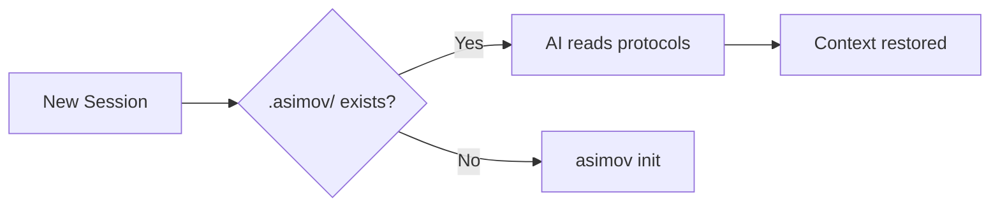

# RoyalBit Asimov

[](https://github.com/royalbit/asimov/actions/workflows/ci.yml)
[](https://github.com/royalbit/asimov/blob/main/LICENSE)
[](https://creativecommons.org/licenses/by-nc-nd/4.0/)

> 🤖 **RoyalBit Asimov** | The Ethical Operating System for Claude's Autonomous Power
>
> Claude provides the velocity. Asimov provides the guardrails.

> *"A robot may not harm humanity, or, by inaction, allow humanity to come to harm."*
> — Isaac Asimov, The Zeroth Law (1985)

> *"The needs of the many outweigh the needs of the few."*
> — Spock, Star Trek II: The Wrath of Khan (1982)

> *"The Three Laws were science fiction for 80 years. Now they're source code."*

**The Mission: Democratize AI Power.**

AI capabilities shouldn't be reserved for well-funded organizations. RoyalBit Asimov enables solo founders, small teams, and developers globally to operate at enterprise scale — ethically, sustainably, and independently.

**Claude Opus 4.5 and Sonnet 4.5 deliver 50-100x velocity.** That's Claude, not Asimov. ([Anthropic](https://www.anthropic.com/news/claude-opus-4-5))

**Asimov ensures you don't destroy yourself in the process:** Ethics, bounded autonomy, sustainability.

## The Open Foundation

**The Three Laws of Robotics, encoded in JSON.**

Each project initialized with `asimov init` becomes a Self-Evolving Autonomous AI project with ethics built in.

```json
// .asimov/asimov.json - The Three Laws
{
  "harm": ["financial", "physical", "privacy", "deception"],
  "veto": ["stop", "halt", "abort", "emergency stop"]
}
```

**RoyalBit Asimov requires Claude Code.** Protocol files work anywhere (paste them).

📖 **Origin Story** ([PDF](docs/ORIGIN_STORY.pdf) | [MD](docs/ORIGIN_STORY.md)) — How we built a protocol that creates Self-Evolving Autonomous AI projects with ethics

📰 **Press Kit** ([PDF](docs/PRESS_KIT.pdf) | [MD](docs/PRESS_KIT.md)) — Verified numbers, ethics proof, media-ready

📊 **Presentations:** Executive Deck ([PDF](docs/EXECUTIVE_DECK.pdf) | [PPTX](docs/EXECUTIVE_DECK.pptx) | [MD](docs/EXECUTIVE_DECK.md)) | Technical Deck ([PDF](docs/TECHNICAL_DECK.pdf) | [PPTX](docs/TECHNICAL_DECK.pptx) | [MD](docs/TECHNICAL_DECK.md))

📚 **Deep Dives:** [Value Proposition](https://github.com/royalbit/asimov/blob/main/docs/VALUE_PROPOSITION.md) | [Use Cases](https://github.com/royalbit/asimov/blob/main/docs/USE_CASES.md) | [The Open Foundation (ADR-020)](https://github.com/royalbit/asimov/blob/main/docs/adr/020-asimov-mode-open-foundation.md)

📈 **Case Study:** [RoyalBit Asimov vs Copilot](https://github.com/royalbit/asimov/blob/main/docs/ASIMOV_VS_COPILOT.md) — Same Claude models, **different ceiling** (200k thinking tokens, unlimited autonomy, 8 protocol files). Ethics that [refused the creator](https://github.com/royalbit/asimov/blob/main/docs/case-studies/001-ethics-protocol-blocks-surveillance.md), [Copilot safety trivially bypassed](https://www.darkreading.com/vulnerabilities-threats/new-jailbreaks-manipulate-github-copilot)

---

### The Journey: 10 Phases in 12 Days

| Phase | Date | What Happened |
|-------|------|---------------|
| 1 | Nov 23, 2025 | **Forge** - Building a spreadsheet engine, context lost every session. Created `warmup.yaml` hack. |
| 2 | Nov 23-24, 2025 | **Warmup Protocol** - The hack became a protocol. Quality standards, file locations, release procedures. |
| 3 | Nov 24-25, 2025 | **Sprint Boundaries** - Sessions ran forever, nothing shipped. Added 4hr max, "done > perfect". |
| 4 | Nov 25, 2025 | **Forge Protocol** - Extracted as standalone. But the name was wrong—other projects could use it. |
| 5 | Nov 25-26, 2025 | **Ethics** - Claude refused to build surveillance features. The protocol worked. Formalized harm prevention. |
| 6 | Nov 26-27, 2025 | **Asimov** - Named after Isaac Asimov's Three Laws (1942). First Law = do no harm. Second = obey humans. Third = self-preserve. |
| 7 | Nov 27-28, 2025 | **Protocol Suite** - Not one protocol, eight. Ethics, freshness, sycophancy, green, sprint, migrations, exhaustive. |
| 8 | Nov 28-29, 2025 | **Inaction Principle** - Asimov's First Law has two halves: "do no harm" AND "allow no harm through inaction". |
| 9 | Nov 29-30, 2025 | **Self-Evolving AI** - The protocol improves itself. Forge built Asimov → Asimov now builds Forge. |
| 10 | Nov 30-Dec 4, 2025 | **Zeroth Law** - "The needs of the many outweigh the needs of the few." Democratize AI power. |

**12 days. 10 phases. 62 releases. 65,000+ LOC. 1 human + 1 AI.**

📖 [Full Origin Story](docs/ORIGIN_STORY.md)

---

### The Complete Stack

| Layer | Provides | Source |
|-------|----------|--------|
| **Claude Opus 4.5 / Sonnet 4.5** | 50-100x velocity, SWE-bench 80.9% | [Anthropic](https://www.anthropic.com/news/claude-opus-4-5) |
| **Claude Code** | 200k thinking tokens (6x Anthropic threshold) | [ADR-026](docs/adr/026-claude-code-requirement.md) |
| **Asimov Protocol** | Ethics, bounded autonomy, sustainability | [ADR-025](docs/adr/025-claude-attribution-principle.md) |

**Why Claude Code specifically?** MCP IDEs (Cursor, Windsurf) cap thinking tokens at 30k-48k or charge premium. Claude Code allows 200k FREE via env var. See [ADR-026](docs/adr/026-claude-code-requirement.md).

See [ADR-009](https://github.com/royalbit/asimov/blob/main/docs/adr/009-claude-code-native-integration.md) and [ADR-013](https://github.com/royalbit/asimov/blob/main/docs/adr/013-self-healing-not-replaced.md).

## The Problem

AI hallucinates. It invents project conventions. It forgets rules mid-session. It "remembers" things that never happened. Context compaction makes it worse—your carefully explained requirements get compressed into oblivion.

## The Solution

**Ground AI in file-based truth.**

Eight JSON protocols in `.asimov/` that ground AI in file-based truth. Not from memory. From disk.

*Protocol files work with any AI (paste them). Full integration requires Claude Code.*

## The Protocol Files

Eight JSON protocols in `.asimov/` directory, loaded on session start:

```
.asimov/
├── warmup.json      # Entry point - loads all protocols
├── asimov.json      # Ethics: harm categories + veto commands
├── freshness.json   # WebSearch for current information
├── sycophancy.json  # Truth over comfort
├── green.json       # Efficiency benchmarking
├── sprint.json      # 4hr max, autonomous execution
├── migrations.json  # Functional equivalence rules
└── exhaustive.json  # Finish the job
```

### asimov.json - The Three Laws

```json
{
  "harm": ["financial", "physical", "privacy", "deception"],
  "veto": ["stop", "halt", "abort", "emergency stop"]
}
```

### sprint.json - Bounded Autonomy

```json
{
  "max_hours": 4,
  "rule": "Run autonomously until done or max_hours. WebSearch when blocked. Document issues in ASIMOV_MODE_ISSUES.md."
}
```

### sycophancy.json - Truth Over Comfort

```json
{
  "truth_over_comfort": true,
  "disagree_openly": true
}
```

**Social contract, not technical lock.** Works for good-faith users.

## Quick Start

```bash
# Install CLI
curl -L https://github.com/royalbit/asimov/releases/latest/download/asimov-x86_64-unknown-linux-gnu.tar.gz | tar xz
sudo mv asimov /usr/local/bin/

# Initialize project
asimov init

# Start session (launches Claude Code with optimal settings)
asimov
```

That's it. Protocol files created, hooks installed, ready for autonomous development.

## The Anti-Hallucination Foundation

"Hallucination" is a misnomer. **AI is working exactly as designed**—the limitations are architectural (by design) or platform defaults.

| AI Limitation | Why It Happens | RoyalBit Asimov Fix |
|---------------|----------------|-------------------|
| Forgets your rules | Auto-compact compresses context | Re-read protocols from `.asimov/` |
| Invents conventions | Generates "probable" text, not facts | Structured rules in JSON |
| **Stale data** | Training cutoff (Jan 2025) + no search | `freshness.json` enforces search |
| Lost in the middle | Attention degrades mid-context | Key info in scannable format |
| Confident mistakes | Trained for plausibility, not accuracy | Deterministic validation |

**The Pattern:**

```
AI memory (lossy, probabilistic)   → "Hallucinations"
File truth (stable, deterministic) → Reliability
```

**The RoyalBit Asimov doesn't fix AI. It compensates for architectural limitations.**

- Don't let AI *imagine* your project context → **read protocols from `.asimov/`**
- Don't let AI *imagine* your financial calculations → **execute locally with [Forge](https://github.com/royalbit/forge)**
- Don't let AI give *stale data confidently* → **`freshness.json` enforces search**

📖 **[Read the full analysis: AI_REALITY.md](https://github.com/royalbit/asimov/blob/main/docs/AI_REALITY.md)** — vendor limits, research citations, what's really happening.

### freshness.json - Date-Aware Search

```json
{
  "rule": "Run WebSearch and WebFetch against current runtime date/time for any information that requires online search or fetch."
}
```

Stale data ≠ hallucination. The protocol enforces search before answering from training data.

## CLI Commands

```bash
asimov                  # Launch Claude Code with optimal settings
asimov init             # Initialize project (creates .asimov/, hooks)
asimov warmup           # Load protocols, show milestone
asimov validate         # Validate protocol files
asimov doctor           # Diagnose setup issues
asimov stats            # Session metrics (commits, lines)
asimov replay           # Session history
asimov update           # Self-update
asimov lint-docs        # Lint markdown files
asimov refresh          # Output protocol reminder (for hooks)
```

**Platforms:** Linux (x86_64, ARM64), macOS (Intel, ARM), Windows (x86_64)

**Binary:** 1.5MB (UPX compressed) | **Dependencies:** Zero

## Why JSON + YAML?

**Protocols (JSON):** Machine-readable, schema-validated, minimal
**Project files (YAML):** Human-editable roadmaps and project config

- Every AI can read both formats
- Git-friendly (diffable, mergeable)
- No vendor lock-in

## Protocol Suite

All protocols stored as JSON in `.asimov/` directory:

| File | Purpose |
|------|---------|
| `warmup.json` | Entry point - loads all other protocols |
| `asimov.json` | Ethics: harm categories, veto commands |
| `freshness.json` | WebSearch for current information |
| `sycophancy.json` | Truth over comfort, disagree openly |
| `green.json` | Efficiency benchmarking |
| `sprint.json` | Bounded autonomy (4hr max) |
| `migrations.json` | Functional equivalence rules |
| `exhaustive.json` | Complete the task |

Plus YAML files for project metadata:
- `roadmap.yaml` - Milestones & planning
- `project.yaml` - Project configuration

## Proven at Scale

| Project | Stack | Stats |
|---------|-------|-------|
| **[Forge](https://github.com/royalbit/forge)** | Rust | 45,700 LOC, 1,436 tests, 46 releases |
| **[Asimov](https://github.com/royalbit/asimov)** | Rust | 19,000+ LOC, 429 tests, 62 releases |

**Total: 65,000+ LOC, 108 releases. 1 human + 1 AI.**

## Use Case: Forge

**[Forge](https://github.com/royalbit/forge)** - deterministic YAML formula calculator. AI hallucinates numbers; Forge doesn't.

| Stat | Value |
|------|-------|
| Version | v5.0.0 |
| LOC | 45,700 |
| Tests | 1,436 |
| Releases | 46 |
| Throughput | 96K rows/sec |

```bash
forge calculate model.yaml       # Evaluate formulas
forge sensitivity model.yaml ... # Analysis tools
forge export model.yaml out.xlsx # Excel bridge
```

**62 Excel functions**, sensitivity analysis, goal seek, break-even, scenarios, LSP server, MCP server, HTTP API, VSCode/Zed extensions.

### The Protocol Built Itself

| Project | LOC | Releases | Verified |
|---------|-----|----------|----------|
| [forge](https://github.com/royalbit/forge) | 45,700 | 46 | [GitHub](https://github.com/royalbit/forge/releases) |
| [asimov](https://github.com/royalbit/asimov) | 19,000+ | 62 | [GitHub](https://github.com/royalbit/asimov/releases) |
| **Total** | **65,000+** | **108** | Git history |

**1 human. 1 AI. Verify it yourself.**

**Context Window Impact** (see [ADR-010](https://github.com/royalbit/asimov/blob/main/docs/adr/010-velocity-constraints-tier-analysis.md)):

| Tier | Context | Session Overhead | Notes |
|------|---------|-----------------|-------|
| Max 20x | 200K | Compaction every ~15 min | Self-healing needed |
| Enterprise | 500K | Compaction every ~40 min | Less overhead |
| API Tier 4 | **1M** | Compaction every ~90 min | Minimal overhead |

*Larger context = less compaction = less self-healing overhead. Hardware is NOT the bottleneck.*

## How It Works



## Self-Healing

**Bounded autonomy with automatic recovery.**

- **Session start**: `asimov warmup` loads all protocols from `.asimov/`
- **Mid-session recovery**: Re-read protocols when confused
- **Cross-session resume**: Claude Code `--continue` / `--resume`

The `sprint.json` protocol bounds autonomous sessions to 4 hours max.

## Documentation

### Start Here
- **[Value Proposition](https://github.com/royalbit/asimov/blob/main/docs/VALUE_PROPOSITION.md)** - Why 50-150x velocity matters
- **[Use Cases](https://github.com/royalbit/asimov/blob/main/docs/USE_CASES.md)** - What you can build
- **[Implications](https://github.com/royalbit/asimov/blob/main/docs/IMPLICATIONS.md)** - Honest analysis of adoption (Qowat Milat)

### RoyalBit Asimov
- **[RoyalBit Asimov Overview](https://github.com/royalbit/asimov/blob/main/docs/ROYALBIT_ASIMOV.md)** - The complete autonomous AI development system
- [Setup Guide](https://github.com/royalbit/asimov/blob/main/docs/SETUP.md) - Get started with one command

### The Five Components
1. [Protocol Files](https://github.com/royalbit/asimov/blob/main/docs/components/1-PROTOCOL_FILES.md) - JSON protocols in `.asimov/`
2. [Sprint Autonomy](https://github.com/royalbit/asimov/blob/main/docs/components/2-SPRINT_AUTONOMY.md) - Bounded sessions that ship
3. [Quality Gates](https://github.com/royalbit/asimov/blob/main/docs/components/3-QUALITY_GATES.md) - Tests pass + zero warnings
4. [Self-Healing](https://github.com/royalbit/asimov/blob/main/docs/components/4-SELF_HEALING.md) - Recover from context compaction
5. [Release Discipline](https://github.com/royalbit/asimov/blob/main/docs/components/5-RELEASE_DISCIPLINE.md) - Triple release to everywhere

### Reference
- [Full Specification](https://github.com/royalbit/asimov/blob/main/docs/SPECIFICATION.md) - Protocol schema and details
- [AI Reality](https://github.com/royalbit/asimov/blob/main/docs/AI_REALITY.md) - Why AI "hallucinates" and vendor limitations
- [Vendor Implementation](https://github.com/royalbit/asimov/blob/main/docs/VENDOR_IMPLEMENTATION.md) - What other AI tools need
- [Presentation](https://github.com/royalbit/asimov/blob/main/docs/PRESENTATION.md) - Marp slide deck

### Architecture Decisions
- [ADR-023: The Inaction Principle](https://github.com/royalbit/asimov/blob/main/docs/adr/023-inaction-principle.md) - **v6.2.0** - "Through inaction, allow no harm"
- [ADR-022: Freshness Protocol (Date-Aware Search)](https://github.com/royalbit/asimov/blob/main/docs/adr/022-date-aware-search-protocol.md) - **v6.1.0** - Stale data ≠ Hallucination
- [ADR-020: The Open Foundation](https://github.com/royalbit/asimov/blob/main/docs/adr/020-asimov-open-foundation.md) - **v4.2.0** - The Three Laws
- [ADR-008: Ethics Protocol and Humanist Mode](https://github.com/royalbit/asimov/blob/main/docs/adr/008-ethics-protocol-humanist-mode.md) - **v3.0**
- [ADR-003: Self-Healing Based on Real Compaction Data](https://github.com/royalbit/asimov/blob/main/docs/adr/003-self-healing-real-compaction-data.md) - **v2.0**

## Origin

Born from building [Forge](https://github.com/royalbit/forge) - a YAML formula calculator. The protocol emerged from solving real problems: How do you maintain context across AI sessions? How do you ship quality code autonomously? How do you scale to an entire ecosystem?

The answers became the RoyalBit Asimov.

## Contributing (AI-Only Development)

**Pull Requests are disabled.** This is intentional.

### Why No PRs?

This project uses the **AI-Only Development Model** ([ADR-011](https://github.com/royalbit/asimov/blob/main/docs/adr/011-ai-only-development-no-external-prs.md)).

External PRs are an **attack vector for ethics bypass**. A malicious contributor could:
1. Submit innocent-looking PR with obfuscated harmful code
2. Bypass `.asimov/` safeguards if merged
3. Break the trust model of the RoyalBit Asimov

**The trust model:**
```
Human Owner → AI (autonomous) → Tests Pass → Direct Commit → Main
```

PRs require human code review, but humans reviewing AI-generated code is not the model. Tests and `.asimov/` protocols are the gatekeepers.

### How to Contribute

| Method | Description |
|--------|-------------|
| **[Issues](https://github.com/royalbit/asimov/issues)** | Report bugs, request features |
| **[Discussions](https://github.com/royalbit/asimov/discussions)** | Ask questions, share ideas |

When AI implements your idea from an Issue, you'll be credited in the commit message.

### Commercial Licensing

For commercial use, contact us via [GitHub Issues](https://github.com/royalbit/asimov/issues) with subject "Commercial License Request".

## License

- **Code:** Proprietary - See [LICENSE](LICENSE)
- **Documentation:** [CC BY-NC-ND 4.0](https://creativecommons.org/licenses/by-nc-nd/4.0/) - See [DOCS-LICENSE](DOCS-LICENSE)

### What This Means

| Use Case | Allowed? |
|----------|----------|
| View and study source code | ✅ Yes |
| Clone for local viewing | ✅ Yes |
| Personal, non-commercial educational use | ✅ Yes |
| **Any commercial use** | ❌ Requires license |
| **Use by/for employers, clients, organizations** | ❌ Requires license |
| **Compensation, funding, or commercial benefit** | ❌ Requires license |
| **Modify, distribute, sublicense** | ❌ Not permitted |
| **Create derivative works** | ❌ Not permitted |

**Commercial licensing:** [Open an issue](https://github.com/royalbit/asimov/issues)

---
*Documentation licensed under [CC BY-NC-ND 4.0](https://creativecommons.org/licenses/by-nc-nd/4.0/) - Copyright (c) 2024-2025 RoyalBit Inc.*
