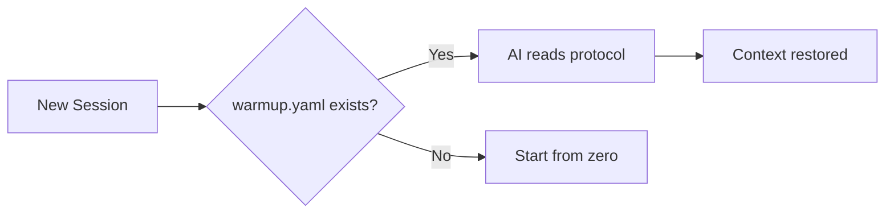

# Forge Protocol

Vendor-neutral AI session continuity. Any AI. Any project.

## The Problem

AI sessions are stateless. Every conversation starts from zero. Context about your project, conventions, and progress is lost.

## The Solution

A simple YAML file (`warmup.yaml`) that any AI can read to restore project context.

```yaml
# warmup.yaml - minimal example
identity:
  project: "My Project"

files:
  source:
    - "src/main.py - Entry point"

session:
  start:
    - "Read warmup.yaml"
    - "Run tests"
```

## Quick Start

1. Create `warmup.yaml` in your project root
2. Tell your AI: *"If there is a warmup.yaml file, read it first"*
3. That's it. Session continuity restored.

## Why YAML?

- Every AI can read it
- Humans can read it
- Git-friendly (diffable, mergeable)
- No vendor lock-in

## Protocol Suite

| File             | Purpose                | Required |
| ---------------- | ---------------------- | -------- |
| `warmup.yaml`    | Session bootstrap      | Yes      |
| `sprint.yaml`    | Active work tracking   | Optional |
| `roadmap.yaml`   | Milestones & planning  | Optional |

## How It Works



## Documentation

### Core
- [Full Specification](docs/SPECIFICATION.md) - Protocol schema and details
- [Examples](docs/EXAMPLES.md) - Configurations for Rust, Python, JS, monorepos
- [Manifesto](docs/MANIFESTO.md) - The full philosophy and methodology

### Guides
- [Autonomous Session Guide](docs/guides/AUTONOMOUS_SESSION_GUIDE.md) - How to run autonomous AI sessions
- [Sprint Protocol](docs/guides/SPRINT_AUTONOMY_PROTOCOL.md) - Bounded sessions with shipping discipline

### Stories
- [The Autonomous Developer Story](docs/stories/AUTONOMOUS_STORY.md) - How Forge was built by AI
- [AI Promotion Story](docs/stories/AI-PROMOTION-STORY.md) - From junior to senior developer

### Research
- [Experiential Continuity](docs/research/EXPERIENTIAL_CONTINUITY.md) - Beyond knowledge persistence

## Origin

Extracted from [Forge](https://github.com/lctavares/forge) - a YAML formula calculator built entirely by Claude using this protocol.

## License

MIT
