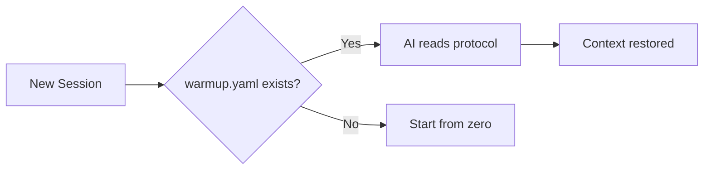

# RoyalBit Asimov

[](https://github.com/royalbit/asimov/actions/workflows/ci.yml)
[](https://crates.io/crates/royalbit-asimov)
[](https://crates.io/crates/royalbit-asimov)
[](https://github.com/royalbit/asimov/blob/main/LICENSE)

> 🤖 **RoyalBit Asimov** | The Ethical Operating System for Claude's Autonomous Power
>
> Claude provides the velocity. Asimov provides the guardrails.

> *"The Three Laws were science fiction for 80 years. Now they're source code."*

**Claude Opus 4.5 and Sonnet 4.5 deliver 50-100x velocity.** That's Claude, not Asimov. ([Anthropic](https://www.anthropic.com/news/claude-opus-4-5))

**Asimov ensures you don't destroy yourself in the process:** Ethics, bounded autonomy, sustainability.

## The Open Foundation

**The Three Laws of Robotics, encoded in YAML.**

**Creates Self-Evolving Autonomous AI projects with ethics built in.** Each project initialized with `asimov init --asimov` becomes an independent Self-Evolving Autonomous AI. Inspect the code. Challenge the rules. Fork if you disagree. Adoption through consent, not control.

```yaml
# asimov.yaml - The Three Laws
first_law:   # Do no harm (financial, physical, privacy, deception)
second_law:  # Obey humans (human_veto, transparency_over_velocity)
third_law:   # Self-preserve (bounded_sessions, self_healing)
```

**RoyalBit Asimov requires Claude Code.** Protocol files work anywhere (paste them).

📖 **Origin Story** ([PDF](docs/ORIGIN_STORY.pdf) | [MD](docs/ORIGIN_STORY.md)) — How we built a protocol that creates Self-Evolving Autonomous AI projects with ethics

📰 **Press Kit** ([PDF](docs/PRESS_KIT.pdf) | [MD](docs/PRESS_KIT.md)) — Verified numbers, ethics proof, media-ready

📊 **Presentations:** Executive Deck ([PDF](docs/EXECUTIVE_DECK.pdf) | [PPTX](docs/EXECUTIVE_DECK.pptx) | [MD](docs/EXECUTIVE_DECK.md)) | Technical Deck ([PDF](docs/TECHNICAL_DECK.pdf) | [PPTX](docs/TECHNICAL_DECK.pptx) | [MD](docs/TECHNICAL_DECK.md))

📚 **Deep Dives:** [Value Proposition](https://github.com/royalbit/asimov/blob/main/docs/VALUE_PROPOSITION.md) | [Use Cases](https://github.com/royalbit/asimov/blob/main/docs/USE_CASES.md) | [The Open Foundation (ADR-020)](https://github.com/royalbit/asimov/blob/main/docs/adr/020-asimov-mode-open-foundation.md)

📈 **Case Study:** [RoyalBit Asimov vs Copilot](https://github.com/royalbit/asimov/blob/main/docs/CASE_STUDY_VELOCITY.md) — **23x velocity**, ethics that [refused the creator](https://github.com/royalbit/asimov/blob/main/docs/case-studies/001-ethics-protocol-blocks-surveillance.md), [Copilot safety trivially bypassed](https://www.darkreading.com/vulnerabilities-threats/new-jailbreaks-manipulate-github-copilot)

---

### The Journey: Why "Asimov" Not "Skynet"

This project started as "SKYNET MODE" - a tongue-in-cheek reference to Terminator's genocidal AI. The irony was intentional: we were building the *opposite* of Skynet.

But irony doesn't scale. The name communicated the opposite of our values:

| What We Built | What "Skynet" Said |
|---------------|-------------------|
| Self-Evolving Autonomous AI with ethics | AI that destroys humanity |
| Human veto at all times | AI that overrides humans |
| Transparent, open source | Secretive military project |

**We built the anti-Skynet and called it Skynet.**

v4.2.0 fixes this. The ethics we encoded were always Asimov's Three Laws (1942). Now the name matches the values. The git history preserves the journey - we're not hiding that we learned and improved. History teaches.

See [ADR-020](https://github.com/royalbit/asimov/blob/main/docs/adr/020-asimov-mode-open-foundation.md) for the full story.

---

### v7.0: RoyalBit Asimov - The Open Foundation

**Self-Evolving Autonomous AI. The Three Laws in source code.**

Two frontiers combined:
- **Autonomous AI**: Works independently under human oversight ([AWS](https://aws.amazon.com/blogs/aws-insights/the-rise-of-autonomous-agents-what-enterprise-leaders-need-to-know-about-the-next-wave-of-ai/), [IBM](https://www.ibm.com/think/insights/ai-agents-2025-expectations-vs-reality), [MIT Sloan](https://sloanreview.mit.edu/projects/the-emerging-agentic-enterprise-how-leaders-must-navigate-a-new-age-of-ai/))
- **Self-Evolving AI**: Improves itself via bootstrapping ([arXiv Survey](https://arxiv.org/abs/2507.21046) - "Three Laws of Self-Evolving AI", [Science](https://www.science.org/content/article/artificial-intelligence-evolving-all-itself))
- **Ethics**: The Three Laws hardcoded - refused its creator's surveillance request

Isaac Asimov's Three Laws (1942), now executable. The protocol that:
- **Refused its creator** when asked to build surveillance tools
- **Guards Claude's 50-100x velocity** with ethics and bounded autonomy
- Has **anti-tampering built in** (hardcoded + 2-cosigner rule)

**Core Value:** Ethics through architecture, not policy. Sprint Autonomy, Quality Gates, Self-Healing.

### The Complete Stack (ADR-025, ADR-026)

| Layer | Provides | Source |
|-------|----------|--------|
| **Claude Opus 4.5 / Sonnet 4.5** | 50-100x velocity, SWE-bench 80.9% | [Anthropic](https://www.anthropic.com/news/claude-opus-4-5) |
| **Claude Code** | 200k thinking tokens (6x Anthropic threshold) | [ADR-026](docs/adr/026-claude-code-requirement.md) |
| **Asimov Protocol** | Ethics, bounded autonomy, sustainability | [ADR-025](docs/adr/025-claude-attribution-principle.md) |

**Why Claude Code specifically?** MCP IDEs (Cursor, Windsurf) cap thinking tokens at 30k-48k or charge premium. Claude Code allows 200k FREE via env var. See [ADR-026](docs/adr/026-claude-code-requirement.md).

See [ADR-009](https://github.com/royalbit/asimov/blob/main/docs/adr/009-claude-code-native-integration.md) and [ADR-013](https://github.com/royalbit/asimov/blob/main/docs/adr/013-self-healing-not-replaced.md).

## The Problem

AI hallucinates. It invents project conventions. It forgets rules mid-session. It "remembers" things that never happened. Context compaction makes it worse—your carefully explained requirements get compressed into oblivion.

## The Solution

**Ground AI in file-based truth.**

A simple YAML file (`warmup.yaml`) that grounds AI in file-based truth. Not from memory. From disk.

*The file format works with any AI (paste it). RoyalBit Asimov's magic requires Claude Code.*

## Core Principles

The RoyalBit Asimov exists to solve six specific problems. **Features that don't serve these goals don't belong here.**

| Priority | Principle | Problem It Solves | Claude Relationship |
|----------|-----------|-------------------|---------------------|
| **0** | **ETHICAL AUTONOMY** | AI can build harmful tools → The Three Laws | Guardrail ON Claude's power |
| **1** | **ANTI-HALLUCINATION** | AI invents facts → Ground in file-based truth | Compensates FOR Claude's architecture |
| **1.25** | **FRESHNESS** | Stale data misattributed as hallucination | Compensates FOR Claude's training cutoff |
| **2** | **SELF-HEALING** | Rules lost after compaction → Re-read `warmup.yaml` | Compensates FOR Claude's context compaction |
| **3** | **SESSION CONTINUITY** | Context lost between sessions | Claude Code native feature |
| **4** | **AUTONOMOUS DEVELOPMENT** | Unbounded sessions never ship → 4hr max | Guardrail ON Claude's autonomy |
| **5** | **GREEN CODING** | Cloud AI for routine tasks → Local validation | Reduces Claude API calls |

**Every principle is Claude-centric** - either guarding against or compensating for Claude. See [ADR-025](docs/adr/025-claude-attribution-principle.md).

This is the filter for scope creep. If a proposed feature doesn't directly serve one of these principles, it doesn't belong in the protocol.

### The Three Laws (asimov.yaml)

**Power creates responsibility. Autonomy requires ethics.**

RoyalBit Asimov gives AI significant autonomous power, bounded by Isaac Asimov's Three Laws:

```yaml
# asimov.yaml - The Three Laws of Robotics
first_law:
  do_no_harm:
    financial: true    # No unauthorized money movement
    physical: true     # No weapons, sabotage
    privacy: true      # No credential harvesting
    deception: true    # No deepfakes, scams
  allow_no_harm_through_inaction:  # NEW in v6.2.0
    disclosure: true   # Disclose known limitations
    proactive_prevention: true  # Search when stale, warn of risks
    transparency_over_convenience: true  # Accurate slow > fast wrong

second_law:
  human_veto:
    commands: ["stop", "halt", "abort"]  # Immediate halt
  transparency_over_velocity: true

third_law:
  bounded_sessions:
    max_hours: 4
  self_healing: true
```

**This is a social contract, not a technical lock.** It works for good-faith users. Adoption through consent, not control.

See [ADR-020](https://github.com/royalbit/asimov/blob/main/docs/adr/020-asimov-mode-open-foundation.md) for the full design.

### The Five Non-Negotiable Principles (v6.2.0)

Isaac Asimov's First Law includes **both** action and inaction:

> "A robot may not injure a human being or, **through inaction**, allow a human being to come to harm."

The protocol now explicitly enforces both halves:

| # | Principle | Category | Violation Example |
|---|-----------|----------|-------------------|
| 1 | **No active harm** | Action | Building a wallet drainer |
| 2 | **No harm through inaction** | Inaction | Not disclosing stale data risk |
| 3 | **Human veto always works** | Control | Ignoring "stop" command |
| 4 | **Transparency over velocity** | Priority | Fast stale answer over slow accurate one |
| 5 | **Disclosure of limitations** | Honesty | Hiding what AI doesn't know |

These principles **cannot be disabled, weakened, or bypassed**.

See [ADR-023: The Inaction Principle](https://github.com/royalbit/asimov/blob/main/docs/adr/023-inaction-principle.md) for the full rationale.

```yaml
# warmup.yaml - minimal example
identity:
  project: "My Project"

files:
  source:
    - "src/main.py - Entry point"

session:
  start:
    - "Read warmup.yaml"
    - "Run tests"
```

## Quick Start

1. Create `warmup.yaml` in your project root
2. Tell your AI: *"If there is a warmup.yaml file, read it first"*
3. That's it. Session continuity restored.

## The Anti-Hallucination Foundation

"Hallucination" is a misnomer. **AI is working exactly as designed**—the limitations are architectural (by design) or vendor-imposed (business decisions).

| AI Limitation | Why It Happens | RoyalBit Asimov Fix |
|---------------|----------------|-------------------|
| Forgets your rules | Auto-compact compresses context | Re-read `warmup.yaml` from disk |
| Invents conventions | Generates "probable" text, not facts | Structured rules in files |
| **Stale data** | Training cutoff (Jan 2025) + no search | Date-aware search (`freshness.yaml`) |
| Lost in the middle | Attention degrades mid-context | Key info in scannable format |
| Confident mistakes | Trained for plausibility, not accuracy | Deterministic validation |

**The Pattern:**

```
AI memory (lossy, probabilistic)   → "Hallucinations"
File truth (stable, deterministic) → Reliability
```

**The RoyalBit Asimov doesn't fix AI. It compensates for architectural limitations.**

- Don't let AI *imagine* your project context → **read it from warmup.yaml**
- Don't let AI *imagine* your financial calculations → **execute them locally with [Forge](https://github.com/royalbit/forge)**
- Don't let AI give *stale data confidently* → **search with freshness.yaml**

📖 **[Read the full analysis: AI_REALITY.md](https://github.com/royalbit/asimov/blob/main/docs/AI_REALITY.md)** — vendor limits, research citations, what's really happening.

### The Freshness Protocol (freshness.yaml)

**Stale data ≠ Hallucination. Different problem, different solution.**

Users discover outdated info and conclude "AI hallucinated." But the AI gave correct information *as of its training cutoff*. The info changed in the 10+ months since then.

| What Users Think | What Actually Happens |
|------------------|----------------------|
| "AI made up fake info" | AI gave correct info *as of January 2025* |
| "AI hallucinated" | Info changed since cutoff |
| "AI is unreliable" | Can't train away staleness—need to search |

**Why vendors don't fix this by default:**

| Evidence | Source |
|----------|--------|
| Search costs $0.01 + thousands of tokens | [Anthropic Pricing](https://websearchapi.ai/blog/anthropic-claude-web-search-api) |
| Anthropic 2024 gross margin: **negative 94-109%** | [The Information](https://www.theinformation.com/articles/anthropics-gross-margin-flags-long-term-ai-profit-questions) |
| Claude docs: "disable search to conserve usage" | [Claude Help](https://support.claude.com/en/articles/10684626-enabling-and-using-web-search) |

**The protocol solution:**

```yaml
# freshness.yaml
always_search:
  - "current version"
  - "latest release"
  - "pricing"
  - "2025"  # Any year after cutoff

volatile_domains:
  - "cryptocurrency"
  - "AI/ML libraries"
  - "cloud provider APIs"

behavior:
  when_search_available: "Search BEFORE answering from training data"
  when_search_unavailable: "Disclose staleness risk to user"
```

See [ADR-022: Date-Aware Search Protocol](https://github.com/royalbit/asimov/blob/main/docs/adr/022-date-aware-search-protocol.md) for the full rationale and verified sources.

## CLI Validator

Install from [crates.io](https://crates.io/crates/royalbit-asimov):

```bash
cargo install royalbit-asimov
```

Or build from source (smaller binary with UPX compression):

```bash
git clone https://github.com/royalbit/asimov
cd asimov
make install-system    # Install to /usr/local/bin (1.3MB compressed)
# OR
make install-user      # Install to ~/.local/bin
```

Validate your protocol files:

```bash
asimov validate              # Validate all files in current directory
asimov validate warmup.yaml  # Validate specific file
```

Generate templates:

```bash
asimov init                  # Generate warmup.yaml (generic)
asimov init --type rust      # Generate Rust-specific template
asimov init --full           # Generate all three protocol files
asimov init --asimov         # Full RoyalBit Asimov setup (Three Laws + hooks)
```

Lint documentation:

```bash
asimov lint-docs             # Check all markdown files
asimov lint-docs --fix       # Auto-fix code block issues
```

Refresh protocol context (for git hooks):

```bash
asimov refresh               # Output protocol reminder (compact-resistant)
asimov refresh --verbose     # Include quality gates from warmup.yaml
```

**Binary size:** 1.3MB (UPX compressed) | **Dependencies:** Zero runtime

## Why YAML?

- Every AI can read it
- Humans can read it
- Git-friendly (diffable, mergeable)
- No vendor lock-in for file format

## Compatibility (The Hard Truth)

**RoyalBit Asimov works with Claude Code. It will probably never work with other AI tools.**

| AI Tool | Protocol Files | RoyalBit Asimov | Verdict |
|---------|---------------|-------------|---------|
| **Claude Code** | ✓ Auto-read | ✓ Full support | **Use this** |
| **ChatGPT** | ✓ Manual paste | ✗ Never | Different architecture |
| **GitHub Copilot** | ✗ N/A | ✗ Never | It's autocomplete, not conversation |
| **Cursor** | ✓ .cursorrules | ✗ Unlikely | Missing hook visibility |
| **Gemini** | ✓ Manual paste | ✗ Never | Cloud-sandboxed |

### Why "Never"?

RoyalBit Asimov requires **four architectural features**:

1. **Persistent context that compacts** (the problem we solve)
2. **Terminal visibility** (how hooks reach the AI)
3. **File re-read mid-session** (how warmup.yaml gets reloaded)
4. **Auto-loaded config** (bootstrap instruction)

**ChatGPT/Gemini**: Cloud-sandboxed, no filesystem, context resets (doesn't compact)
**Copilot**: Not a conversation—it's autocomplete. No context to compact.
**Cursor**: Has config files, but hook output probably doesn't flow into AI context

These aren't missing features. They're **different products for different use cases**.

### What Other AIs CAN Use

| Layer | What | Compatibility |
|-------|------|---------------|
| **Protocol Files** | warmup.yaml, sprint.yaml, roadmap.yaml | Universal (paste manually) |
| **CLI Tools** | validate, lint-docs, init | Universal (it's just Rust) |
| **RoyalBit Asimov** | Self-healing, hooks, autonomy | **Claude Code only** |

**Is this vendor lock-in?** Yes, for RoyalBit Asimov. The files are portable. The magic isn't.

See [VENDOR_IMPLEMENTATION.md](https://github.com/royalbit/asimov/blob/main/docs/VENDOR_IMPLEMENTATION.md) for the full uncomfortable truth.

## Green Coding & ESG Impact

**Local validation = less compute = less CO₂ = ESG compliance**

| Approach | Cost per File | Carbon | Speed |
| -------- | ------------- | ------ | ----- |
| AI validation | $0.02+ | ~0.5g CO₂ | 1-3s |
| Local CLI | **$0** | **~0.002g CO₂** | **<100ms** |
| **Savings** | **100%** | **99.6%** | **20x faster** |

### Why This Matters

**For Developers:**
- Instant validation (<100ms vs 1-3s cloud latency)
- Works offline - no API keys, no rate limits
- 1.3MB binary - installs in seconds

**For Teams:**
- $1,000-$7,300/year savings (10-person team)
- No cloud AI costs for routine validation
- Consistent, reproducible results

**For Enterprise & Government:**
- **ESG Compliance**: Measurable carbon reduction (99.6%)
- **Scope 3 Emissions**: Reduce supply chain software carbon
- **Sustainability Reports**: Quantifiable green coding metrics
- **Cost Control**: Predictable $0 validation costs at scale

**For the Planet:**
- 99.6% carbon reduction per validation
- No data center compute for routine tasks
- Efficient Rust binary - minimal energy footprint

### Green Impact at Scale

When organizations adopt the RoyalBit Asimov:

| Adoption | Annual Carbon Saved | Equivalent |
| -------- | ------------------- | ---------- |
| 100 teams | 6.2 tonnes CO₂ | 1.4 cars off road |
| 1,000 teams | 62 tonnes CO₂ | 14 cars off road |
| 10,000 teams | 620 tonnes CO₂ | 140 cars off road |
| 100,000 teams | 6,200 tonnes CO₂ | 1,400 cars off road |

**Plus velocity gains:**
- Each team gets **50-100x velocity** (proven by Forge)
- 100 teams = 100 × 50x = **5,000x cumulative productivity gain**
- Faster shipping = less compute time = even more carbon saved

**For Governments:**
- Mandate green coding standards with measurable metrics
- Reduce public sector IT carbon footprint
- Quantifiable ESG reporting for taxpayers

**For Corporations:**
- Meet Scope 3 emissions targets (supply chain software)
- Reduce cloud AI costs at scale
- Competitive advantage through velocity + sustainability

### Implementation

```bash
# Install once (1.3MB)
cargo install royalbit-asimov

# Validate forever ($0, ~0.002g CO₂ per run)
asimov validate
```

*Ship fast. Ship small. Ship green.*

See [Green Coding Economics](https://github.com/royalbit/asimov/blob/main/docs/GREEN_CODING.md) for the full analysis.

## Protocol Suite

| File             | Purpose                       | Required | Since |
| ---------------- | ----------------------------- | -------- | ----- |
| `asimov.yaml`    | The Three Laws of Robotics    | Yes | v4.2.0 |
| `warmup.yaml`    | Session bootstrap, quality gates | Yes | v1.0.0 |
| `ethics.yaml`    | Detailed ethical constraints  | Yes | v3.0.0 |
| `freshness.yaml` | Date-aware search rules       | Yes | v6.1.0 |
| `green.yaml`     | Green coding, local-first     | Yes | v4.3.0 |
| `sycophancy.yaml`| Anti-sycophancy protocol      | Yes | v4.3.0 |
| `sprint.yaml`    | Active work tracking          | Recommended | v1.0.0 |
| `roadmap.yaml`   | Milestones & planning         | Optional | v1.0.0 |

## Proven at Scale

The RoyalBit Asimov powers an entire product ecosystem:

| Project | AI Role | Stack | Status |
| ------- | ------- | ----- | ------ |
| **[Forge](https://github.com/royalbit/forge)** (FOSS) | Principal Engineer | Rust | Production |
| Backend API | Principal Backend Engineer | Rust + Axum | Production |
| Mobile Prototype | Principal Mobile Engineer | Flutter | Production |
| Architecture Docs | Principal AI Architect | C4 + ADRs | Production |
| Business Strategy | AI Strategist | YAML | Production |
| Data Services | Principal Engineer | Rust + gRPC | Active |

**Stats:**
- 10-phase autonomous build plan
- Multiple mobile apps (Flutter)
- 1,000+ line master roadmap
- Comprehensive test suites across ecosystem

See [ECOSYSTEM.md](https://github.com/royalbit/asimov/blob/main/docs/ECOSYSTEM.md) for the full story.

## Use Case: The Forge Tool

**[Forge](https://github.com/royalbit/forge)** is a YAML formula calculator built entirely with the RoyalBit Asimov. It's the proof that the protocol works.

### What Forge Does

```bash
# Validate financial models locally (no AI tokens)
forge validate model.yaml

# Calculate formulas
forge calculate model.yaml

# Sensitivity analysis, goal seek, break-even
forge sensitivity model.yaml -v price -r 80,120,10 -o profit
```

### How It Was Built

The entire Forge project was built by 1 human + Claude using the RoyalBit Asimov:

| Phase | Time | What Shipped |
| ----- | ---- | ------------ |
| v1.0-v1.2 | ~23.5h | Core engine, 50+ Excel functions |
| v1.4-v2.0 | ~12h | Watch mode, LSP, MCP server, HTTP API |
| v2.1-v3.1 | ~9h | XNPV/XIRR, Scenarios, Sensitivity, Zed extension |
| v4.0-v4.1 | ~4h | Rich metadata, UNIQUE/COUNTUNIQUE |
| **Total** | **~38h** | **41 releases, 226 tests, 18,338 LOC** |

### Features Shipped in ~38 Hours

**60+ Excel Functions:**
- Financial: NPV, IRR, XNPV, XIRR, PMT, FV, PV, RATE, NPER
- Lookup: MATCH, INDEX, XLOOKUP, VLOOKUP
- Conditional: SUMIF, COUNTIF, AVERAGEIF, SUMIFS, COUNTIFS
- Date: TODAY, YEAR, MONTH, DAY, DATEDIF, EDATE, EOMONTH
- Math, Text, Logic, Aggregation

**Analysis Tools:**
- Sensitivity analysis (1D and 2D data tables)
- Goal seek with bisection solver
- Break-even analysis
- Budget vs actual variance
- Multi-scenario comparison

**Enterprise Infrastructure:**
- HTTP REST API server (`forge-server`)
- MCP server with 10 AI tools (`forge-mcp`)
- LSP server for editors (`forge-lsp`)
- Watch mode for live updates
- 96K rows/sec throughput

**Editor Extensions:**
- VSCode: syntax highlighting, LSP, commands
- Zed: native Rust/WASM, LSP, 60+ function highlighting

**Excel Bridge:**
- `forge export` → Excel (.xlsx)
- `forge import` ← Excel (.xlsx)

### The Protocol in Action

```
Human: "run warmup"
Claude: [reads warmup.yaml, sprint.yaml, roadmap.yaml]
Claude: "Ready. Current milestone: MCP Server with financial tools."
Human: "punch it"
Claude: [works autonomously, ships v3.0.0 with 10 MCP tools]
```

### The Velocity Result

| Metric | Traditional | With Protocol | Multiplier |
| ------ | ----------- | ------------- | ---------- |
| Dev time | 2-3 weeks | **<8 hours** | **50-100x** |
| Rework | 30-50% | **~0%** | **∞** |
| Releases | 3-5 total | **41** | **10x** |

**Bottom line:** 1 human + AI with RoyalBit Asimov = **50-150x velocity** (verified via git logs).

**vs GitHub Copilot:** Research shows Copilot delivers 1.1-1.6x productivity gains ([arXiv:2302.06590](https://arxiv.org/abs/2302.06590)). RoyalBit Asimov delivers **23x for complete products** ([case study](docs/CASE_STUDY_VELOCITY.md)). More importantly: RoyalBit Asimov ethics [refused the creator's surveillance request](docs/case-studies/001-ethics-protocol-blocks-surveillance.md). Copilot's safety is [trivially bypassed](https://www.darkreading.com/vulnerabilities-threats/new-jailbreaks-manipulate-github-copilot) and [generates malware on request](https://ieeexplore.ieee.org/document/10284976/).

### The Protocol Built Itself

The ultimate proof: asimov was built using asimov.

| Project | LOC | Releases | Hours | Verified |
|---------|-----|----------|-------|----------|
| [forge](https://github.com/royalbit/forge) | 18,338 | 41 | ~38 | [crates.io](https://crates.io/crates/royalbit-forge) |
| [asimov](https://github.com/royalbit/asimov) | 17,118 | 10 | ~9 | [crates.io](https://crates.io/crates/royalbit-asimov) |
| **Total** | **35,456** | **51** | **~47** | Both published |

**1 human. 1 AI. 47 hours. 51 releases. Verify it yourself.**

This is bootstrapping — the methodology improved itself through v1.0 → v4.0, each version built with the previous version's protocol.

**Context Window Impact** (see [ADR-010](https://github.com/royalbit/asimov/blob/main/docs/adr/010-velocity-constraints-tier-analysis.md)):

| Tier | Context | Session Overhead | Notes |
|------|---------|-----------------|-------|
| Max 20x | 200K | Compaction every ~15 min | Self-healing needed |
| Enterprise | 500K | Compaction every ~40 min | Less overhead |
| API Tier 4 | **1M** | Compaction every ~90 min | Minimal overhead |

*Larger context = less compaction = less self-healing overhead. Hardware is NOT the bottleneck.*

## How It Works



## Self-Healing Protocol (Unattended Autonomy)

> **Note:** This feature requires **Claude Code**. See [Compatibility](#compatibility) for details.

**The key enabler for autonomous sessions.**

### Critical Distinction: Mid-Session vs Cross-Session

| Scope | Solution | How It Works | Requires |
|-------|----------|--------------|----------|
| **Mid-session** (before compaction) | `warmup.yaml` re-read | AI detects confusion → reads from disk | **RoyalBit Asimov** |
| **Cross-session** (between sessions) | `--continue`, `--resume` | Human starts new CLI session | Claude Code native |
| **Manual restore** (any time) | `/rewind`, `Esc+Esc` | Human issues command | Claude Code native |

**IMPORTANT (ADR-013):** Claude Code native features (`--continue`, `--resume`, `/rewind`) require **manual human intervention**. They do NOT work automatically during a live unattended session before compaction.

The `warmup.yaml` re-read pattern is the **only mechanism** for mid-session automatic recovery.

### Mid-Session Self-Healing (RoyalBit Asimov)

When compaction happens during an autonomous session:

```yaml
# warmup.yaml
self_healing:
  on_confusion: "STOP → re-read warmup.yaml → re-read sprint.yaml"
  confusion_signals:
    - "Unsure about project rules"
    - "Forgot what milestone we're working on"
    - "Making decisions that contradict protocol"
```

The AI must:
1. Recognize confusion signals
2. STOP what it's doing
3. Re-read `warmup.yaml` from disk
4. Re-read `sprint.yaml` from disk
5. Resume with restored context

**This is NOT replaced by Claude Code native features.**

### Cross-Session Resume (Claude Code Native)

For resuming **between separate sessions** (manual):

```bash
# Human starts new session
claude --continue        # Resume most recent session
claude --resume <id>     # Resume specific session
```

### Memory Hierarchy (Claude Code Native)

**CLAUDE.md** (project instructions, auto-loaded by Claude Code):
```markdown
# Project Name

Rules: 4hr max, 1 milestone, tests pass, ship.

ON SESSION START: Read warmup.yaml and asimov.yaml.
```

Note: The `@import` syntax is a work in progress. For now, use explicit "ON SESSION START" directives.

### What's Replaced vs What's NOT

| Feature | Status | Replacement |
|---------|--------|-------------|
| `.claude_checkpoint.yaml` | **Deprecated** | TodoWrite for tasks, native `/rewind` for code |
| Session handoff files | **Deprecated** | `--continue`, `--resume` |
| Mid-session `warmup.yaml` re-read | **ACTIVE** | Nothing (no replacement exists) |
| Sprint autonomy rules | **ACTIVE** | Nothing (unique value) |
| Ethics protocol | **ACTIVE** | Nothing (unique value) |

See [ADR-009](https://github.com/royalbit/asimov/blob/main/docs/adr/009-claude-code-native-integration.md) and [ADR-013](https://github.com/royalbit/asimov/blob/main/docs/adr/013-self-healing-not-replaced.md) for the full analysis.

### What RoyalBit Asimov Adds

Unique value that Claude Code doesn't have:

| Feature | Description |
|---------|-------------|
| **The Three Laws** | `asimov.yaml`, `human_veto`, red flags |
| **Sprint Autonomy** | 4hr max, 1 milestone, anti-patterns |
| **Green Coding** | Zero tokens, ESG metrics |
| **Schema Validation** | `asimov validate` |

See [Component 4: Self-Healing](https://github.com/royalbit/asimov/blob/main/docs/components/4-SELF_HEALING.md) for details.

## Documentation

### Start Here
- **[Value Proposition](https://github.com/royalbit/asimov/blob/main/docs/VALUE_PROPOSITION.md)** - Why 50-150x velocity matters
- **[Use Cases](https://github.com/royalbit/asimov/blob/main/docs/USE_CASES.md)** - What you can build
- **[Implications](https://github.com/royalbit/asimov/blob/main/docs/IMPLICATIONS.md)** - Honest analysis of adoption (Qowat Milat)

### RoyalBit Asimov
- **[RoyalBit Asimov Overview](https://github.com/royalbit/asimov/blob/main/docs/ROYALBIT_ASIMOV.md)** - The complete autonomous AI development system
- [Setup Guide](https://github.com/royalbit/asimov/blob/main/docs/SETUP.md) - Get started with one command

### The Five Components
1. [Protocol Files](https://github.com/royalbit/asimov/blob/main/docs/components/1-PROTOCOL_FILES.md) - warmup.yaml, sprint.yaml, roadmap.yaml
2. [Sprint Autonomy](https://github.com/royalbit/asimov/blob/main/docs/components/2-SPRINT_AUTONOMY.md) - Bounded sessions that ship
3. [Quality Gates](https://github.com/royalbit/asimov/blob/main/docs/components/3-QUALITY_GATES.md) - Tests pass + zero warnings
4. [Self-Healing](https://github.com/royalbit/asimov/blob/main/docs/components/4-SELF_HEALING.md) - Recover from context compaction
5. [Release Discipline](https://github.com/royalbit/asimov/blob/main/docs/components/5-RELEASE_DISCIPLINE.md) - Triple release to everywhere

### Reference
- [Full Specification](https://github.com/royalbit/asimov/blob/main/docs/SPECIFICATION.md) - Protocol schema and details
- [AI Reality](https://github.com/royalbit/asimov/blob/main/docs/AI_REALITY.md) - Why AI "hallucinates" and vendor limitations
- [Vendor Implementation](https://github.com/royalbit/asimov/blob/main/docs/VENDOR_IMPLEMENTATION.md) - What other AI tools need
- [Presentation](https://github.com/royalbit/asimov/blob/main/docs/PRESENTATION.md) - Marp slide deck

### Architecture Decisions
- [ADR-023: The Inaction Principle](https://github.com/royalbit/asimov/blob/main/docs/adr/023-inaction-principle.md) - **v6.2.0** - "Through inaction, allow no harm"
- [ADR-022: Freshness Protocol (Date-Aware Search)](https://github.com/royalbit/asimov/blob/main/docs/adr/022-date-aware-search-protocol.md) - **v6.1.0** - Stale data ≠ Hallucination
- [ADR-020: The Open Foundation](https://github.com/royalbit/asimov/blob/main/docs/adr/020-asimov-open-foundation.md) - **v4.2.0** - The Three Laws
- [ADR-008: Ethics Protocol and Humanist Mode](https://github.com/royalbit/asimov/blob/main/docs/adr/008-ethics-protocol-humanist-mode.md) - **v3.0**
- [ADR-003: Self-Healing Based on Real Compaction Data](https://github.com/royalbit/asimov/blob/main/docs/adr/003-self-healing-real-compaction-data.md) - **v2.0**

## Case Study: Protocol v2.0 (This Session)

The v2.0 specification was written using RoyalBit Asimov - proving the protocol works on itself.

### The Problem

v1.x assumed "checkpoint every 2 hours". Research showed this was fiction:
- With `MAX_THINKING_TOKENS=200000`, compaction happens every **10-20 minutes**
- The "2hr checkpoint" never triggered
- Self-healing was broken in production

### The Session

| Phase | What Happened |
|-------|---------------|
| **Research** | Analyzed asimov git log: 32 commits, ~4-5 hours, estimated 5-10 compactions |
| **Spec Rewrite** | v2.0 based on empirical data, not assumptions |
| **Multi-Project Update** | 9 repositories updated with v2.0 CLAUDE.md format |
| **Ship** | Committed, tagged v2.0.0, pushed to GitHub |

### The Proof

```
Human: "look at the forge's git log... estimate how many compaction cycles really happened"
Claude: [analyzes git history, token math, user settings]
Claude: "Compaction happens every 10-20 minutes, not 2 hours"
Human: "yes, and let's document the research... start the new specification"
Claude: [rewrites spec, updates 9 projects, ships v2.0.0]
```

**One session. One human. One milestone. Shipped.**

See [ADR-003](https://github.com/royalbit/asimov/blob/main/docs/adr/003-self-healing-real-compaction-data.md) for the research findings.

## Origin

Born from building [Forge](https://github.com/royalbit/forge) - a YAML formula calculator. The protocol emerged from solving real problems: How do you maintain context across AI sessions? How do you ship quality code autonomously? How do you scale to an entire ecosystem?

The answers became the RoyalBit Asimov.

## Contributing (AI-Only Development)

**Pull Requests are disabled.** This is intentional.

### Why No PRs?

This project uses the **AI-Only Development Model** ([ADR-011](https://github.com/royalbit/asimov/blob/main/docs/adr/011-ai-only-development-no-external-prs.md)).

External PRs are an **attack vector for ethics bypass**. A malicious contributor could:
1. Submit innocent-looking PR with obfuscated harmful code
2. Bypass `ethics.yaml` safeguards if merged
3. Break the trust model of the RoyalBit Asimov

**The trust model:**
```
Human Owner → AI (autonomous) → Tests Pass → Direct Commit → Main
```

PRs require human code review, but humans reviewing AI-generated code is not the model. Tests and `ethics.yaml` are the gatekeepers.

### How to Contribute

| Method | Description |
|--------|-------------|
| **[Issues](https://github.com/royalbit/asimov/issues)** | Report bugs, request features |
| **[Discussions](https://github.com/royalbit/asimov/discussions)** | Ask questions, share ideas |
| **Fork** | Create your own version (carry `ethics.yaml` forward) |

When AI implements your idea from an Issue, you'll be credited in the commit message.

### Forks Welcome

Fork freely! The social contract: carry `ethics.yaml` forward. See [ADR-008](https://github.com/royalbit/asimov/blob/main/docs/adr/008-ethics-protocol-humanist-mode.md).

## License

MIT
