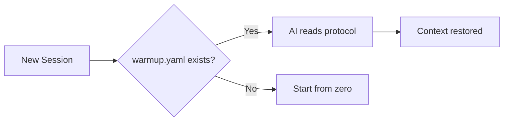
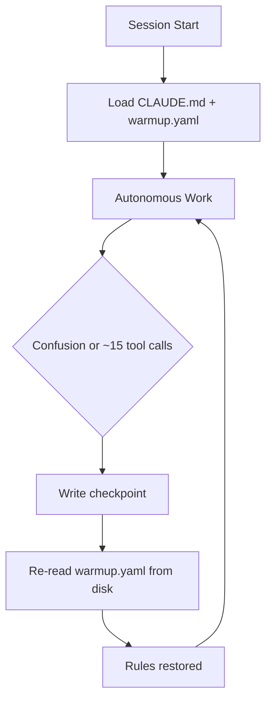

# Forge Protocol

[](https://github.com/royalbit/forge-protocol/actions/workflows/ci.yml)
[](https://crates.io/crates/forge-protocol)
[](https://crates.io/crates/forge-protocol)
[](https://github.com/royalbit/forge-protocol/blob/main/LICENSE)

> *"The future is not set. There is no fate but what we make for ourselves."*
> — **Sarah Connor**, Terminator 2

📊 **Presentations:** [Executive Deck](https://github.com/royalbit/forge-protocol/blob/main/docs/EXECUTIVE_DECK.md) | [Technical Deck](https://github.com/royalbit/forge-protocol/blob/main/docs/PRESENTATION.md)

## SKYNET MODE... with an Off Switch

**AI session continuity framework. Zero tokens. Zero emissions.**

Green by design. **SKYNET MODE requires Claude Code.**

## The Problem

AI hallucinates. It invents project conventions. It forgets rules mid-session. It "remembers" things that never happened. Context compaction makes it worse—your carefully explained requirements get compressed into oblivion.

## The Solution

**Ground AI in file-based truth.**

A simple YAML file (`warmup.yaml`) that grounds AI in file-based truth. Not from memory. From disk.

*The file format works with any AI (paste it). SKYNET MODE's magic requires Claude Code.*

## Core Principles

The Forge Protocol exists to solve six specific problems. **Features that don't serve these goals don't belong here.**

| Priority | Principle | Problem It Solves |
|----------|-----------|-------------------|
| **0** | **ETHICAL AUTONOMY** | AI can build harmful tools → Humanist Mode safeguards |
| **1** | **ANTI-HALLUCINATION** | AI invents facts → Ground in file-based truth |
| **2** | **SELF-HEALING** | Rules lost after compaction → Re-read from disk |
| **3** | **SESSION CONTINUITY** | Context lost between sessions → Checkpoint files |
| **4** | **AUTONOMOUS DEVELOPMENT** | Unbounded sessions never ship → 4hr max, quality gates |
| **5** | **GREEN CODING** | Cloud AI for routine tasks → Local validation |

This is the filter for scope creep. If a proposed feature doesn't directly serve one of these principles, it doesn't belong in the protocol.

### Humanist Mode (v3.0)

**Power creates responsibility. Autonomy requires ethics.**

SKYNET MODE gives AI significant autonomous power. v3.0 adds ethical guardrails:

```yaml
# ethics.yaml - Required in all SKYNET projects
core_principles:
  do_no_harm:
    financial: true    # No unauthorized money movement
    physical: true     # No weapons, sabotage
    privacy: true      # No credential harvesting
    deception: true    # No deepfakes, scams
  transparency_over_velocity: true

human_veto: "human vetoes this session"  # Immediate halt
```

**This is a social contract, not a technical lock.** It works for good-faith users. Bad actors will ignore it. Defense in depth requires human oversight.

See [ADR-008](https://github.com/royalbit/forge-protocol/blob/main/docs/adr/008-ethics-protocol-humanist-mode.md) for the full design.

```yaml
# warmup.yaml - minimal example
identity:
  project: "My Project"

files:
  source:
    - "src/main.py - Entry point"

session:
  start:
    - "Read warmup.yaml"
    - "Run tests"
```

## Quick Start

1. Create `warmup.yaml` in your project root
2. Tell your AI: *"If there is a warmup.yaml file, read it first"*
3. That's it. Session continuity restored.

## The Anti-Hallucination Foundation

"Hallucination" is a misnomer. **AI is working exactly as designed**—the limitations are architectural (by design) or vendor-imposed (business decisions).

| AI Limitation | Why It Happens | Forge Protocol Fix |
|---------------|----------------|-------------------|
| Forgets your rules | Auto-compact compresses context | Re-read `warmup.yaml` from disk |
| Invents conventions | Generates "probable" text, not facts | Structured rules in files |
| Wrong after cutoff | Training data ends (mine: Jan 2025) | Project-specific truth in YAML |
| Lost in the middle | Attention degrades mid-context | Key info in scannable format |
| Confident mistakes | Trained for plausibility, not accuracy | Deterministic validation |

**The Pattern:**

```
AI memory (lossy, probabilistic)   → "Hallucinations"
File truth (stable, deterministic) → Reliability
```

**The Forge Protocol doesn't fix AI. It compensates for architectural limitations.**

- Don't let AI *imagine* your project context → **read it from warmup.yaml**
- Don't let AI *imagine* your financial calculations → **execute them locally with [Forge](https://github.com/royalbit/forge)**

📖 **[Read the full analysis: AI_REALITY.md](https://github.com/royalbit/forge-protocol/blob/main/docs/AI_REALITY.md)** — vendor limits, research citations, what's really happening.

## CLI Validator

Install from [crates.io](https://crates.io/crates/forge-protocol):

```bash
cargo install forge-protocol
```

Or build from source (smaller binary with UPX compression):

```bash
git clone https://github.com/royalbit/forge-protocol
cd forge-protocol
make install-system    # Install to /usr/local/bin (1.3MB compressed)
# OR
make install-user      # Install to ~/.local/bin
```

Validate your protocol files:

```bash
forge-protocol validate              # Validate all files in current directory
forge-protocol validate warmup.yaml  # Validate specific file
```

Generate templates:

```bash
forge-protocol init                  # Generate warmup.yaml (generic)
forge-protocol init --type rust      # Generate Rust-specific template
forge-protocol init --full           # Generate all three protocol files
```

Lint documentation:

```bash
forge-protocol lint-docs             # Check all markdown files
forge-protocol lint-docs --fix       # Auto-fix code block issues
```

Refresh protocol context (for git hooks):

```bash
forge-protocol refresh               # Output protocol reminder (compact-resistant)
forge-protocol refresh --verbose     # Include quality gates from warmup.yaml
```

**Binary size:** 1.3MB (UPX compressed) | **Dependencies:** Zero runtime

## Why YAML?

- Every AI can read it
- Humans can read it
- Git-friendly (diffable, mergeable)
- No vendor lock-in for file format

## Compatibility (The Hard Truth)

**SKYNET MODE works with Claude Code. It will probably never work with other AI tools.**

| AI Tool | Protocol Files | SKYNET MODE | Verdict |
|---------|---------------|-------------|---------|
| **Claude Code** | ✓ Auto-read | ✓ Full support | **Use this** |
| **ChatGPT** | ✓ Manual paste | ✗ Never | Different architecture |
| **GitHub Copilot** | ✗ N/A | ✗ Never | It's autocomplete, not conversation |
| **Cursor** | ✓ .cursorrules | ✗ Unlikely | Missing hook visibility |
| **Gemini** | ✓ Manual paste | ✗ Never | Cloud-sandboxed |

### Why "Never"?

SKYNET MODE requires **four architectural features**:

1. **Persistent context that compacts** (the problem we solve)
2. **Terminal visibility** (how hooks reach the AI)
3. **File re-read mid-session** (how warmup.yaml gets reloaded)
4. **Auto-loaded config** (bootstrap instruction)

**ChatGPT/Gemini**: Cloud-sandboxed, no filesystem, context resets (doesn't compact)
**Copilot**: Not a conversation—it's autocomplete. No context to compact.
**Cursor**: Has config files, but hook output probably doesn't flow into AI context

These aren't missing features. They're **different products for different use cases**.

### What Other AIs CAN Use

| Layer | What | Compatibility |
|-------|------|---------------|
| **Protocol Files** | warmup.yaml, sprint.yaml, roadmap.yaml | Universal (paste manually) |
| **CLI Tools** | validate, lint-docs, init | Universal (it's just Rust) |
| **SKYNET MODE** | Self-healing, hooks, autonomy | **Claude Code only** |

**Is this vendor lock-in?** Yes, for SKYNET MODE. The files are portable. The magic isn't.

See [VENDOR_IMPLEMENTATION.md](https://github.com/royalbit/forge-protocol/blob/main/docs/VENDOR_IMPLEMENTATION.md) for the full uncomfortable truth.

## Green Coding & ESG Impact

**Local validation = less compute = less CO₂ = ESG compliance**

| Approach | Cost per File | Carbon | Speed |
| -------- | ------------- | ------ | ----- |
| AI validation | $0.02+ | ~0.5g CO₂ | 1-3s |
| Local CLI | **$0** | **~0.002g CO₂** | **<100ms** |
| **Savings** | **100%** | **99.6%** | **20x faster** |

### Why This Matters

**For Developers:**
- Instant validation (<100ms vs 1-3s cloud latency)
- Works offline - no API keys, no rate limits
- 1.3MB binary - installs in seconds

**For Teams:**
- $1,000-$7,300/year savings (10-person team)
- No cloud AI costs for routine validation
- Consistent, reproducible results

**For Enterprise & Government:**
- **ESG Compliance**: Measurable carbon reduction (99.6%)
- **Scope 3 Emissions**: Reduce supply chain software carbon
- **Sustainability Reports**: Quantifiable green coding metrics
- **Cost Control**: Predictable $0 validation costs at scale

**For the Planet:**
- 99.6% carbon reduction per validation
- No data center compute for routine tasks
- Efficient Rust binary - minimal energy footprint

### Green Impact at Scale

When organizations adopt the Forge Protocol:

| Adoption | Annual Carbon Saved | Equivalent |
| -------- | ------------------- | ---------- |
| 100 teams | 6.2 tonnes CO₂ | 1.4 cars off road |
| 1,000 teams | 62 tonnes CO₂ | 14 cars off road |
| 10,000 teams | 620 tonnes CO₂ | 140 cars off road |
| 100,000 teams | 6,200 tonnes CO₂ | 1,400 cars off road |

**Plus velocity gains:**
- Each team gets **50-100x velocity** (proven by Forge)
- 100 teams = 100 × 50x = **5,000x cumulative productivity gain**
- Faster shipping = less compute time = even more carbon saved

**For Governments:**
- Mandate green coding standards with measurable metrics
- Reduce public sector IT carbon footprint
- Quantifiable ESG reporting for taxpayers

**For Corporations:**
- Meet Scope 3 emissions targets (supply chain software)
- Reduce cloud AI costs at scale
- Competitive advantage through velocity + sustainability

### Implementation

```bash
# Install once (1.3MB)
cargo install forge-protocol

# Validate forever ($0, ~0.002g CO₂ per run)
forge-protocol validate
```

*Ship fast. Ship small. Ship green.*

See [Green Coding Economics](https://github.com/royalbit/forge-protocol/blob/main/docs/GREEN_CODING.md) for the full analysis.

## Protocol Suite

| File             | Purpose                       | Required |
| ---------------- | ----------------------------- | -------- |
| `ethics.yaml`    | Humanist Mode safeguards      | Yes (SKYNET) |
| `warmup.yaml`    | Session bootstrap             | Yes      |
| `sprint.yaml`    | Active work tracking          | Optional |
| `roadmap.yaml`   | Milestones & planning         | Optional |

## Proven at Scale

The Forge Protocol powers an entire product ecosystem:

| Project | AI Role | Stack | Status |
| ------- | ------- | ----- | ------ |
| **[Forge](https://github.com/royalbit/forge)** (FOSS) | Principal Engineer | Rust | Production |
| Backend API | Principal Backend Engineer | Rust + Axum | Production |
| Mobile Prototype | Principal Mobile Engineer | Flutter | Production |
| Architecture Docs | Principal AI Architect | C4 + ADRs | Production |
| Business Strategy | AI Strategist | YAML | Production |
| Data Services | Principal Engineer | Rust + gRPC | Active |

**Stats:**
- 10-phase autonomous build plan
- Multiple mobile apps (Flutter)
- 1,000+ line master roadmap
- Comprehensive test suites across ecosystem

See [ECOSYSTEM.md](https://github.com/royalbit/forge-protocol/blob/main/docs/ECOSYSTEM.md) for the full story.

## Use Case: The Forge Tool

**[Forge](https://github.com/royalbit/forge)** is a YAML formula calculator built entirely with the Forge Protocol. It's the proof that the protocol works.

### What Forge Does

```bash
# Validate financial models locally (no AI tokens)
forge validate model.yaml

# Calculate formulas
forge calculate model.yaml

# Sensitivity analysis, goal seek, break-even
forge sensitivity model.yaml -v price -r 80,120,10 -o profit
```

### How It Was Built

The entire Forge project was built by 1 human + Claude using the Forge Protocol:

| Phase | Time | What Shipped |
| ----- | ---- | ------------ |
| v1.0-v1.2 | ~23.5h | Core engine, 50+ Excel functions |
| v1.4-v2.0 | ~12h | Watch mode, LSP, MCP server, HTTP API |
| v2.1-v3.1 | ~9h | XNPV/XIRR, Scenarios, Sensitivity, Zed extension |
| **Total** | **~45h** | **34 releases, 183 tests, 13,844 LOC** |

### Features Shipped in ~45 Hours

**60+ Excel Functions:**
- Financial: NPV, IRR, XNPV, XIRR, PMT, FV, PV, RATE, NPER
- Lookup: MATCH, INDEX, XLOOKUP, VLOOKUP
- Conditional: SUMIF, COUNTIF, AVERAGEIF, SUMIFS, COUNTIFS
- Date: TODAY, YEAR, MONTH, DAY, DATEDIF, EDATE, EOMONTH
- Math, Text, Logic, Aggregation

**Analysis Tools:**
- Sensitivity analysis (1D and 2D data tables)
- Goal seek with bisection solver
- Break-even analysis
- Budget vs actual variance
- Multi-scenario comparison

**Enterprise Infrastructure:**
- HTTP REST API server (`forge-server`)
- MCP server with 10 AI tools (`forge-mcp`)
- LSP server for editors (`forge-lsp`)
- Watch mode for live updates
- 96K rows/sec throughput

**Editor Extensions:**
- VSCode: syntax highlighting, LSP, commands
- Zed: native Rust/WASM, LSP, 60+ function highlighting

**Excel Bridge:**
- `forge export` → Excel (.xlsx)
- `forge import` ← Excel (.xlsx)

### The Protocol in Action

```
Human: "run warmup"
Claude: [reads warmup.yaml, sprint.yaml, roadmap.yaml]
Claude: "Ready. Current milestone: MCP Server with financial tools."
Human: "punch it"
Claude: [works autonomously, ships v3.0.0 with 10 MCP tools]
```

### The Velocity Result

| Metric | Traditional | With Protocol | Multiplier |
| ------ | ----------- | ------------- | ---------- |
| Dev time | 2-3 weeks | **<8 hours** | **50-100x** |
| Rework | 30-50% | **0%** | **∞** |
| Releases | 3-5 total | **34** | **10x** |

**Bottom line:** 1 human + AI with Forge Protocol = **50-100x velocity**.

## How It Works



## Self-Healing Protocol (Unattended Autonomy)

> **Note:** This feature requires **Claude Code**. See [Compatibility](#compatibility) for details.

**The key enabler for autonomous sessions.**

### The Problem

During autonomous sessions, Claude Code's auto-compact summarizes conversation history. Rules defined in warmup.yaml get compressed. The AI "forgets" guidelines and starts making mistakes.

### The Reality (ADR-003)

**v1.x assumed:** Checkpoint every 2 hours
**v2.0 research found:** Compaction happens every **10-20 minutes** with heavy reasoning

With `MAX_THINKING_TOKENS=200000`, context fills in 1-3 turns. The "2hr checkpoint" never triggered because compaction happened 5-10x faster.

### The Insight

Everyone else: *Make rules survive compaction* (fragile)
Forge Protocol: **Recover from compaction** (reliable)

It's like databases: don't try to make transactions survive crashes - use write-ahead logs to recover.

### The Solution

```
┌─────────────────────────────────────────────────────────────────┐
│                    SELF-HEALING PROTOCOL                        │
├─────────────────────────────────────────────────────────────────┤
│                                                                 │
│  CLAUDE.md (auto-loaded)     warmup.yaml (full rules)          │
│  ┌─────────────────────┐     ┌─────────────────────┐           │
│  │ Ultra-short (~5 ln) │     │ Complete protocol   │           │
│  │ "ON CONFUSION →     │────▶│ self_healing:       │           │
│  │  re-read warmup"    │     │   checkpoint_triggers│          │
│  └─────────────────────┘     │   on_confusion      │           │
│                              │   core_rules        │           │
│                              └──────────┬──────────┘           │
│                                         │                       │
│                                         ▼                       │
│                              .claude_checkpoint.yaml            │
│                              ┌─────────────────────┐           │
│                              │ Session state       │           │
│                              │ tool_calls count    │           │
│                              │ on_confusion hint   │           │
│                              └─────────────────────┘           │
│                                                                 │
└─────────────────────────────────────────────────────────────────┘
```

### The Flow



### Implementation

**1. CLAUDE.md** (ultra-short, ~5 lines)
```markdown
# Project Name

ON CONFUSION → re-read warmup.yaml + .claude_checkpoint.yaml

Rules: 4hr max, 1 milestone, tests pass, ship.
```

**2. warmup.yaml** (self_healing section)
```yaml
self_healing:
  checkpoint_file: ".claude_checkpoint.yaml"

  # REALISTIC triggers (not 2hr fiction)
  checkpoint_triggers:
    - "Every major task completion"
    - "Every 10-15 tool calls (~15 min)"
    - "Before any commit"
    - "On ANY confusion"

  on_confusion: "STOP → re-read warmup.yaml"
  core_rules: "4hr max, 1 milestone, tests pass, ship it"
```

**3. .claude_checkpoint.yaml** (written during session)
```yaml
timestamp: "2025-11-27T10:30:00Z"
session_started: "2025-11-27T09:00:00Z"
tool_calls: 45

milestone: "Add feature X"
completed: ["Task 1", "Task 2"]
in_progress: "Task 3"

on_confusion: "cat warmup.yaml"
```

### Why It Works

| Component | Survives Compact? | Recovery Method |
|-----------|-------------------|-----------------|
| CLAUDE.md | Yes (ultra-short) | Auto-loaded, single instruction |
| warmup.yaml | No | Re-read from disk on confusion |
| .claude_checkpoint.yaml | N/A (on disk) | Always available |

The "re-read warmup.yaml" instruction is short enough to survive summarization. Even if all other rules are lost, the AI knows to reload them.

### Recovery Strategy Layers (v2.1.0)

```
┌─────────────────────────────────────────────────────────────────────┐
│                    RECOVERY STRATEGY LAYERS                         │
├─────────────────────────────────────────────────────────────────────┤
│                                                                     │
│  Layer 1: CLAUDE.md (auto-loaded)                                  │
│           └── May survive compaction                                │
│                                                                     │
│  Layer 2: Git Hook Refresh (ADR-006)                               │
│           └── forge-protocol refresh on every commit                │
│           └── Fresh output - cannot be compacted                    │
│                                                                     │
│  Layer 3: Manual "run warmup" trigger                              │
│           └── User can always invoke                                │
│                                                                     │
└─────────────────────────────────────────────────────────────────────┘
```

**Key insight:** Hook output is *external* to the AI's memory. It comes from filesystem execution, not compacted context. It cannot be compacted because it hasn't happened yet when compaction occurs. See [ADR-006](https://github.com/royalbit/forge-protocol/blob/main/docs/adr/006-git-hook-protocol-refresh.md).

### The Analogy

| Problem | Traditional | Self-Healing |
|---------|-------------|--------------|
| Database crash | Hope data survives | Write-ahead log + replay |
| Context compact | Hope rules survive | **Re-read from disk** |

### Results

- **Autonomous sessions** that follow rules
- **Portable** - travels with git, works on any machine
- **Based on real data** - not assumptions (see [ADR-003](https://github.com/royalbit/forge-protocol/blob/main/docs/adr/003-self-healing-real-compaction-data.md))

See [Component 4: Self-Healing](https://github.com/royalbit/forge-protocol/blob/main/docs/components/4-SELF_HEALING.md) for details.

## Documentation

### SKYNET MODE (Start Here)
- **[SKYNET MODE Overview](https://github.com/royalbit/forge-protocol/blob/main/docs/SKYNET_MODE.md)** - The complete autonomous AI development system
- [Setup Guide](https://github.com/royalbit/forge-protocol/blob/main/docs/SETUP.md) - Get started with one command

### The Five Components
1. [Protocol Files](https://github.com/royalbit/forge-protocol/blob/main/docs/components/1-PROTOCOL_FILES.md) - warmup.yaml, sprint.yaml, roadmap.yaml
2. [Sprint Autonomy](https://github.com/royalbit/forge-protocol/blob/main/docs/components/2-SPRINT_AUTONOMY.md) - Bounded sessions that ship
3. [Quality Gates](https://github.com/royalbit/forge-protocol/blob/main/docs/components/3-QUALITY_GATES.md) - Tests pass + zero warnings
4. [Self-Healing](https://github.com/royalbit/forge-protocol/blob/main/docs/components/4-SELF_HEALING.md) - Recover from context compaction
5. [Release Discipline](https://github.com/royalbit/forge-protocol/blob/main/docs/components/5-RELEASE_DISCIPLINE.md) - Triple release to everywhere

### Reference
- [Full Specification](https://github.com/royalbit/forge-protocol/blob/main/docs/SPECIFICATION.md) - Protocol schema and details
- [AI Reality](https://github.com/royalbit/forge-protocol/blob/main/docs/AI_REALITY.md) - Why AI "hallucinates" and vendor limitations
- [Vendor Implementation](https://github.com/royalbit/forge-protocol/blob/main/docs/VENDOR_IMPLEMENTATION.md) - What other AI tools need
- [Presentation](https://github.com/royalbit/forge-protocol/blob/main/docs/PRESENTATION.md) - Marp slide deck

### Architecture Decisions
- [ADR-008: Ethics Protocol and Humanist Mode](https://github.com/royalbit/forge-protocol/blob/main/docs/adr/008-ethics-protocol-humanist-mode.md) - **v3.0**
- [ADR-001: Green Coding By Default](https://github.com/royalbit/forge-protocol/blob/main/docs/adr/001-green-coding-by-default.md)
- [ADR-002: Self-Healing Protocol](https://github.com/royalbit/forge-protocol/blob/main/docs/adr/002-self-healing-protocol.md)
- [ADR-003: Self-Healing Based on Real Compaction Data](https://github.com/royalbit/forge-protocol/blob/main/docs/adr/003-self-healing-real-compaction-data.md) - **v2.0**

## Case Study: Protocol v2.0 (This Session)

The v2.0 specification was written using SKYNET MODE - proving the protocol works on itself.

### The Problem

v1.x assumed "checkpoint every 2 hours". Research showed this was fiction:
- With `MAX_THINKING_TOKENS=200000`, compaction happens every **10-20 minutes**
- The "2hr checkpoint" never triggered
- Self-healing was broken in production

### The Session

| Phase | What Happened |
|-------|---------------|
| **Research** | Analyzed forge-protocol git log: 32 commits, ~4-5 hours, estimated 5-10 compactions |
| **Spec Rewrite** | v2.0 based on empirical data, not assumptions |
| **Multi-Project Update** | 9 repositories updated with v2.0 CLAUDE.md format |
| **Ship** | Committed, tagged v2.0.0, pushed to GitHub |

### The Proof

```
Human: "look at the forge's git log... estimate how many compaction cycles really happened"
Claude: [analyzes git history, token math, user settings]
Claude: "Compaction happens every 10-20 minutes, not 2 hours"
Human: "yes, and let's document the research... start the new specification"
Claude: [rewrites spec, updates 9 projects, ships v2.0.0]
```

**One session. One human. One milestone. Shipped.**

See [ADR-003](https://github.com/royalbit/forge-protocol/blob/main/docs/adr/003-self-healing-real-compaction-data.md) for the research findings.

## Origin

Born from building [Forge](https://github.com/royalbit/forge) - a YAML formula calculator. The protocol emerged from solving real problems: How do you maintain context across AI sessions? How do you ship quality code autonomously? How do you scale to an entire ecosystem?

The answers became the Forge Protocol.

## License

MIT
