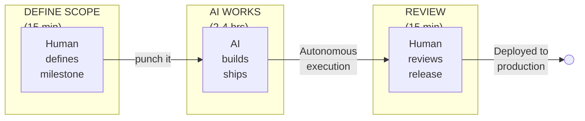

<!--
SKYNET MODE - Executive Deck Template
=====================================
Generic version for consultants and enterprises.
Customize the "Questions?" slide with your company/contact info.

Generate PDF:  marp --no-stdin EXECUTIVE_DECK.md -o EXECUTIVE_DECK.pdf
Generate PPTX: marp --no-stdin EXECUTIVE_DECK.md --pptx -o EXECUTIVE_DECK.pptx
-->

<!-- _class: lead -->
<!-- _backgroundColor: #0066b3 -->
<!-- _color: #ffffff -->

# SKYNET MODE
## Autonomous AI Development Protocol

**Transforming AI from Cost Center to Competitive Advantage**

---

# The $14,000 Problem

### Your AI coding tools are losing money

| Reality | Impact |
|---------|--------|
| Developer time fixing AI-generated code | **66%** |
| Productivity loss on complex tasks (METR) | **19% slower** |
| Annual cost of AI hallucinations per developer | **$14,000** |
| Rework rate on AI-assisted projects | **30-50%** |

**Sources:** Forrester, METR.org, Index.dev

---

# The Hidden Costs

### What CFOs don't see on AI tool invoices

| Hidden Cost | Annual Impact (100 developers) |
|-------------|-------------------------------|
| Rework from AI hallucinations | **$1.4M** |
| Context loss between sessions | **$500K** |
| Scope creep from unbounded AI | **$300K** |
| Quality issues reaching production | **$800K** |
| **Total Hidden Cost** | **$3.0M+** |

*AI tools cost $50K/year. Hidden costs: 60x the license fee.*

---

# The Root Cause

### AI tools are **unmanaged**

| Traditional AI Usage | Result |
|---------------------|--------|
| No session boundaries | Scope creep, rabbit holes |
| No quality enforcement | "Almost right" code ships |
| No context persistence | Every session starts from zero |
| No accountability | "AI did it" blame game |

**The problem isn't AI capability. It's AI governance.**

---

<!-- _class: lead -->
<!-- _backgroundColor: #0066b3 -->
<!-- _color: #ffffff -->

# The Solution

## SKYNET MODE
### Autonomous AI Development Protocol

---

# SKYNET MODE: Five Components

| # | Component | Function | Business Value |
|---|-----------|----------|----------------|
| 1 | **Protocol Files** | YAML config for standards | Consistent output |
| 2 | **Sprint Autonomy** | 4hr max, ONE deliverable | Predictable milestones |
| 3 | **Quality Gates** | Tests + zero warnings | No technical debt |
| 4 | **Self-Healing** | Auto-recovery from context loss | Multiple 4hr sessions |
| 5 | **Release Discipline** | Must ship every session | Continuous delivery |

---

# How It Works

### The autonomous development workflow

---

# The Proof: Real Numbers

### Built with SKYNET MODE in ~38 hours

| Metric | Delivered |
|--------|-----------|
| Production code | **18,338 lines** (Rust) |
| Test coverage | **226 tests**, zero warnings |
| Releases | **41 releases** |
| Infrastructure | HTTP API, MCP server, LSP server |
| Integrations | VSCode + Zed extensions |
| crates.io | **Published**, 646+ downloads |

**Traditional estimate: 6-9 months. Actual: ~38 hours.**

---

# Velocity Comparison

| Metric | Traditional | SKYNET MODE | Improvement |
|--------|-------------|-------------|-------------|
| Development time | 6-9 months | ~38 hours | **50-150x** |
| LOC/day | 25 | 3,056 | **122x** |
| Rework rate | 30-50% | 0% | **100%** |
| Human oversight | Constant | Phase gates only | **-90%** |
| Releases per week | 0.5-1 | **8-12** | **10-20x** |
| vs GitHub Copilot | 1.1-1.6x | **50-150x** | **~100x better** |

---

<!-- _class: lead -->
<!-- _backgroundColor: #28a745 -->
<!-- _color: #ffffff -->

# ROI Model

## The Money Slide

---

# Cost Savings: Per Developer

| Category | Before | After | Annual Savings |
|----------|--------|-------|----------------|
| AI hallucination fixes | $14,000 | $0 | **$14,000** |
| Rework (30% → 0%) | $45,000 | $0 | **$45,000** |
| Context rebuilding | $8,000 | $0 | **$8,000** |
| **Per Developer** | | | **$67,000** |

### At scale:
- **100 developers**: $6.7M/year savings
- **1,000 developers**: $67M/year savings
- **10,000 developers**: $670M/year savings

---

# Revenue Acceleration

### Faster delivery = faster revenue

| Scenario | Traditional | SKYNET MODE | Revenue Impact |
|----------|-------------|-------------|----------------|
| Feature delivery | 3 months | 1 week | **12x faster to market** |
| Client projects | 6 months | 1 month | **6x more projects/year** |
| Competitive bids | Standard | 50% faster | **Win rate increase** |

**Conservative estimate:** 20% revenue increase from velocity alone

---

# Implementation Cost

| Item | Cost |
|------|------|
| Forge Protocol license | **$0** (MIT open source) |
| CLI tool | **$0** (free) |
| Training (per developer) | **2 hours** |
| Pilot program (10 devs, 1 month) | **Internal time only** |

**Total implementation cost: $0**
**Payback period: Immediate**

---

<!-- _class: lead -->
<!-- _backgroundColor: #17a2b8 -->
<!-- _color: #ffffff -->

# ESG & Sustainability

## The Green Advantage

---

# Carbon Reduction: 99.6%

### Local validation vs. cloud AI

| Approach | Cost | Carbon | Speed |
|----------|------|--------|-------|
| Cloud AI validation | $0.02/file | ~0.5g CO₂ | 1-3 sec |
| SKYNET MODE (local) | **$0** | **~0.002g** | **<100ms** |
| **Reduction** | **100%** | **99.6%** | **20x** |

---

# ESG Impact at Scale

| Adoption | Annual Carbon Saved | Equivalent |
|----------|---------------------|------------|
| 100 developers | 6.2 tonnes CO₂ | 1.4 cars off road |
| 1,000 developers | 62 tonnes CO₂ | 14 cars off road |
| 10,000 developers | 620 tonnes CO₂ | 140 cars off road |

### For sustainability reporting:
- **Scope 3** emissions reduction (supply chain software)
- **Quantifiable** metrics for ESG disclosures
- **Audit trail** for every validation

---

<!-- _class: lead -->
<!-- _backgroundColor: #0066b3 -->
<!-- _color: #ffffff -->

# Enterprise Value

## Internal + Client Opportunity

---

# Internal Value

### Transform your delivery capability

| Benefit | Impact |
|---------|--------|
| Developer productivity | **50-100x velocity** on AI-assisted projects |
| Delivery predictability | **Zero rework**, bounded sessions |
| Quality consistency | **Automated gates**, audit trail |
| Talent optimization | Senior devs review, not babysit |
| ESG compliance | **Measurable** carbon reduction |

**Competitive advantage:** Deliver faster than any competitor.

---

# Client Offering (Consultants)

### New service opportunity

| Service | Description | Revenue Model |
|---------|-------------|---------------|
| **SKYNET Assessment** | Evaluate client AI readiness | Fixed fee |
| **Implementation** | Deploy protocol + training | Project-based |
| **Managed SKYNET** | Ongoing optimization | Retainer |
| **AI Governance** | Compliance + audit trails | Annual contract |

**Market positioning:** "Proven 50-100x AI velocity methodology"

---

# Competitive Differentiation

| Claim | Proof |
|-------|-------|
| "Proven 50-100x velocity" | Forge project (public, auditable) |
| "Zero AI rework methodology" | SKYNET MODE protocol |
| "Green AI development" | 99.6% carbon reduction |
| "Bounded 4hr autonomous sessions" | Self-healing protocol |

**Open source protocol = no vendor lock-in for the methodology.**

---

<!-- _class: lead -->
<!-- _backgroundColor: #ffc107 -->
<!-- _color: #1a1a2e -->

# Risk & Mitigation

---

# Risk Analysis

| Risk | Mitigation |
|------|------------|
| AI hallucinations | Quality gates block bad code |
| Scope creep | Sprint autonomy enforces boundaries |
| Context loss | Self-healing auto-recovers |
| Security concerns | Local validation, no cloud data |
| Adoption resistance | Start with pilot, prove ROI |

**SKYNET MODE is designed to reduce risk, not introduce it.**

---

# Platform Requirements

| AI Tool | SKYNET MODE | Why |
|---------|-------------|-----|
| **Claude Code** | ✓ Full | **Use this** |
| ChatGPT | **Never** | Cloud-sandboxed |
| Copilot | **Never** | Autocomplete only |
| Cursor | **Unlikely** | Missing features |

**Details:** [Vendor Implementation Guide](https://github.com/royalbit/forge-protocol/blob/main/docs/VENDOR_IMPLEMENTATION.md)

---

<!-- _class: lead -->
<!-- _backgroundColor: #0066b3 -->
<!-- _color: #ffffff -->

# Recommended Next Steps

---

# Pilot Proposal

### 30-day proof of concept

| Phase | Duration | Activity |
|-------|----------|----------|
| Week 1 | Setup | Select team, install protocol, training |
| Week 2-3 | Execution | Real project with SKYNET MODE |
| Week 4 | Evaluation | Measure velocity, quality, ROI |

**Pilot team:** 5-10 developers
**Investment:** Internal time only
**Expected result:** Measurable velocity increase

---

# Success Metrics

### What to measure in the pilot

| Metric | Baseline | Target |
|--------|----------|--------|
| Feature delivery time | Current | **50%+ reduction** |
| Rework rate | 30-50% | **<5%** |
| Developer satisfaction | Current | **Improvement** |
| Code quality (warnings) | Variable | **Zero** |
| Autonomous session length | N/A | **2-4 hours** |

---

# Decision Timeline

| Date | Milestone |
|------|-----------|
| Today | Executive alignment |
| This week | Identify pilot team |
| Next week | Training + setup |
| +30 days | Pilot results review |
| +45 days | Scale decision |

---

<!-- _class: lead -->
<!-- _backgroundColor: #0066b3 -->
<!-- _color: #ffffff -->

# Summary

---

# The Bottom Line

| Investment | Return |
|------------|--------|
| **Protocol** | **$0** (MIT open source) |
| **Claude Max** | ~$200/user/month (enterprise) |
| **Training** | 2 hours |
| **Velocity** | **50-100x** proven |

### Protocol is free. Claude subscription required for SKYNET MODE.

### ROI: $67K savings/dev/year vs ~$2.4K subscription cost

---

# Resources

**Protocol:** [https://github.com/royalbit/forge-protocol](https://github.com/royalbit/forge-protocol)

**Proof project:** [https://github.com/royalbit/forge](https://github.com/royalbit/forge)

**CLI:** `cargo install forge-protocol`

---

<!-- _class: lead -->
<!-- _backgroundColor: #1a1a2e -->
<!-- _color: #ffffff -->

# Questions?

<!-- Customize with your company/contact info -->

**[Your Name]**
[Your Title], [Your Company]

---

<!-- _class: lead -->
<!-- _backgroundColor: #ffffff -->
<!-- _color: #666666 -->

# Appendix

---

# Technical Deep Dive

### Full documentation available at:

**Specification:** [SPECIFICATION.md](https://github.com/royalbit/forge-protocol/blob/main/docs/SPECIFICATION.md)

**Self-Healing Protocol:** [ADR-003](https://github.com/royalbit/forge-protocol/blob/main/docs/adr/003-self-healing-real-compaction-data.md)

**Hook Refresh (v2.1):** [ADR-006](https://github.com/royalbit/forge-protocol/blob/main/docs/adr/006-git-hook-protocol-refresh.md)

**Vendor Compatibility:** [VENDOR_IMPLEMENTATION.md](https://github.com/royalbit/forge-protocol/blob/main/docs/VENDOR_IMPLEMENTATION.md)

---

# Case Study: Forge Project

| Phase | Duration | Delivered |
|-------|----------|-----------|
| v1.0-1.3 | ~12 hrs | Core engine, 50+ Excel functions |
| v1.4-1.6 | ~8 hrs | Watch mode, financial functions |
| v2.0-2.5 | ~15 hrs | HTTP API, MCP server, LSP |
| v3.0-3.1 | ~10 hrs | Scenarios, sensitivity, extensions |
| **Total** | **~45 hrs** | **Full product ecosystem** |

**Auditable:** [https://github.com/royalbit/forge](https://github.com/royalbit/forge)

---

# Competitive Landscape

| Solution | Velocity | Rework | Autonomous | Open Source |
|----------|----------|--------|------------|-------------|
| GitHub Copilot | 1.5-2x | High | No | No |
| ChatGPT | 2-3x | High | No | No |
| Cursor | 2-3x | Medium | No | No |
| **SKYNET MODE** | **50-100x** | **0%** | **Yes** | **Yes** |

---

# FAQ (1/2)

**Q: Why Claude Code? Will other tools support this?**
A: SKYNET MODE requires 4 architectural features only Claude Code has. Other tools have different architectures for different use cases. This won't change.

**Q: Is this vendor lock-in?**
A: For SKYNET MODE, yes. Protocol FILES are portable. The magic isn't.

**Q: What about proprietary code security?**
A: All validation is local. No code leaves your environment.

---

# FAQ (2/2)

**Q: How do we measure ROI?**
A: Track: delivery time, rework rate, releases per sprint, hours saved.

**Q: What if AI makes mistakes?**
A: Quality gates block commits until tests pass and warnings are zero.

