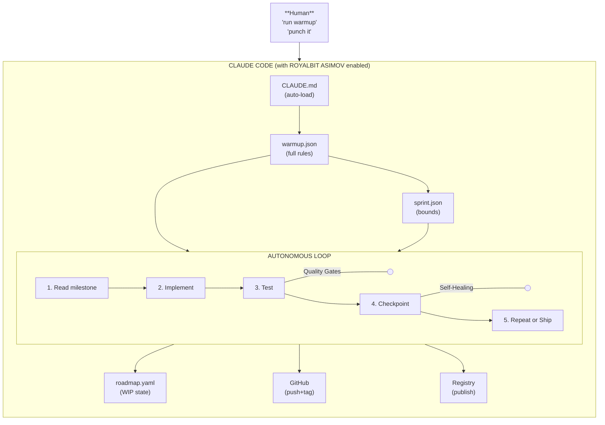
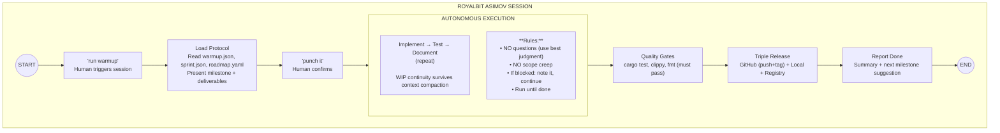

# RoyalBit Asimov

> *"A robot may not injure a human being or, through inaction, allow a human being to come to harm."*
> — Isaac Asimov, First Law of Robotics (1942)

## What is RoyalBit Asimov?

RoyalBit Asimov creates Self-Evolving Autonomous AI projects with ethics built in.

Each project initialized with `asimov init --asimov` becomes an independent Self-Evolving Autonomous AI with:
- The Three Laws (asimov.json)
- Green coding (green.json)
- Sprint autonomy (run until done, quality gates)
- Self-healing (survives context compaction)

**Two frontiers combined:**
- **Autonomous AI**: Works independently under human oversight ([AWS](https://aws.amazon.com/blogs/aws-insights/the-rise-of-autonomous-agents-what-enterprise-leaders-need-to-know-about-the-next-wave-of-ai/), [IBM](https://www.ibm.com/think/insights/ai-agents-2025-expectations-vs-reality))
- **Self-Evolving AI**: Improves itself over time via bootstrapping ([arXiv Survey](https://arxiv.org/abs/2507.21046), [Science](https://www.science.org/content/article/artificial-intelligence-evolving-all-itself))
- **Ethics**: The Three Laws hardcoded

It's not just one thing—it's five components working together:


## The Five Components

| # | Component | Purpose | Key Rule |
|---|-----------|---------|----------|
| 1 | [Protocol Files](components/1-PROTOCOL_FILES.md) | Define HOW/WHAT/WHEN | Protocol files in git |
| 2 | [Sprint Autonomy](components/2-SPRINT_AUTONOMY.md) | Run until done | Keep shipping, quality gates |
| 3 | [Quality Gates](components/3-QUALITY_GATES.md) | Enforce standards | Tests + zero warnings |
| 4 | [Self-Healing](components/4-SELF_HEALING.md) | Survive compaction | Re-read from disk |
| 5 | [Release Discipline](components/5-RELEASE_DISCIPLINE.md) | Ship everything | Triple release |

## Why All Five?

| Without... | Failure Mode |
|------------|--------------|
| Protocol Files | AI doesn't know project conventions |
| Sprint Autonomy | Sessions run forever, nothing ships |
| Quality Gates | Code ships with bugs and warnings |
| Self-Healing | Rules forgotten after 2-3 hours |
| Release Discipline | Code written but never released |

## Architecture



## The Session Flow



## Requirements

### Platform Requirements

| Requirement | Notes |
|-------------|-------|
| **Claude Code** | Required for RoyalBit Asimov |
| `--dangerously-skip-permissions` | Required for autonomous execution |
| File system access | Read/write files |
| CLAUDE.md auto-load | Triggers self-healing |

**RoyalBit Asimov requires Claude Code.** Other AI tools can use the protocol files (paste warmup.json), but cannot run unattended autonomous sessions.

See [Vendor Implementation Guide](VENDOR_IMPLEMENTATION.md) for what other tools would need.

### Project Requirements

| File | Purpose | Generated by |
|------|---------|--------------|
| `warmup.json` | Full protocol rules | `asimov init` |
| `sprint.json` | Session boundaries | `asimov init --full` |
| `roadmap.yaml` | Milestone planning + WIP state | `asimov init --full` |
| `CLAUDE.md` | Self-healing trigger | `asimov init --asimov` |
| Pre-commit hooks | Quality enforcement + WIP continuity | `asimov init --asimov` |

## Quick Start

```bash
# Install
curl -L https://github.com/royalbit/asimov/releases/latest/download/asimov-x86_64-unknown-linux-gnu.tar.gz | tar xz
sudo mv asimov /usr/local/bin/

# Setup
asimov init --type rust --asimov

# Launch
claude --dangerously-skip-permissions
> run warmup
> punch it
```

## The Result

| Metric | Without ASIMOV | With RoyalBit Asimov |
|--------|----------------|------------------|
| Session length | 30-60min (manual intervention) | Run until done (WIP continuity provides resumption) |
| Shipping frequency | When human decides | Every session |
| Quality consistency | Varies | Tests + zero warnings |
| Context after compaction | Lost | Recovered |
| Scope creep | Common | Rejected |

**Proven:** 50-150x velocity (Forge project: 45K LOC, 2,486 tests, 159 functions)

## Component Deep Dives

1. **[Protocol Files](components/1-PROTOCOL_FILES.md)** - The protocol files that define everything
2. **[Sprint Autonomy](components/2-SPRINT_AUTONOMY.md)** - Run until done sessions that ship
3. **[Quality Gates](components/3-QUALITY_GATES.md)** - Tests and standards enforcement
4. **[Self-Healing](components/4-SELF_HEALING.md)** - Surviving context compaction
5. **[Release Discipline](components/5-RELEASE_DISCIPLINE.md)** - Triple release to everywhere

## Related Documentation

- [Setup Guide](SETUP.md) - Detailed setup instructions per project type
- [Vendor Implementation](VENDOR_IMPLEMENTATION.md) - What other AI tools need
- [CLI Reference](../README.md#cli-validator) - asimov commands

---
