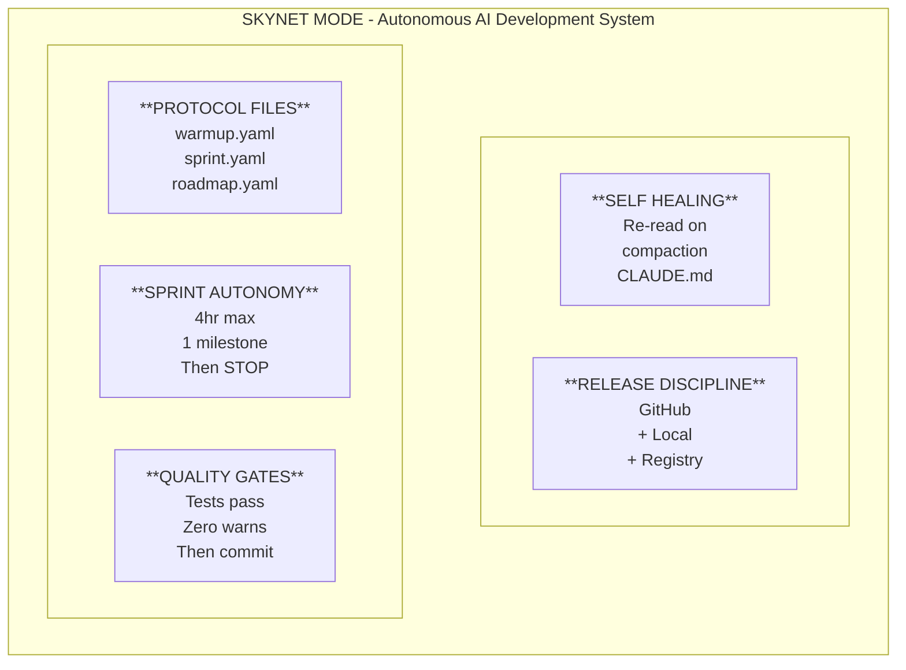
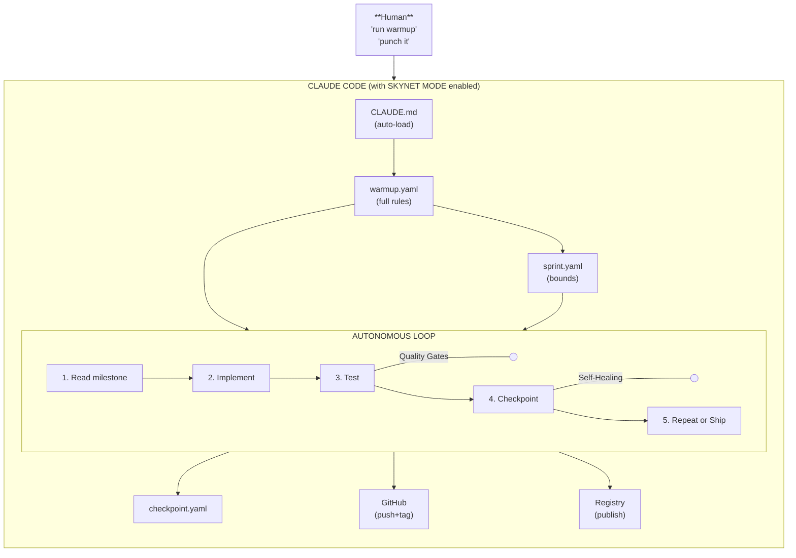
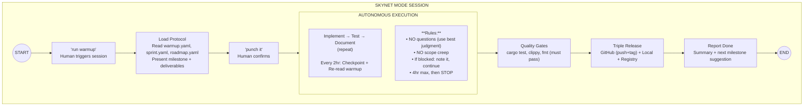

# SKYNET MODE

> *"The future is not set. There is no fate but what we make for ourselves."*
> — Sarah Connor, Terminator 2

## What is SKYNET MODE?

SKYNET MODE is a **complete autonomous AI development system** that enables bounded 4-hour sprints with consistent quality and shipping discipline. Self-healing enables multiple consecutive sessions without human intervention.

It's not just one thing—it's five components working together:



## The Five Components

| # | Component | Purpose | Key Rule |
|---|-----------|---------|----------|
| 1 | [Protocol Files](components/1-PROTOCOL_FILES.md) | Define HOW/WHAT/WHEN | YAML files in git |
| 2 | [Sprint Autonomy](components/2-SPRINT_AUTONOMY.md) | Bounded sessions | 4hr max, 1 milestone |
| 3 | [Quality Gates](components/3-QUALITY_GATES.md) | Enforce standards | Tests + zero warnings |
| 4 | [Self-Healing](components/4-SELF_HEALING.md) | Survive compaction | Re-read from disk |
| 5 | [Release Discipline](components/5-RELEASE_DISCIPLINE.md) | Ship everything | Triple release |

## Why All Five?

Each component solves a specific failure mode:

| Without... | Failure Mode |
|------------|--------------|
| Protocol Files | AI doesn't know project conventions |
| Sprint Autonomy | Sessions run forever, nothing ships |
| Quality Gates | Code ships with bugs and warnings |
| Self-Healing | Rules forgotten after 2-3 hours |
| Release Discipline | Code written but never released |

**Remove any component and the system breaks.**

## Architecture



## The Session Flow



## Requirements

### Platform Requirements

| Requirement | Notes |
|-------------|-------|
| **Claude Code** | Required for SKYNET MODE |
| `--dangerously-skip-permissions` | Required for autonomous execution |
| File system access | Read/write files |
| CLAUDE.md auto-load | Triggers self-healing |

**SKYNET MODE requires Claude Code.** Other AI tools can use the protocol files (paste warmup.yaml), but cannot run unattended autonomous sessions.

See [Vendor Implementation Guide](VENDOR_IMPLEMENTATION.md) for what other tools would need.

### Project Requirements

| File | Purpose | Generated by |
|------|---------|--------------|
| `warmup.yaml` | Full protocol rules | `forge-protocol init` |
| `sprint.yaml` | Session boundaries | `forge-protocol init --full` |
| `roadmap.yaml` | Milestone planning | `forge-protocol init --full` |
| `CLAUDE.md` | Self-healing trigger | `forge-protocol init --skynet` |
| Pre-commit hooks | Quality enforcement | `forge-protocol init --skynet` |

## Quick Start

```bash
# Install forge-protocol
cargo install forge-protocol

# Full SKYNET MODE setup
forge-protocol init --type rust --skynet

# This creates:
# ✓ warmup.yaml      - Protocol rules
# ✓ sprint.yaml      - Session boundaries
# ✓ roadmap.yaml     - Milestone planning
# ✓ CLAUDE.md        - Self-healing trigger
# ✓ .hooks/          - Pre-commit hooks
# ✓ .gitignore       - Checkpoint file excluded

# Launch Claude Code
claude --dangerously-skip-permissions

# Start session
> run warmup

# Confirm milestone
> punch it

# Go grab coffee. Come back to a release.
```

## The Result

| Metric | Without SKYNET | With SKYNET MODE |
|--------|----------------|------------------|
| Session length | 30-60min (manual intervention) | 4hr sprints (self-healing chains them) |
| Shipping frequency | When human decides | Every session |
| Quality consistency | Varies | Tests + zero warnings |
| Context after compaction | Lost | Recovered |
| Scope creep | Common | Rejected |

**Proven:** 50-150x velocity, 41 releases in ~38 hours (Forge project: 18K LOC, 226 tests, published on crates.io)

## Component Deep Dives

1. **[Protocol Files](components/1-PROTOCOL_FILES.md)** - The YAML files that define everything
2. **[Sprint Autonomy](components/2-SPRINT_AUTONOMY.md)** - Bounded sessions that ship
3. **[Quality Gates](components/3-QUALITY_GATES.md)** - Tests and standards enforcement
4. **[Self-Healing](components/4-SELF_HEALING.md)** - Surviving context compaction
5. **[Release Discipline](components/5-RELEASE_DISCIPLINE.md)** - Triple release to everywhere

## Related Documentation

- [Setup Guide](SETUP.md) - Detailed setup instructions per project type
- [Vendor Implementation](VENDOR_IMPLEMENTATION.md) - What other AI tools need
- [CLI Reference](../README.md#cli-validator) - forge-protocol commands
