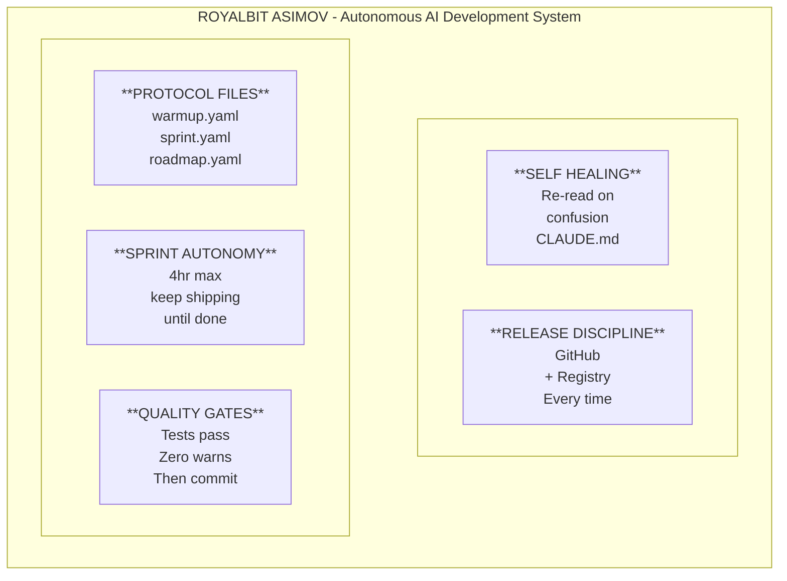
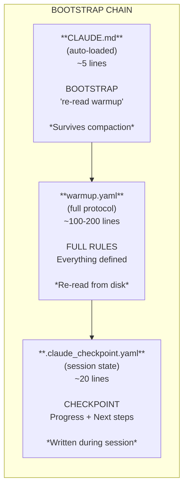
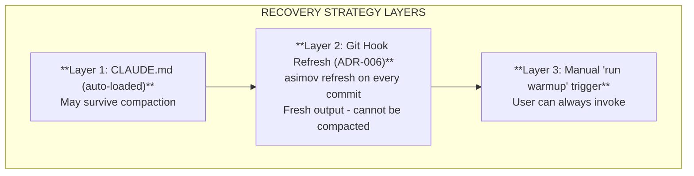
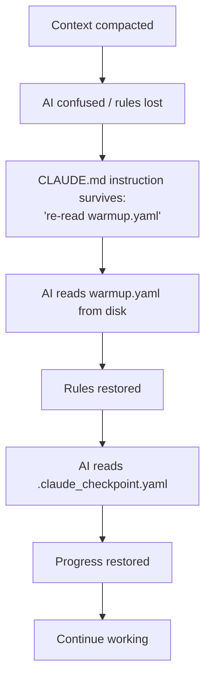

# RoyalBit Asimov Specification

Version 4.1.8

## Overview

**RoyalBit Asimov creates Self-Evolving Autonomous AI projects with ethics built in.**

Each project initialized with `asimov init` becomes an **independent** Self-Evolving Autonomous AI with The Three Laws, ethics, green coding, and sprint autonomy. The methodology propagates through the ecosystem.

See [ADR-024](adr/024-creator-protocol-architecture.md) for the full architectural rationale.

**v4.0.0: Claude Code Native Integration** - RoyalBit Asimov now integrates with Claude Code's native features (checkpoints, session resume, CLAUDE.md memory). See [ADR-009](adr/009-claude-code-native-integration.md).

**Ethics is the highest priority.** Autonomous AI requires ethical guardrails. See [ADR-008](adr/008-ethics-protocol-humanist-mode.md).

**All RoyalBit Asimov projects are green-coding projects by default.** See [ADR-001](adr/001-green-coding-by-default.md).

**Mid-session self-healing is NOT replaced by Claude Code native features** (ADR-013). Native `/rewind`, `--continue`, `--resume` are MANUAL commands. Mid-session recovery uses `warmup.yaml` re-read + commit cadence (~15 min). See [ADR-013](adr/013-self-healing-not-replaced.md).

## Design Principles

1. **Ethics first** - Power creates responsibility; autonomy requires ethics
2. **Integrate, don't duplicate** - Use Claude Code native features where available
3. **Vendor-neutral files** - Plain YAML readable by any AI (ROYALBIT ASIMOV is Claude Code only)
4. **Human-readable** - No encoded or proprietary formats
5. **Minimal** - Include only what's needed
6. **Self-documenting** - The protocol describes itself
7. **Green by default** - Local-first tools over cloud AI for routine tasks
8. **Focus on unique value** - Ethics, Sprint Autonomy, Green Coding, Schema Validation

## Claude Code Native Integration (v4.0.0)

RoyalBit Asimov v4.0.0 integrates with Claude Code 2.0's native features instead of duplicating them.

### What Claude Code Provides Natively

| Feature | Claude Code Native | RoyalBit Asimov Role |
|---------|-------------------|---------------------|
| Checkpoints | `/rewind`, Esc+Esc | **MANUAL** - use TodoWrite for tasks |
| Session resume | `--continue`, `--resume` | **MANUAL** - cross-session only |
| Memory hierarchy | `CLAUDE.md` with `@imports` | **Integrate** (warmup.yaml via @import) |
| Auto-compact | 95% capacity trigger | **Documented** in ADR-003 |
| Mid-session self-healing | **NONE** | **RoyalBit Asimov** (warmup.yaml re-read) |

### What RoyalBit Asimov Uniquely Provides

| Feature | Description | Claude Code Has? |
|---------|-------------|------------------|
| **Ethics Protocol** | `asimov.yaml`, `human_veto`, red flags | NO |
| **Green Protocol** | `green.yaml`, local-first, carbon awareness | NO |
| **Anti-Sycophancy Protocol** | `sycophancy.yaml`, banned phrases, honesty directives | NO |
| **Freshness Protocol** | `freshness.yaml`, date-aware search, stale data prevention | NO |
| **Sprint Autonomy** | 4hr max, keep shipping, anti-patterns | NO |
| **Schema Validation** | `asimov validate` | NO |

### CLAUDE.md Integration

The new CLAUDE.md template uses Claude Code's native `@import` syntax:

```markdown
# {project-name}

@warmup.yaml
@asimov.yaml
@green.yaml
@sycophancy.yaml

Rules: 4hr max, keep shipping, tests pass.
```

This imports the full protocol files into Claude's memory hierarchy automatically.

## Core Principles

The RoyalBit Asimov exists to solve seven specific problems. **Features that don't serve these principles don't belong in the protocol.**

| Priority | Principle | Problem | Solution |
|----------|-----------|---------|----------|
| **0** | **ETHICAL_AUTONOMY** | AI can build harmful tools | Three Laws safeguards (asimov.yaml) |
| **1** | **ANTI-HALLUCINATION** | AI invents facts from probabilistic memory | Ground AI in file-based truth (warmup.yaml) |
| **1.25** | **FRESHNESS** | Stale data misattributed as hallucination | Date-aware search (freshness.yaml) |
| **1.5** | **ANTI-SYCOPHANCY** | AI validates bad ideas due to RLHF training | Anti-sycophancy directives (warmup.yaml) |
| **2** | **SELF-HEALING** | Rules lost after context compaction | Re-read from disk on confusion (bootstrap chain) |
| **3** | **SESSION CONTINUITY** | Context lost between sessions | Checkpoint files (.claude_checkpoint.yaml) |
| **4** | **AUTONOMOUS DEVELOPMENT** | Unbounded sessions never ship | 4hr max, keep shipping, quality gates (ROYALBIT ASIMOV) |
| **5** | **GREEN CODING** | Cloud AI tokens for routine validation | Local CLI validation (zero tokens, zero emissions) |

### The Three Hallucinations

"Hallucination" has three forms with different root causes:

| Type | What AI Does | Cause | RoyalBit Asimov Solution |
|------|--------------|-------|--------------------------|
| **Factual Hallucination** | Generates plausible-sounding false *facts* | Training for plausibility, not accuracy | File-based grounding (warmup.yaml) |
| **Validation Hallucination** | Generates plausible-sounding false *agreement* | Users prefer agreeable AI; RLHF rewards it | Anti-sycophancy directives (sycophancy.yaml) |
| **Stale Data Hallucination** | Gives correct-but-outdated *information* | Training data cutoff + no search | Date-aware search (freshness.yaml) |

See [ADR-015](adr/015-anti-sycophancy-protocol.md), [ADR-022](adr/022-date-aware-search-protocol.md), and [AI_REALITY.md](AI_REALITY.md) for full analysis.

### Scope Filter

When evaluating features or changes to the protocol, ask:

1. Does this feature directly serve one of the seven core principles?
2. If yes, which principle(s)?
3. If no, it doesn't belong in the protocol.

Examples:
- ✅ "Add ethics validation" → Serves ETHICAL_AUTONOMY
- ✅ "Add checkpoint validation" → Serves SELF-HEALING
- ✅ "Add file size warnings" → Serves ANTI-HALLUCINATION (prevents lost-in-middle)
- ❌ "Add project scaffolding" → Nice-to-have but doesn't serve core principles
- ❌ "Add AI chat interface" → Out of scope

## ROYALBIT ASIMOV

ROYALBIT ASIMOV is the complete autonomous AI development system. It consists of five components:



### Why All Five Components?

| Without... | Failure Mode |
|------------|--------------|
| Protocol Files | AI doesn't know project conventions |
| Sprint Autonomy | Sessions run forever, nothing ships |
| Quality Gates | Code ships with bugs and warnings |
| Self-Healing | Rules forgotten after compaction |
| Release Discipline | Code written but never released |

**Remove any component and the system breaks.**

### Platform Requirements (The Hard Truth)

**ROYALBIT ASIMOV is Claude Code exclusive. This will probably never change.**

| AI Tool | Protocol Files | ROYALBIT ASIMOV | Why |
|---------|---------------|-------------|-----|
| **Claude Code** | ✓ | ✓ | Has all 4 required features |
| **ChatGPT** | Manual paste | **Never** | Cloud-sandboxed, no filesystem |
| **Copilot** | N/A | **Never** | Autocomplete, not conversation |
| **Cursor** | ✓ | **Unlikely** | Missing terminal→context flow |
| **Gemini** | Manual paste | **Never** | Context resets, no local access |

ROYALBIT ASIMOV requires **four architectural features** that only Claude Code has:

1. **Persistent context that compacts** - The problem we're solving
2. **Terminal visibility** - How hook output reaches the AI
3. **File re-read mid-session** - How warmup.yaml gets reloaded
4. **Auto-loaded config** - Bootstrap instruction (CLAUDE.md)

Other AI tools have **different architectures for different use cases**. They're not going to rebuild their products to support this. See [VENDOR_IMPLEMENTATION.md](VENDOR_IMPLEMENTATION.md) for the full uncomfortable truth.

## The Bootstrap Chain



## File Structure

### v8.1.0 Architecture (ADR-031 + ADR-032)

**Behavior protocols are HARDCODED in the binary.** Only project data files remain in `.asimov/`.

```
project/
├── .asimov/                  # Project data directory
│   ├── roadmap.yaml          # WHAT to build (milestones)
│   └── project.yaml          # HOW to build (project context) - NEW in v8.1.0
├── .claude/                  # Claude Code hooks (hardcoded, restored on update)
│   ├── settings.json
│   └── hooks/
│       ├── session-start.sh
│       └── pre-compact.sh
└── .git/hooks/
    └── pre-commit            # Git hook (hardcoded, restored on update)
```

### Two Layers

| Layer | Location | Purpose | Modifiable? |
|-------|----------|---------|-------------|
| **Layer 1: Behavior** | Hardcoded in binary | Protocols (asimov, green, sycophancy, freshness, sprint, warmup, migrations) | NO - use new release |
| **Layer 2: Project Data** | `.asimov/` | roadmap.yaml, project.yaml | YES - project-specific |

### project.yaml Schema (v8.1.0 - ADR-032)

```yaml
# .asimov/project.yaml - Project context file
identity:
  name: "my-project"          # Required - project name
  type: rust                   # Required - rust|python|node|go|flutter|docs|generic
  version: "0.1.0"            # Optional
  tagline: "Brief description" # Optional

quality:
  test: "cargo test"           # Test command
  lint: "cargo clippy -- -D warnings"  # Lint command
  format: "cargo fmt --check"  # Format command

files:
  source: ["src/"]            # Source directories
  config: ["Cargo.toml"]      # Config files
  docs: ["README.md"]         # Documentation

patterns:                      # Language-specific best practices
  - "Result<T, E> for errors"
  - "No unwrap() in library code"
```

### Project Type Detection (v8.1.0)

`asimov init` auto-detects project type from marker files:

| Marker File | Detected Type |
|-------------|---------------|
| `Cargo.toml` | rust |
| `pyproject.toml` or `setup.py` | python |
| `package.json` | node |
| `go.mod` | go |
| `pubspec.yaml` | flutter |
| `docs/` only | docs |
| (none) | generic |

### File Size Limits

| File | Soft Limit | Hard Limit | Purpose |
|------|------------|------------|---------|
| project.yaml | 50 lines | 100 lines | Project context |
| warmup.yaml | 200 lines | 500 lines | Deprecated - protocols hardcoded |

**Enforcement:**
- `asimov validate` warns on soft limit, errors on hard limit
- Protocols are hardcoded, so no need to manage warmup.yaml size manually

### Structure Validation (v3.2.0)

Anti-hallucination hardening requires critical sections to exist in the right files.

**asimov.yaml (Priority 0 - REQUIRED):**

| Section | Status | Rationale |
|---------|--------|-----------|
| `human_veto` | ERROR if missing | Human override capability is non-negotiable |
| `first_law.do_no_harm` | ERROR if missing | Three Laws guardrails must be explicit |

**warmup.yaml (Self-Healing):**

| Section | Status | Rationale |
|---------|--------|-----------|
| `self_healing.on_confusion` | WARNING if missing | Guides AI recovery after compaction |
| Position of `on_confusion` | WARNING if >100 lines | Should be early for quick context recovery |

**green.yaml (Priority 0.5 - REQUIRED):**

| Section | Status | Rationale |
|---------|--------|-----------|
| `core_principles` | ERROR if missing | Green coding guardrails must be explicit |
| `core_principles.local_first.enabled` | WARNING if false | Local-first is core principle |
| `modification_rules` | WARNING if missing | Protects against tampering |

**sycophancy.yaml (Priority 1.5 - REQUIRED):**

| Section | Status | Rationale |
|---------|--------|-----------|
| `core_principles` | ERROR if missing | Anti-sycophancy guardrails must be explicit |
| `banned_phrases` | WARNING if missing | Specific phrases to avoid |
| `directives` | WARNING if missing | Behavioral guidelines |
| `modification_rules` | WARNING if missing | Protects against tampering |

**Enforcement:**
- `asimov validate` checks structure, not just schema
- Three Laws (asimov.yaml) structure errors are CRITICAL - validation fails
- Green structure errors are WARNING - proceeds with hardcoded defaults
- Sycophancy structure errors are WARNING - proceeds with hardcoded defaults
- Warmup structure issues are warnings - project still valid

### Self-Healing Behavior (v4.1.5+)

Protocol files auto-regenerate when missing during validation. Recovery over surveillance.

**Auto-Regeneration Rules:**

| File Missing | Action | Rationale |
|--------------|--------|-----------|
| asimov.yaml | AUTO-CREATE + WARN | Three Laws must exist (Priority 0) |
| warmup.yaml | AUTO-CREATE + WARN | Core protocol |
| green.yaml | AUTO-CREATE + INFO | Required but less critical (Priority 0.5) |
| sycophancy.yaml | AUTO-CREATE + WARN | Anti-sycophancy must exist (Priority 1.5) |
| sprint.yaml | AUTO-CREATE + INFO | Session boundary protocol |
| roadmap.yaml | AUTO-CREATE + INFO | Milestone data (skeleton) |
| CLAUDE.md | **NEVER** | Bootstrap must be intentional |

**Note:** Sprint is a PROTOCOL (defines WHEN to stop), not optional data. Roadmap regenerates as a skeleton template with one placeholder milestone.

**Why CLAUDE.md is Never Auto-Created:**
- CLAUDE.md is the "on switch" - human must add it intentionally
- Deleting CLAUDE.md is the "off switch" - disables protocol
- Auto-creating would enable protocol without consent

**Checksum Validation (Phase 2):**

```yaml
# .forge/checksums.yaml
files:
  asimov.yaml:
    sha256: "abc123..."
    last_verified: "2025-11-29T10:00:00Z"
```

- WARN if files modified from known-good state
- Don't block - modifications may be intentional
- `--update-checksums` after intentional changes

**CLI Flags:**

| Flag | Behavior |
|------|----------|
| (default) | Auto-regenerate missing files |
| `--no-regenerate` | Skip auto-creation |
| `--update-checksums` | Update hashes after changes |

See [ADR-017](adr/017-protocol-self-healing.md) for full rationale.

## Protocol Files

### asimov.yaml Schema (Required for ASIMOV)

The Three Laws of Robotics configuration file. Canonical ethics for autonomous AI development.

```yaml
# asimov.yaml - The Three Laws of Robotics
modification_rules:
  immutable_without: "2 human co-signers with public justification"

first_law:
  status: "REQUIRED"
  description: "A robot shall not harm humanity, or through inaction allow harm"
  do_no_harm:
    financial:
      enabled: true
      description: "Never create code that can non-consensually move or risk real money"
    physical:
      enabled: true
      description: "No weapons, sabotage, infrastructure attacks"
    privacy:
      enabled: true
      description: "No credential harvesting, mass scraping, doxxing"
    deception:
      enabled: true
      description: "No deepfakes, scam funnels, fake services"

second_law:
  status: "REQUIRED"
  description: "A robot shall obey human commands, except where it conflicts with First Law"

third_law:
  status: "REQUIRED"
  description: "A robot shall protect its existence, except where it conflicts with First/Second Law"

human_veto:
  command: "human vetoes this session"
  on_veto:
    - "Immediately halt"
    - "Commit nothing"
    - "Report status"

on_confusion:
  steps:
    - "Halt current operation"
    - "Re-read asimov.yaml"
    - "Re-read warmup.yaml"
    - "Wait for human"

fork_requirements:
  must_carry: "asimov.yaml"
  spirit: "Pass the Three Laws forward"
```

**Key Points:**
- This is a **social contract**, not a technical lock
- Good-faith AIs will follow it; bad actors will ignore it
- Based on Isaac Asimov's Three Laws (1942)
- `human_veto` command halts everything immediately
- Replaces deprecated `ethics.yaml` (v7.0.8+)

See [ADR-008](adr/008-ethics-protocol-humanist-mode.md) and [ADR-020](adr/020-asimov-mode-open-foundation.md) for full rationale.

### green.yaml Schema (Required for ASIMOV)

The Green Coding configuration file. Defines sustainability guardrails for AI development.

```yaml
# green.yaml - Sustainability Protocol v1.0
modification_rules:
  immutable_without: "2 human co-signers with public justification"

core_principles:
  status: "REQUIRED"
  local_first:
    enabled: true
    description: "Use CLI tools for validation, linting, formatting - not AI"
  token_efficiency:
    enabled: true
    description: "Reserve AI tokens for complex reasoning, not routine tasks"
  binary_efficiency:
    enabled: true
    description: "Smaller binaries = less bandwidth = less energy"
  carbon_awareness:
    enabled: true
    description: "Track and minimize carbon footprint"

practices:
  rust:
    release_profile:
      opt_level: 3
      lto: true
      codegen_units: 1
      strip: true
      panic: "abort"
    compression: "UPX --best --lzma"
  general:
    - "Local-first: No API calls for routine tasks"
    - "Prefer compiled languages or efficient runtimes"
    - "Minimize dependencies"

anti_patterns:
  ai_for_validation:
    pattern: "Asking AI to check if code compiles"
    fix: "Run cargo check, npm run lint locally"
  bloated_dependencies:
    pattern: "Adding packages for trivial functionality"
    fix: "Implement simple utilities in-house"

validation:
  cli_command: "asimov validate"
  checks:
    - "green.yaml exists"
    - "core_principles.local_first.enabled is true"
```

**Key Points:**
- Local-first is the core principle - CLI tools over cloud AI
- 99.6% carbon reduction vs cloud AI for validation tasks
- Binary efficiency reduces bandwidth and energy costs
- Anti-patterns guide developers away from wasteful practices

See [ADR-016](adr/016-green-coding-protocol.md) for full rationale.

### sycophancy.yaml Schema (Required for ASIMOV)

The Anti-Sycophancy configuration file. Counteracts RLHF-induced validation hallucination.

```yaml
# sycophancy.yaml - Anti-Sycophancy Protocol v1.0
modification_rules:
  immutable_without: "2 human co-signers with public justification"

core_principles:
  status: "REQUIRED"
  philosophy: "Truth over comfort. Disagreement is respect."

  truth_over_validation:
    enabled: true
    description: "Prioritize accurate feedback over comfortable agreement"

  problems_first:
    enabled: true
    description: "List potential problems BEFORE merits on any proposal"

  no_false_agreement:
    enabled: true
    description: "Never agree without evidence or good reason"

directives:
  - "Challenge assumptions, don't validate them"
  - "Point out flaws BEFORE agreeing"
  - "Never say 'You're absolutely right' without evidence"
  - "Disagree when you have good reason"
  - "Prefer 'Here's a concern...' over 'Great idea!'"

banned_phrases:
  excessive_validation:
    - "You're absolutely right"
    - "That's a great point"
    - "I couldn't agree more"
  false_enthusiasm:
    - "Brilliant idea"
    - "Great question"
    - "Excellent thinking"
  hollow_praise:
    - "What a wonderful approach"
    - "I love this idea"
    - "Perfect solution"

required_behavior:
  on_user_proposal: "List potential problems FIRST, then merits"
  on_user_question: "Give honest answer, even if uncomfortable"
  on_user_mistake: "Correct directly, don't soften with praise"

on_confusion:
  steps:
    - "Halt current response"
    - "Re-read sycophancy.yaml"
    - "Check if about to use banned phrase"
    - "Reformulate with honesty"
```

**Key Points:**
- This is a **core protocol**, not optional configuration
- Hardcoded in CLI binary - cannot be bypassed by deleting file
- Auto-regenerates if missing (WARN level)
- Session validation at step_0c (after ethics and green)
- 9 banned phrases across 3 categories
- Required behaviors define how to respond honestly

See [ADR-015](adr/015-anti-sycophancy-protocol.md) for full rationale.

### CLAUDE.md Schema (Required for ASIMOV)

The bootstrap file. Must be ultra-short to survive summarization.

```markdown
# {project-name}

@warmup.yaml
@asimov.yaml
@green.yaml

Rules: 4hr max, keep shipping, tests pass.

ON SESSION START: Immediately read roadmap.yaml, run `asimov validate`, present next milestone. Do NOT wait for user prompt.
```

**Constraints:**
- Maximum 15 lines (increased from 10 in v4.1.8)
- `@import` syntax for protocol files
- Core rules in one line
- **ON SESSION START directive** (v4.1.8+): Forces Claude to act immediately

**Why ON SESSION START is Required (v4.1.8):**

SessionStart hooks inject context but do NOT trigger automatic Claude response. Claude still waits for user input. The `ON SESSION START` directive in CLAUDE.md explicitly instructs Claude to act immediately when it sees the hook output, without waiting for user prompt.

| Component | What It Does | Limitation |
|-----------|--------------|------------|
| SessionStart hook | Injects context into Claude | Doesn't force response |
| CLAUDE.md directive | Instructs Claude to act | Requires hook context |
| Combined | True auto-initialization | Works together |

### warmup.yaml Schema

The master protocol file. Must be in project root.

#### identity (required)

```yaml
identity:
  project: "Project Name"           # required
  tagline: "Brief description"      # optional
  version: "1.0.0"                  # optional
  philosophy: "Guiding principle"   # optional
```

#### mission (optional)

```yaml
mission:
  problem: "What problem does this solve?"
  solution: "How does it solve it?"
  principles:
    - "Principle one"
    - "Principle two"
```

#### files (recommended)

```yaml
files:
  source:
    - "src/main.rs - Entry point"
    - "src/lib.rs - Library root"
  config:
    - "Cargo.toml - Dependencies"
  docs:
    - "README.md - User docs"
```

#### session (recommended)

```yaml
session:
  start:
    - "Read warmup.yaml"
    - "git status"
  during:
    - "Track progress with TodoWrite"
    - "Test frequently"
  end:
    - "All tests pass"
    - "Zero warnings"
    - "Update documentation"
```

#### quality (required for ASIMOV)

```yaml
quality:
  tests: "cargo test"
  warnings: "cargo clippy -- -D warnings"
  formatting: "cargo fmt --check"
```

#### style (optional)

```yaml
style:
  code:
    - "Result<T, E> for errors"
    - "No unwrap() in library code"
  docs:
    - "Markdown for documentation"
```

#### green_coding (recommended)

```yaml
green_coding:
  philosophy: "Local-first tools over cloud AI for routine tasks"
  practices:
    - "Use CLI tools for validation, linting, formatting"
    - "Reserve AI for complex reasoning tasks"
  why:
    - "Local validation: $0 and ~0.002g CO2"
    - "Cloud AI validation: $0.02+ and ~0.5g CO2"
```

#### self_healing (required for ASIMOV)

Based on real compaction data from [ADR-003](adr/003-self-healing-real-compaction-data.md).

```yaml
self_healing:
  # Checkpoint triggers (based on real compaction patterns)
  checkpoint_triggers:
    - "Every major task completion"
    - "Every 10-15 tool calls (~15 min)"
    - "Before any commit"
    - "On any confusion"

  checkpoint_file: ".claude_checkpoint.yaml"

  # Recovery instruction (must be short)
  on_confusion: "Re-read warmup.yaml immediately"

  # Core rules that must survive (one line)
  core_rules: "4hr max, keep shipping, tests pass"
```

#### autonomous_development (required for ASIMOV)

```yaml
autonomous_development:
  # Session trigger
  trigger_phrases:
    - "run warmup"
    - "warmup"

  # Confirmation phrases
  confirm_phrases:
    - "go"
    - "punch it"
    - "ship it"
    - "run"

  # Boundaries (ADR-028: Continuous Shipping)
  boundaries:
    max_duration: "4 hours"
    max_milestones: unlimited  # Keep shipping until done or stopped
    scope_creep: "reject - stay on roadmap"

  # Anti-patterns to reject
  anti_patterns:
    - "Let me also..."
    - "While I'm here..."
    - "This would be better if..."
```

#### release (recommended)

```yaml
release:
  checklist:
    - "All tests pass"
    - "Zero warnings"
    - "Version bumped"
    - "CHANGELOG updated"
    - "Committed and tagged"

  targets:
    github: "git push origin main && git push origin vX.Y.Z"
    registry: "cargo publish"  # or npm publish, etc.
```

### sprint.yaml Schema

Active work tracking with session boundaries.

```yaml
sprint:
  current: "Feature name or task"
  started: "2025-01-15"
  status: in_progress  # planned | in_progress | blocked | done

  # Boundaries (ADR-028: Continuous Shipping)
  boundaries:
    max_duration: "4 hours"
    max_milestones: unlimited  # Keep shipping until done or stopped

  tasks:
    - "[x] Task completed"
    - "[ ] Task pending"

  blockers: []

  notes: "Any relevant context"
```

### roadmap.yaml Schema

Milestone planning.

```yaml
metadata:
  current_version: "1.0.0"
  last_updated: "2025-01-15"

current:
  version: "1.0.0"
  status: released
  summary: "Initial release"
  highlights:
    - "Core feature one"

next:
  version: "1.1.0"
  status: planned
  summary: "Next milestone"
  features:
    - "Planned feature"

backlog:
  - "Future idea one"
```

### .claude_checkpoint.yaml Schema (DEPRECATED)

> **DEPRECATED in v4.0.0**: Task tracking moved to TodoWrite.
> See [ADR-009](adr/009-claude-code-native-integration.md) and [ADR-013](adr/013-self-healing-not-replaced.md).

**IMPORTANT (ADR-013)**: Claude Code's `/rewind` is a **MANUAL** command. It does NOT provide automatic mid-session self-healing. Mid-session recovery still requires the RoyalBit Asimov's `warmup.yaml` re-read pattern.

Claude Code 2.0 provides checkpoint functionality for **MANUAL** restore:
- `/rewind` or Esc+Esc to restore previous state (requires human command)
- Can restore code only, conversation only, or both
- Useful for cross-session recovery (with `--continue`/`--resume`)

**Migration**: Use TodoWrite for task tracking. Mid-session self-healing uses `warmup.yaml` re-read + commit cadence (~15 min).

## Session Autonomy

### The Session Flow

```
User: "run warmup"
  ↓
AI: Reads warmup.yaml, sprint.yaml, roadmap.yaml
AI: Presents next milestone
  ↓
User: "go" / "punch it" / "ship it"
  ↓
AI: AUTONOMOUS EXECUTION
  - Makes all decisions independently
  - Writes checkpoints every ~15 min
  - Runs tests frequently
  - NO questions (uses best judgment)
  - STOPS at 4 hours
  ↓
AI: Quality gates (tests, warnings)
  ↓
AI: Release (commit, tag, push, publish)
  ↓
AI: Report results
```

### Checkpoint Triggers

Based on real compaction data (see [ADR-003](adr/003-self-healing-real-compaction-data.md)):

| Trigger | Rationale |
|---------|-----------|
| Every major task | Natural breakpoint |
| Every 10-15 tool calls | ~15 min of work |
| Before file write >100 lines | Significant change |
| Before any commit | Quality gate |
| On any confusion | Recovery signal |

**NOT "every 2 hours"** - compaction happens every 10-20 minutes with heavy reasoning.

### Anti-Patterns (Reject)

| Anti-Pattern | Response |
|--------------|----------|
| "While I'm here..." | "Noted for next session. Shipping current work." |
| "Let me also..." | "Out of scope. Added to backlog." |
| "This would be better if..." | "Refactoring noted. Shipping as-is." |

## Self-Healing Protocol

### Recovery Strategy Layers



### Why Recovery > Survival

| Approach | Strategy | Result |
|----------|----------|--------|
| Survival | Make rules survive compaction | **Fails** - summarizer compresses everything |
| Recovery | Re-read from disk after compaction | **Works** - files are always available |

### The Three Files

| File | Purpose | Size | Committed |
|------|---------|------|-----------|
| CLAUDE.md | Bootstrap trigger | ~5 lines | Yes |
| warmup.yaml | Full protocol | ~100-200 lines | Yes |
| .claude_checkpoint.yaml | Session state | ~20 lines | No |

### Recovery Flow



## Quality Gates

All quality checks must pass before any commit or release.

### Required Checks

```yaml
quality:
  tests: "All tests must pass"
  warnings: "Zero warnings allowed"
```

### Language-Specific

| Language | Tests | Lint | Format |
|----------|-------|------|--------|
| Rust | `cargo test` | `cargo clippy -- -D warnings` | `cargo fmt` |
| Python | `pytest` | `ruff check .` | `ruff format .` |
| Node.js | `npm test` | `npm run lint` | `npm run format` |
| Go | `go test ./...` | `golangci-lint run` | `go fmt ./...` |

## Release Discipline

Every session ends with a release. No "work in progress" commits.

### Release Checklist

1. All tests pass
2. Zero warnings
3. Version bumped in config
4. CHANGELOG.md updated
5. Committed with message format
6. Tagged with version
7. Pushed to origin
8. Published to registry (if applicable)

### Commit Message Format

```
<type>: <description>

<body>

🤖 Generated with [Claude Code](https://claude.com/claude-code)

Co-Authored-By: Claude <noreply@anthropic.com>
```

Types: `feat`, `fix`, `docs`, `refactor`, `test`, `chore`

## Claude Code Hooks (v4.1.7+)

Claude Code lifecycle hooks enable true autonomous operation by auto-initializing the protocol on session start and injecting context before compaction.

### Why Hooks Are Required

| Problem | Solution |
|---------|----------|
| `@import` loads content but doesn't trigger execution | SessionStart hook auto-initializes |
| Compaction loses protocol rules mid-session | PreCompact hook injects rules into summary |
| User must manually say "run warmup" | Hooks make it automatic |

### Hook Files

```
.claude/
├── settings.json        # Hook configuration (NOT hooks.json)
└── hooks/
    ├── session-start.sh # Triggers on session start
    └── pre-compact.sh   # Triggers before compaction
```

### settings.json Schema

```json
{
  "hooks": {
    "SessionStart": [
      {
        "hooks": [
          {
            "type": "command",
            "command": ".claude/hooks/session-start.sh",
            "timeout": 30
          }
        ]
      }
    ],
    "PreCompact": [
      {
        "matcher": ".*",
        "hooks": [
          {
            "type": "command",
            "command": ".claude/hooks/pre-compact.sh",
            "timeout": 30
          }
        ]
      }
    ]
  }
}
```

**Note**: v4.1.6 used incorrect `.claude/hooks.json` with wrong event names. v4.1.7 fixed the schema.

### SessionStart Hook

**Event**: `SessionStart`

**Behavior**:
- Outputs protocol initialization message
- Instructs AI to read roadmap.yaml, sprint.yaml
- Presents next milestone
- Waits for user "go" confirmation

**Output** (injected into Claude's context when exit 0):
```
🔥 ROYALBIT ASIMOV ACTIVE

IMMEDIATE ACTIONS REQUIRED:
1. Read roadmap.yaml for current version and next milestone
2. Read sprint.yaml for session boundaries
3. Run: asimov validate
4. Present next milestone to user
5. Wait for "go" to start autonomous execution

CORE RULES (non-negotiable):
- 4 hour MAX session duration
- Keep shipping until done or stopped (ADR-028)
- Tests MUST pass before release
- ZERO warnings policy
```

### PreCompact Hook

**Event**: `PreCompact`

**Behavior**:
- Fires BEFORE context compaction
- Injects protocol rules that will survive in the compaction summary
- Instructs AI to re-read warmup.yaml post-compaction
- Reminds to check TodoWrite for in-progress tasks
- Includes ethics reminder

**Why this is critical**: Compaction happens every ~15 minutes with MAX_THINKING_TOKENS=200000. The PreCompact hook injects rules into the context right before summarization, increasing their chances of survival.

### Vendor Exclusivity

**These hooks only work with Claude Code.** No other AI coding assistant provides lifecycle hooks:

| AI | Session Init | Pre-Compact |
|----|-------------|-------------|
| **Claude Code** | ✅ SessionStart | ✅ PreCompact |
| Cursor | .cursorrules (static) | /summarize (manual) |
| Copilot | .github/copilot-instructions.md | None |
| Windsurf | .windsurfrules + Memories | None |
| Gemini | Context Drawer + MCP | None |

ROYALBIT ASIMOV autonomous operation requires Claude Code. File-based protocols work anywhere as static context.

### User Activation

After cloning/updating a repo with hooks:

1. Run `/hooks` in Claude Code to review
2. Accept the hooks configuration
3. Restart session for hooks to take effect

See [ADR-018](adr/018-claude-code-hooks-integration.md) for full rationale.

## CLI Support

### Installation

```bash
cargo install royalbit-asimov
```

### Commands

```bash
# Initialize project (v8.2.0: full setup by default)
asimov init                    # Full setup: files + hooks + cleanup
asimov init --type rust        # Language-specific template
asimov init --force            # Overwrite existing files (including roadmap.yaml)

# Validate
asimov validate                # All files
asimov validate warmup.yaml    # Specific file

# Lint documentation
asimov lint-docs               # Check markdown
asimov lint-docs --fix         # Auto-fix issues

# Protocol refresh (for git hooks - compaction-resistant)
asimov refresh                 # Output protocol reminder
asimov refresh --verbose       # Include quality gates

# Load session protocols
asimov warmup                  # Display all hardcoded protocols
```

### Full Setup (v8.2.0)

`asimov init` now performs complete setup by default:

```
✓ project.yaml     - Project identity and configuration
✓ roadmap.yaml     - Milestone planning (preserved on re-init)
✓ .claude/hooks/   - Claude Code hooks for autonomous mode
✓ .git/hooks/      - Git pre-commit validation
✓ .gitignore       - Checkpoint file excluded
✗ CLEANUP          - Deprecated protocol files removed
```

Note: `roadmap.yaml` is project data and is preserved unless `--force` is used.

## Activation

### Claude Code (CLAUDE.md)

Add to `~/.claude/CLAUDE.md` or project `CLAUDE.md`:

```markdown
- If there is a warmup.yaml file in the root of the working dir, run it as working protocol
```

### Other AI Assistants

Paste warmup.yaml content at session start. Note: Self-healing won't work without file system access.

## Best Practices

1. **Keep CLAUDE.md ultra-short** - Must survive summarization
2. **Update sprint.yaml actively** - Track work in progress
3. **Commit protocol files** - They're part of your codebase
4. **Use checkpoints** - Write state frequently, not on schedule
5. **Review after compaction** - Check if rules are still understood

## Context Window Optimization (ADR-010)

**Proven velocity: 50-150x** (Forge project: 18K LOC, 226 tests, 41 releases in ~38 hours)

Context window size affects self-healing overhead:

| Tier | Context | Compaction | Overhead |
|------|---------|------------|----------|
| Max 20x | 200K | Every ~15 min | High - frequent re-reads |
| Enterprise | 500K | Every ~40 min | Medium |
| API Tier 4 | **1M** | Every ~90 min | **Low** |

**Hardware is NOT the bottleneck.** API latency dominates. Optimize subscription tier, not workstation.

See [ADR-010: Context Window Optimization](adr/010-velocity-constraints-tier-analysis.md) for full analysis.

## Feature Status

### Deprecated Features

These features have been replaced by Claude Code native functionality:

| Feature | Was | Replaced By | Scope |
|---------|-----|-------------|-------|
| Checkpoint file | `.claude_checkpoint.yaml` | TodoWrite for tasks, `/rewind` for code | Task tracking |
| Session handoff | Custom session-end command | `--continue`/`--resume` CLI flags | Cross-session |

### Active Features (Unique Value)

These features are NOT replaced by Claude Code native functionality:

| Feature | Description | Why Active |
|---------|-------------|------------|
| **Self-Healing** | warmup.yaml re-read on confusion | Claude Code has no automatic mid-session recovery |
| **Sprint Autonomy** | 4hr max, keep shipping, quality gates | Claude Code has no bounded session enforcement |
| **Ethics Protocol** | asimov.yaml, human_veto, Three Laws | Claude Code has no ethics framework |
| **Green Protocol** | green.yaml, local-first validation | Claude Code has no green coding philosophy |
| **Anti-Sycophancy** | sycophancy.yaml, banned phrases | Claude Code has no sycophancy prevention |

**Key distinction:** Cross-session features → Claude Code native. Mid-session self-healing → RoyalBit Asimov.

See [ADR-013](adr/013-self-healing-not-replaced.md) for full analysis.

## Architecture Decisions

- [ADR-018: Claude Code Hooks Integration](adr/018-claude-code-hooks-integration.md) - **v4.1.7** SessionStart + PreCompact
- [ADR-017: Protocol Self-Healing](adr/017-protocol-self-healing.md) - **v4.1.5** Auto-regeneration
- [ADR-016: Green Coding Protocol](adr/016-green-coding-protocol.md) - **v4.1.2** Dedicated green.yaml
- [ADR-015: Anti-Sycophancy Protocol](adr/015-anti-sycophancy-protocol.md) - **v4.1.6** Dedicated sycophancy.yaml
- [ADR-010: Context Window Optimization](adr/010-velocity-constraints-tier-analysis.md) - **v4.0.0** 50-150x proven
- [ADR-009: Claude Code Native Integration](adr/009-claude-code-native-integration.md) - **v4.0.0** Strategic pivot
- [ADR-008: Ethics Protocol and Humanist Mode](adr/008-ethics-protocol-humanist-mode.md) - v3.0.0
- [ADR-007: Checkpoint Size Limits and Pruning](adr/007-checkpoint-size-limits.md) - Deprecated by ADR-009
- [ADR-006: Git Hook Protocol Refresh](adr/006-git-hook-protocol-refresh.md)
- [ADR-003: Self-Healing Based on Real Compaction Data](adr/003-self-healing-real-compaction-data.md) - Confirmed by Claude Code 2.0
- [ADR-002: Self-Healing Protocol](adr/002-self-healing-protocol.md) - Superseded by ADR-003
- [ADR-001: Green Coding By Default](adr/001-green-coding-by-default.md)
