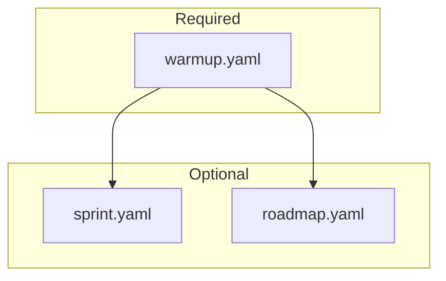
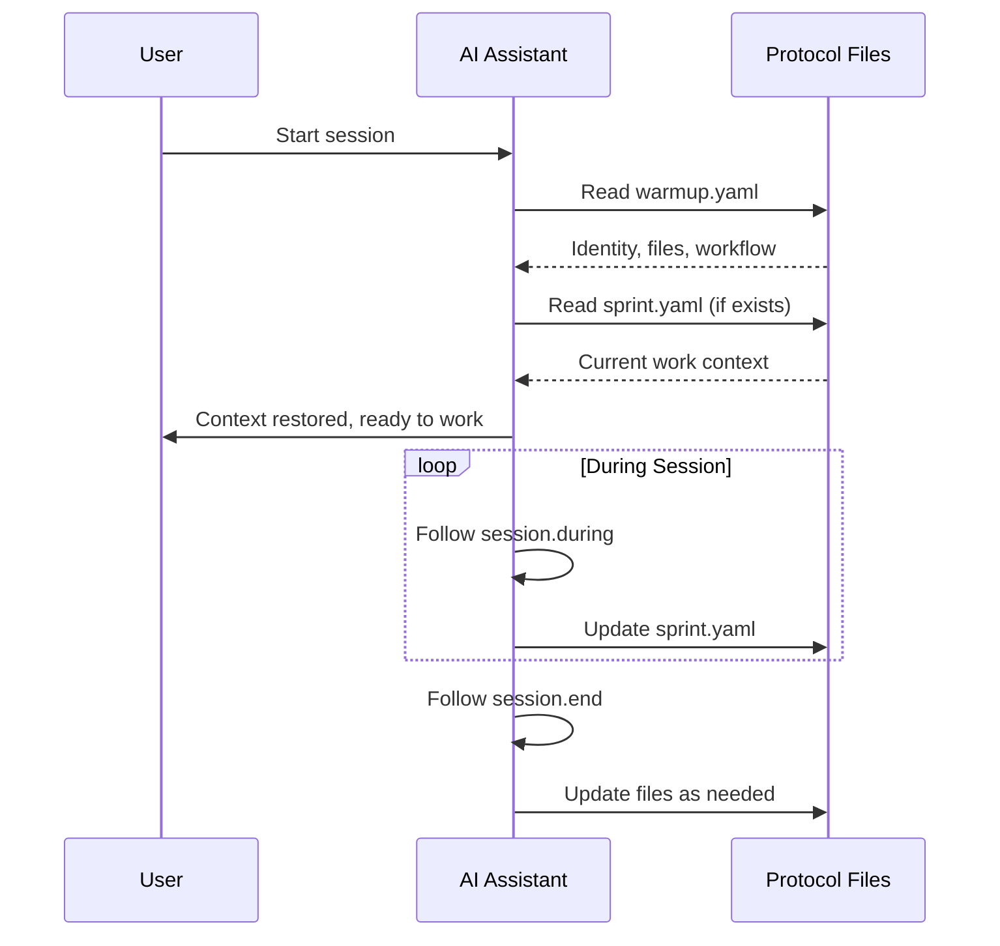

# Forge Protocol Specification

Version 1.0.0

## Overview

The Forge Protocol is a YAML-based standard for preserving project context across AI sessions. It enables any AI assistant to quickly understand a project's identity, structure, and workflow conventions.

## Design Principles

1. **Vendor-neutral** - Plain YAML readable by any AI
2. **Human-readable** - No encoded or proprietary formats
3. **Minimal** - Include only what's needed
4. **Self-documenting** - The protocol describes itself

## File Structure



## warmup.yaml Schema

The core protocol file. Must be in project root.

### identity (required)

Project identity and metadata.

```yaml
identity:
  project: "Project Name"           # required
  tagline: "Brief description"      # optional
  version: "1.0.0"                  # optional
  philosophy: "Guiding principle"   # optional
```

### mission (optional)

Problem/solution framing.

```yaml
mission:
  problem: "What problem does this solve?"
  solution: "How does it solve it?"
  principles:
    - "Principle one"
    - "Principle two"
```

### files (recommended)

Key files for navigation.

```yaml
files:
  source:
    - "src/main.rs - Entry point"
    - "src/lib.rs - Library root"
  config:
    - "Cargo.toml - Dependencies"
  docs:
    - "README.md - User docs"
```

### session (recommended)

Workflow guidance for AI.

```yaml
session:
  start:
    - "Read warmup.yaml"
    - "git status"
    - "Run tests"
  during:
    - "Track progress"
    - "Test frequently"
  end:
    - "Verify tests pass"
    - "Update changelog"
```

### quality (optional)

Quality gates and standards.

```yaml
quality:
  tests: "All tests must pass"
  warnings: "Zero warnings allowed"
  coverage: "80% minimum"
```

### style (optional)

Code and documentation style.

```yaml
style:
  code:
    - "Use Result<T, E> for errors"
    - "No unwrap() in library code"
  docs:
    - "Markdown for documentation"
    - "Mermaid for diagrams"
```

## sprint.yaml Schema (Optional)

Active work tracking.

```yaml
sprint:
  current: "Feature name or task"
  started: "2025-01-15"
  status: "in_progress"  # planned | in_progress | blocked | done
  tasks:
    - "[x] Task completed"
    - "[ ] Task pending"
  blockers: []
  notes: "Any relevant context"
```

## roadmap.yaml Schema (Optional)

Milestone planning.

```yaml
metadata:
  current_version: "1.0.0"
  last_updated: "2025-01-15"

current:
  version: "1.0.0"
  status: "released"
  summary: "Initial release"
  highlights:
    - "Core feature one"
    - "Core feature two"

next:
  version: "1.1.0"
  status: "planned"
  summary: "Next milestone"
  features:
    - "Planned feature"

backlog:
  - "Future idea one"
  - "Future idea two"
```

## Activation

Add to your AI assistant's configuration:

```text
If there is a warmup.yaml file in the root of the working directory,
read it as a working protocol before proceeding.
```

### Claude Code (CLAUDE.md)

```markdown
- If there is a warmup.yaml file in the root of the working dir, run it as working protocol
```

### Other AI Assistants

Add equivalent instruction to system prompt or custom instructions.

## Session Flow



## Best Practices

1. **Keep warmup.yaml focused** - Only include what helps restore context
2. **Update sprint.yaml actively** - Track work in progress
3. **Use roadmap.yaml for planning** - Not for daily tracking
4. **Commit protocol files** - They're part of your codebase
5. **Review periodically** - Remove stale information
