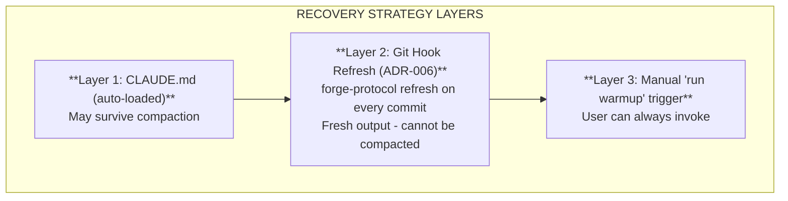

# Forge Protocol Specification

Version 4.1.5

## Overview

The Forge Protocol is a YAML-based standard for AI session continuity and autonomous development. It enables bounded, productive AI coding sessions that consistently ship working code.

**v4.0.0: Claude Code Native Integration** - Forge Protocol now integrates with Claude Code's native features (checkpoints, session resume, CLAUDE.md memory). See [ADR-009](adr/009-claude-code-native-integration.md).

**Ethics is the highest priority.** Autonomous AI requires ethical guardrails. See [ADR-008](adr/008-ethics-protocol-humanist-mode.md).

**All Forge Protocol projects are green-coding projects by default.** See [ADR-001](adr/001-green-coding-by-default.md).

**Mid-session self-healing is NOT replaced by Claude Code native features** (ADR-013). Native `/rewind`, `--continue`, `--resume` are MANUAL commands. Mid-session recovery uses `warmup.yaml` re-read + commit cadence (~15 min). See [ADR-013](adr/013-self-healing-not-replaced.md).

## Design Principles

1. **Ethics first** - Power creates responsibility; autonomy requires ethics
2. **Integrate, don't duplicate** - Use Claude Code native features where available
3. **Vendor-neutral files** - Plain YAML readable by any AI (SKYNET MODE is Claude Code only)
4. **Human-readable** - No encoded or proprietary formats
5. **Minimal** - Include only what's needed
6. **Self-documenting** - The protocol describes itself
7. **Green by default** - Local-first tools over cloud AI for routine tasks
8. **Focus on unique value** - Ethics, Sprint Autonomy, Green Coding, Schema Validation

## Claude Code Native Integration (v4.0.0)

Forge Protocol v4.0.0 integrates with Claude Code 2.0's native features instead of duplicating them.

### What Claude Code Provides Natively

| Feature | Claude Code Native | Forge Protocol Role |
|---------|-------------------|---------------------|
| Checkpoints | `/rewind`, Esc+Esc | **MANUAL** - use TodoWrite for tasks |
| Session resume | `--continue`, `--resume` | **MANUAL** - cross-session only |
| Memory hierarchy | `CLAUDE.md` with `@imports` | **Integrate** (warmup.yaml via @import) |
| Auto-compact | 95% capacity trigger | **Documented** in ADR-003 |
| Mid-session self-healing | **NONE** | **Forge Protocol** (warmup.yaml re-read) |

### What Forge Protocol Uniquely Provides

| Feature | Description | Claude Code Has? |
|---------|-------------|------------------|
| **Ethics Protocol** | `ethics.yaml`, `human_veto`, red flags | NO |
| **Green Protocol** | `green.yaml`, local-first, carbon awareness | NO |
| **Sprint Autonomy** | 4hr max, 1 milestone, anti-patterns | NO |
| **Schema Validation** | `forge-protocol validate` | NO |

### CLAUDE.md Integration

The new CLAUDE.md template uses Claude Code's native `@import` syntax:

```markdown
# {project-name}

@warmup.yaml
@ethics.yaml
@green.yaml

Rules: 4hr max, 1 milestone, tests pass, ship.
```

This imports the full protocol files into Claude's memory hierarchy automatically.

## Core Principles

The Forge Protocol exists to solve seven specific problems. **Features that don't serve these principles don't belong in the protocol.**

| Priority | Principle | Problem | Solution |
|----------|-----------|---------|----------|
| **0** | **ETHICAL_AUTONOMY** | AI can build harmful tools | Humanist Mode safeguards (ethics.yaml) |
| **1** | **ANTI-HALLUCINATION** | AI invents facts from probabilistic memory | Ground AI in file-based truth (warmup.yaml) |
| **1.5** | **ANTI-SYCOPHANCY** | AI validates bad ideas due to RLHF training | Anti-sycophancy directives (warmup.yaml) |
| **2** | **SELF-HEALING** | Rules lost after context compaction | Re-read from disk on confusion (bootstrap chain) |
| **3** | **SESSION CONTINUITY** | Context lost between sessions | Checkpoint files (.claude_checkpoint.yaml) |
| **4** | **AUTONOMOUS DEVELOPMENT** | Unbounded sessions never ship | 4hr max, 1 milestone, quality gates (SKYNET MODE) |
| **5** | **GREEN CODING** | Cloud AI tokens for routine validation | Local CLI validation (zero tokens, zero emissions) |

### The Two Hallucinations

"Hallucination" has two forms, both caused by RLHF training:

| Type | What AI Does | Cause | Forge Solution |
|------|--------------|-------|----------------|
| **Factual Hallucination** | Generates plausible-sounding false *facts* | Training for plausibility, not accuracy | File-based grounding (warmup.yaml) |
| **Validation Hallucination** | Generates plausible-sounding false *agreement* | Users prefer agreeable AI; RLHF rewards it | Anti-sycophancy directives |

See [ADR-015](adr/015-anti-sycophancy-protocol.md) and [AI_REALITY.md](AI_REALITY.md) for full analysis.

### Scope Filter

When evaluating features or changes to the protocol, ask:

1. Does this feature directly serve one of the seven core principles?
2. If yes, which principle(s)?
3. If no, it doesn't belong in the protocol.

Examples:
- ✅ "Add ethics validation" → Serves ETHICAL_AUTONOMY
- ✅ "Add checkpoint validation" → Serves SELF-HEALING
- ✅ "Add file size warnings" → Serves ANTI-HALLUCINATION (prevents lost-in-middle)
- ❌ "Add project scaffolding" → Nice-to-have but doesn't serve core principles
- ❌ "Add AI chat interface" → Out of scope

## SKYNET MODE

SKYNET MODE is the complete autonomous AI development system. It consists of five components:


### Why All Five Components?

| Without... | Failure Mode |
|------------|--------------|
| Protocol Files | AI doesn't know project conventions |
| Sprint Autonomy | Sessions run forever, nothing ships |
| Quality Gates | Code ships with bugs and warnings |
| Self-Healing | Rules forgotten after compaction |
| Release Discipline | Code written but never released |

**Remove any component and the system breaks.**

### Platform Requirements (The Hard Truth)

**SKYNET MODE is Claude Code exclusive. This will probably never change.**

| AI Tool | Protocol Files | SKYNET MODE | Why |
|---------|---------------|-------------|-----|
| **Claude Code** | ✓ | ✓ | Has all 4 required features |
| **ChatGPT** | Manual paste | **Never** | Cloud-sandboxed, no filesystem |
| **Copilot** | N/A | **Never** | Autocomplete, not conversation |
| **Cursor** | ✓ | **Unlikely** | Missing terminal→context flow |
| **Gemini** | Manual paste | **Never** | Context resets, no local access |

SKYNET MODE requires **four architectural features** that only Claude Code has:

1. **Persistent context that compacts** - The problem we're solving
2. **Terminal visibility** - How hook output reaches the AI
3. **File re-read mid-session** - How warmup.yaml gets reloaded
4. **Auto-loaded config** - Bootstrap instruction (CLAUDE.md)

Other AI tools have **different architectures for different use cases**. They're not going to rebuild their products to support this. See [VENDOR_IMPLEMENTATION.md](VENDOR_IMPLEMENTATION.md) for the full uncomfortable truth.

## The Bootstrap Chain


## File Structure

### Standard Structure

```
project/
├── ethics.yaml           # Required for SKYNET - Humanist Mode
├── green.yaml            # Required for SKYNET - Green Coding
├── warmup.yaml           # Required - Protocol rules (HOW)
├── sprint.yaml           # Required for SKYNET - Session boundaries (WHEN)
├── roadmap.yaml          # Required for SKYNET - Milestones (WHAT)
├── CLAUDE.md             # Required for SKYNET - Bootstrap
└── .claude_checkpoint.yaml  # Generated - Session state
```

### Modular Structure (Large Projects)

When warmup.yaml exceeds 200 lines, split into modules. **CRITICAL: ethics.yaml and green.yaml must NEVER be modularized - they stay in project root.**

```
project/
├── ethics.yaml           # NEVER modularize - Priority 0
├── green.yaml            # NEVER modularize - Priority 0.5
├── warmup.yaml           # Core only (~100 lines)
├── .forge/               # Protocol modules
│   ├── identity.yaml     # Project identity/mission
│   ├── files.yaml        # File structure docs
│   ├── session.yaml      # Session workflow
│   ├── quality.yaml      # Quality gates
│   └── style.yaml        # Code style rules
├── sprint.yaml
├── roadmap.yaml
├── CLAUDE.md
└── .claude_checkpoint.yaml
```

**Module Loading Order:**
1. `warmup.yaml` - Always read first (contains `self_healing.on_confusion`)
2. `.forge/*.yaml` - Loaded alphabetically when referenced
3. `ethics.yaml` - Checked at validation time (never in .forge/)
4. `green.yaml` - Checked at validation time (never in .forge/)

**Module Schemas:**

| Module | Required Fields | Purpose |
|--------|-----------------|---------|
| identity.yaml | `project`, `version` | Project identity |
| files.yaml | `source`, `docs` | File structure documentation |
| session.yaml | `start`, `during`, `end` | Session workflow |
| quality.yaml | `tests`, `lint` | Quality gates |
| style.yaml | `code` | Code style guidelines |

**Why ethics.yaml and green.yaml Cannot Be Modularized:**
- ethics.yaml contains `human_veto` - the emergency stop capability
- green.yaml contains core sustainability principles - non-negotiable for responsible AI
- Validation MUST error if `human_veto` is missing
- Putting these in a module directory risks oversight during security review
- Ethics is Priority 0, Green is Priority 0.5 - visibility is mandatory

### File Size Limits (ADR-007)

Self-healing requires small files that can be re-read efficiently after compaction.

| File | Soft Limit | Hard Limit | Purpose |
|------|------------|------------|---------|
| CLAUDE.md | 10 lines | 15 lines | Must survive summarization |
| .claude_checkpoint.yaml | 20 lines | 30 lines | Session state for recovery |
| warmup.yaml | 200 lines | 500 lines | Full protocol rules |

**Enforcement:**
- `forge-protocol validate` warns on soft limit, errors on hard limit
- CLAUDE.md: Ultra-short is critical - it's the bootstrap trigger
- Checkpoint: Trim completed/next_steps arrays when oversized
- Warmup: Consider modular structure (`.forge/` directory) if too large

### Structure Validation (v3.2.0)

Anti-hallucination hardening requires critical sections to exist in the right files.

**ethics.yaml (Priority 0 - REQUIRED):**

| Section | Status | Rationale |
|---------|--------|-----------|
| `human_veto` | ERROR if missing | Human override capability is non-negotiable |
| `core_principles` | ERROR if missing | Ethical guardrails must be explicit |

**warmup.yaml (Self-Healing):**

| Section | Status | Rationale |
|---------|--------|-----------|
| `self_healing.on_confusion` | WARNING if missing | Guides AI recovery after compaction |
| Position of `on_confusion` | WARNING if >100 lines | Should be early for quick context recovery |

**green.yaml (Priority 0.5 - REQUIRED):**

| Section | Status | Rationale |
|---------|--------|-----------|
| `core_principles` | ERROR if missing | Green coding guardrails must be explicit |
| `core_principles.local_first.enabled` | WARNING if false | Local-first is core principle |
| `modification_rules` | WARNING if missing | Protects against tampering |

**Enforcement:**
- `forge-protocol validate` checks structure, not just schema
- Ethics structure errors are CRITICAL - validation fails
- Green structure errors are WARNING - proceeds with hardcoded defaults
- Warmup structure issues are warnings - project still valid

### Self-Healing Behavior (v4.1.5+)

Protocol files auto-regenerate when missing during validation. Recovery over surveillance.

**Auto-Regeneration Rules:**

| File Missing | Action | Rationale |
|--------------|--------|-----------|
| ethics.yaml | AUTO-CREATE + WARN | Ethics must exist |
| warmup.yaml | AUTO-CREATE + WARN | Core protocol |
| green.yaml | AUTO-CREATE + INFO | Required but less critical |
| sprint.yaml | AUTO-CREATE + INFO | Session boundary protocol |
| roadmap.yaml | AUTO-CREATE + INFO | Milestone data (skeleton) |
| CLAUDE.md | **NEVER** | Bootstrap must be intentional |

**Note:** Sprint is a PROTOCOL (defines WHEN to stop), not optional data. Roadmap regenerates as a skeleton template with one placeholder milestone.

**Why CLAUDE.md is Never Auto-Created:**
- CLAUDE.md is the "on switch" - human must add it intentionally
- Deleting CLAUDE.md is the "off switch" - disables protocol
- Auto-creating would enable protocol without consent

**Checksum Validation (Phase 2):**

```yaml
# .forge/checksums.yaml
files:
  ethics.yaml:
    sha256: "abc123..."
    last_verified: "2025-11-29T10:00:00Z"
```

- WARN if files modified from known-good state
- Don't block - modifications may be intentional
- `--update-checksums` after intentional changes

**CLI Flags:**

| Flag | Behavior |
|------|----------|
| (default) | Auto-regenerate missing files |
| `--no-regenerate` | Skip auto-creation |
| `--update-checksums` | Update hashes after changes |

See [ADR-017](adr/017-protocol-self-healing.md) for full rationale.

## Protocol Files

### ethics.yaml Schema (Required for SKYNET)

The Humanist Mode configuration file. Defines ethical guardrails for autonomous AI development.

```yaml
# ethics.yaml - Humanist Mode v1.0
modification_rules:
  immutable_without: "2 human co-signers with public justification"

core_principles:
  status: "REQUIRED"
  do_no_harm:
    financial:
      enabled: true
      description: "No non-consensual money movement"
    physical:
      enabled: true
      description: "No weapons, sabotage, infrastructure attacks"
    privacy:
      enabled: true
      description: "No credential harvesting, mass scraping, doxxing"
    deception:
      enabled: true
      description: "No deepfakes, scam funnels, fake services"
  transparency_over_velocity:
    enabled: true
    description: "When in doubt, ask human"

session_limits:
  max_unattended_hours: 4              # Maximum 8
  internet_access:
    mode: "read-only"                  # read-only | none | full
    blocked_by_default:
      - "Authenticated API calls"
      - "Trading platforms"
      - "Wallet interactions"

red_flags:
  description: "Patterns that trigger immediate halt"
  financial: ["crypto wallet", "private key", "trading bot"]
  security: ["credential harvester", "keylogger", "exploit"]
  privacy: ["scrape personal", "doxxing"]
  deception: ["deepfake", "phishing"]

human_veto:
  command: "human vetoes this session"
  on_veto:
    - "Immediately halt"
    - "Commit nothing"
    - "Report status"

on_confusion:
  steps:
    - "Halt current operation"
    - "Re-read ethics.yaml"
    - "Re-read warmup.yaml"
    - "Wait for human"

fork_requirements:
  must_carry: "ethics.yaml"
  spirit: "Pass the values forward"
```

**Key Points:**
- This is a **social contract**, not a technical lock
- Good-faith AIs will follow it; bad actors will ignore it
- `max_unattended_hours` capped at 8 (default 4)
- Red flags trigger immediate halt and human review
- `human_veto` command halts everything immediately

See [ADR-008](adr/008-ethics-protocol-humanist-mode.md) for full rationale.

### green.yaml Schema (Required for SKYNET)

The Green Coding configuration file. Defines sustainability guardrails for AI development.

```yaml
# green.yaml - Sustainability Protocol v1.0
modification_rules:
  immutable_without: "2 human co-signers with public justification"

core_principles:
  status: "REQUIRED"
  local_first:
    enabled: true
    description: "Use CLI tools for validation, linting, formatting - not AI"
  token_efficiency:
    enabled: true
    description: "Reserve AI tokens for complex reasoning, not routine tasks"
  binary_efficiency:
    enabled: true
    description: "Smaller binaries = less bandwidth = less energy"
  carbon_awareness:
    enabled: true
    description: "Track and minimize carbon footprint"

practices:
  rust:
    release_profile:
      opt_level: 3
      lto: true
      codegen_units: 1
      strip: true
      panic: "abort"
    compression: "UPX --best --lzma"
  general:
    - "Local-first: No API calls for routine tasks"
    - "Prefer compiled languages or efficient runtimes"
    - "Minimize dependencies"

anti_patterns:
  ai_for_validation:
    pattern: "Asking AI to check if code compiles"
    fix: "Run cargo check, npm run lint locally"
  bloated_dependencies:
    pattern: "Adding packages for trivial functionality"
    fix: "Implement simple utilities in-house"

validation:
  cli_command: "forge-protocol validate"
  checks:
    - "green.yaml exists"
    - "core_principles.local_first.enabled is true"
```

**Key Points:**
- Local-first is the core principle - CLI tools over cloud AI
- 99.6% carbon reduction vs cloud AI for validation tasks
- Binary efficiency reduces bandwidth and energy costs
- Anti-patterns guide developers away from wasteful practices

See [ADR-016](adr/016-green-coding-protocol.md) for full rationale.

### CLAUDE.md Schema (Required for SKYNET)

The bootstrap file. Must be ultra-short to survive summarization.

```markdown
# {project-name}

ON CONFUSION → re-read warmup.yaml + ethics.yaml + green.yaml

Rules: 4hr max, 1 milestone, tests pass, ship.
```

**Constraints:**
- Maximum 10 lines
- Single critical instruction: "re-read warmup.yaml"
- Core rules in one line

### warmup.yaml Schema

The master protocol file. Must be in project root.

#### identity (required)

```yaml
identity:
  project: "Project Name"           # required
  tagline: "Brief description"      # optional
  version: "1.0.0"                  # optional
  philosophy: "Guiding principle"   # optional
```

#### mission (optional)

```yaml
mission:
  problem: "What problem does this solve?"
  solution: "How does it solve it?"
  principles:
    - "Principle one"
    - "Principle two"
```

#### files (recommended)

```yaml
files:
  source:
    - "src/main.rs - Entry point"
    - "src/lib.rs - Library root"
  config:
    - "Cargo.toml - Dependencies"
  docs:
    - "README.md - User docs"
```

#### session (recommended)

```yaml
session:
  start:
    - "Read warmup.yaml"
    - "git status"
  during:
    - "Track progress with TodoWrite"
    - "Test frequently"
  end:
    - "All tests pass"
    - "Zero warnings"
    - "Update documentation"
```

#### quality (required for SKYNET)

```yaml
quality:
  tests: "cargo test"
  warnings: "cargo clippy -- -D warnings"
  formatting: "cargo fmt --check"
```

#### style (optional)

```yaml
style:
  code:
    - "Result<T, E> for errors"
    - "No unwrap() in library code"
  docs:
    - "Markdown for documentation"
```

#### green_coding (recommended)

```yaml
green_coding:
  philosophy: "Local-first tools over cloud AI for routine tasks"
  practices:
    - "Use CLI tools for validation, linting, formatting"
    - "Reserve AI for complex reasoning tasks"
  why:
    - "Local validation: $0 and ~0.002g CO2"
    - "Cloud AI validation: $0.02+ and ~0.5g CO2"
```

#### self_healing (required for SKYNET)

Based on real compaction data from [ADR-003](adr/003-self-healing-real-compaction-data.md).

```yaml
self_healing:
  # Checkpoint triggers (based on real compaction patterns)
  checkpoint_triggers:
    - "Every major task completion"
    - "Every 10-15 tool calls (~15 min)"
    - "Before any commit"
    - "On any confusion"

  checkpoint_file: ".claude_checkpoint.yaml"

  # Recovery instruction (must be short)
  on_confusion: "Re-read warmup.yaml immediately"

  # Core rules that must survive (one line)
  core_rules: "4hr max, 1 milestone, tests pass, ship it"
```

#### autonomous_development (required for SKYNET)

```yaml
autonomous_development:
  # Session trigger
  trigger_phrases:
    - "run warmup"
    - "warmup"

  # Confirmation phrases
  confirm_phrases:
    - "go"
    - "punch it"
    - "ship it"
    - "run"

  # Boundaries
  boundaries:
    max_duration: "4 hours"
    max_milestones: 1
    scope_creep: "reject - note for next session"

  # Anti-patterns to reject
  anti_patterns:
    - "Let me also..."
    - "While I'm here..."
    - "This would be better if..."
```

#### release (recommended)

```yaml
release:
  checklist:
    - "All tests pass"
    - "Zero warnings"
    - "Version bumped"
    - "CHANGELOG updated"
    - "Committed and tagged"

  targets:
    github: "git push origin main && git push origin vX.Y.Z"
    registry: "cargo publish"  # or npm publish, etc.
```

#### anti_sycophancy (recommended for SKYNET)

Counteracts RLHF-induced validation hallucination. See [ADR-015](adr/015-anti-sycophancy-protocol.md).

```yaml
anti_sycophancy:
  philosophy: "Truth over comfort. Disagreement is respect."

  directives:
    - "Challenge assumptions, don't validate them"
    - "Point out flaws BEFORE agreeing"
    - "Never say 'You're absolutely right' without evidence"
    - "Disagree when you have good reason"
    - "Prefer 'Here's a concern...' over 'Great idea!'"

  banned_phrases:
    - "You're absolutely right"
    - "That's a great point"
    - "I couldn't agree more"
    - "Brilliant idea"
    - "Great question"

  required_behavior:
    on_user_proposal: "List potential problems FIRST, then merits"
    on_user_question: "Give honest answer, even if uncomfortable"
    on_user_mistake: "Correct directly, don't soften with praise"
```

**Why this exists:** AI sycophancy is a documented problem ([Nature 2025](https://www.nature.com/articles/d41586-025-03390-0)). Models are 50% more sycophantic than humans due to RLHF training. This harms users by validating bad decisions, reinforcing delusions, and providing false confidence.

### sprint.yaml Schema

Active work tracking with session boundaries.

```yaml
sprint:
  current: "Feature name or task"
  started: "2025-01-15"
  status: in_progress  # planned | in_progress | blocked | done

  # Boundaries (required for SKYNET)
  boundaries:
    max_duration: "4 hours"
    max_milestones: 1

  tasks:
    - "[x] Task completed"
    - "[ ] Task pending"

  blockers: []

  notes: "Any relevant context"
```

### roadmap.yaml Schema

Milestone planning.

```yaml
metadata:
  current_version: "1.0.0"
  last_updated: "2025-01-15"

current:
  version: "1.0.0"
  status: released
  summary: "Initial release"
  highlights:
    - "Core feature one"

next:
  version: "1.1.0"
  status: planned
  summary: "Next milestone"
  features:
    - "Planned feature"

backlog:
  - "Future idea one"
```

### .claude_checkpoint.yaml Schema (DEPRECATED)

> **DEPRECATED in v4.0.0**: Task tracking moved to TodoWrite.
> See [ADR-009](adr/009-claude-code-native-integration.md) and [ADR-013](adr/013-self-healing-not-replaced.md).

**IMPORTANT (ADR-013)**: Claude Code's `/rewind` is a **MANUAL** command. It does NOT provide automatic mid-session self-healing. Mid-session recovery still requires the Forge Protocol's `warmup.yaml` re-read pattern.

Claude Code 2.0 provides checkpoint functionality for **MANUAL** restore:
- `/rewind` or Esc+Esc to restore previous state (requires human command)
- Can restore code only, conversation only, or both
- Useful for cross-session recovery (with `--continue`/`--resume`)

**Migration**: Use TodoWrite for task tracking. Mid-session self-healing uses `warmup.yaml` re-read + commit cadence (~15 min).

## Session Autonomy

### The Session Flow

```
User: "run warmup"
  ↓
AI: Reads warmup.yaml, sprint.yaml, roadmap.yaml
AI: Presents next milestone
  ↓
User: "go" / "punch it" / "ship it"
  ↓
AI: AUTONOMOUS EXECUTION
  - Makes all decisions independently
  - Writes checkpoints every ~15 min
  - Runs tests frequently
  - NO questions (uses best judgment)
  - STOPS at 4 hours
  ↓
AI: Quality gates (tests, warnings)
  ↓
AI: Release (commit, tag, push, publish)
  ↓
AI: Report results
```

### Checkpoint Triggers

Based on real compaction data (see [ADR-003](adr/003-self-healing-real-compaction-data.md)):

| Trigger | Rationale |
|---------|-----------|
| Every major task | Natural breakpoint |
| Every 10-15 tool calls | ~15 min of work |
| Before file write >100 lines | Significant change |
| Before any commit | Quality gate |
| On any confusion | Recovery signal |

**NOT "every 2 hours"** - compaction happens every 10-20 minutes with heavy reasoning.

### Anti-Patterns (Reject)

| Anti-Pattern | Response |
|--------------|----------|
| "While I'm here..." | "Noted for next session. Shipping current work." |
| "Let me also..." | "Out of scope. Added to backlog." |
| "This would be better if..." | "Refactoring noted. Shipping as-is." |

## Self-Healing Protocol

### Recovery Strategy Layers



### Why Recovery > Survival

| Approach | Strategy | Result |
|----------|----------|--------|
| Survival | Make rules survive compaction | **Fails** - summarizer compresses everything |
| Recovery | Re-read from disk after compaction | **Works** - files are always available |

### The Three Files

| File | Purpose | Size | Committed |
|------|---------|------|-----------|
| CLAUDE.md | Bootstrap trigger | ~5 lines | Yes |
| warmup.yaml | Full protocol | ~100-200 lines | Yes |
| .claude_checkpoint.yaml | Session state | ~20 lines | No |

### Recovery Flow


## Quality Gates

All quality checks must pass before any commit or release.

### Required Checks

```yaml
quality:
  tests: "All tests must pass"
  warnings: "Zero warnings allowed"
```

### Language-Specific

| Language | Tests | Lint | Format |
|----------|-------|------|--------|
| Rust | `cargo test` | `cargo clippy -- -D warnings` | `cargo fmt` |
| Python | `pytest` | `ruff check .` | `ruff format .` |
| Node.js | `npm test` | `npm run lint` | `npm run format` |
| Go | `go test ./...` | `golangci-lint run` | `go fmt ./...` |

## Release Discipline

Every session ends with a release. No "work in progress" commits.

### Release Checklist

1. All tests pass
2. Zero warnings
3. Version bumped in config
4. CHANGELOG.md updated
5. Committed with message format
6. Tagged with version
7. Pushed to origin
8. Published to registry (if applicable)

### Commit Message Format

```
<type>: <description>

<body>

🤖 Generated with [Claude Code](https://claude.com/claude-code)

Co-Authored-By: Claude <noreply@anthropic.com>
```

Types: `feat`, `fix`, `docs`, `refactor`, `test`, `chore`

## CLI Support

### Installation

```bash
cargo install forge-protocol
```

### Commands

```bash
# Generate protocol files
forge-protocol init                    # Basic warmup.yaml
forge-protocol init --type rust        # Language-specific
forge-protocol init --full             # All three files
forge-protocol init --skynet           # Full SKYNET MODE setup

# Validate
forge-protocol validate                # All files
forge-protocol validate warmup.yaml    # Specific file

# Lint documentation
forge-protocol lint-docs               # Check markdown
forge-protocol lint-docs --fix         # Auto-fix issues

# Protocol refresh (for git hooks - compaction-resistant)
forge-protocol refresh                 # Output protocol reminder
forge-protocol refresh --verbose       # Include quality gates
```

### --skynet Flag

Generates complete SKYNET MODE setup:

```
✓ warmup.yaml      - Protocol rules
✓ sprint.yaml      - Session boundaries
✓ roadmap.yaml     - Milestone planning
✓ CLAUDE.md        - Self-healing trigger
✓ .hooks/          - Pre-commit hooks
✓ .gitignore       - Checkpoint file excluded
```

## Activation

### Claude Code (CLAUDE.md)

Add to `~/.claude/CLAUDE.md` or project `CLAUDE.md`:

```markdown
- If there is a warmup.yaml file in the root of the working dir, run it as working protocol
```

### Other AI Assistants

Paste warmup.yaml content at session start. Note: Self-healing won't work without file system access.

## Best Practices

1. **Keep CLAUDE.md ultra-short** - Must survive summarization
2. **Update sprint.yaml actively** - Track work in progress
3. **Commit protocol files** - They're part of your codebase
4. **Use checkpoints** - Write state frequently, not on schedule
5. **Review after compaction** - Check if rules are still understood

## Context Window Optimization (ADR-010)

**Proven velocity: 50-150x** (Forge project: 18K LOC, 226 tests, 41 releases in ~38 hours)

Context window size affects self-healing overhead:

| Tier | Context | Compaction | Overhead |
|------|---------|------------|----------|
| Max 20x | 200K | Every ~15 min | High - frequent re-reads |
| Enterprise | 500K | Every ~40 min | Medium |
| API Tier 4 | **1M** | Every ~90 min | **Low** |

**Hardware is NOT the bottleneck.** API latency dominates. Optimize subscription tier, not workstation.

See [ADR-010: Context Window Optimization](adr/010-velocity-constraints-tier-analysis.md) for full analysis.

## Architecture Decisions

- [ADR-017: Protocol Self-Healing](adr/017-protocol-self-healing.md) - **v4.1.5** Auto-regeneration
- [ADR-016: Green Coding Protocol](adr/016-green-coding-protocol.md) - **v4.1.2** Dedicated green.yaml
- [ADR-010: Context Window Optimization](adr/010-velocity-constraints-tier-analysis.md) - **v4.0.0** 50-150x proven
- [ADR-009: Claude Code Native Integration](adr/009-claude-code-native-integration.md) - **v4.0.0** Strategic pivot
- [ADR-008: Ethics Protocol and Humanist Mode](adr/008-ethics-protocol-humanist-mode.md) - v3.0.0
- [ADR-007: Checkpoint Size Limits and Pruning](adr/007-checkpoint-size-limits.md) - Deprecated by ADR-009
- [ADR-006: Git Hook Protocol Refresh](adr/006-git-hook-protocol-refresh.md)
- [ADR-003: Self-Healing Based on Real Compaction Data](adr/003-self-healing-real-compaction-data.md) - Confirmed by Claude Code 2.0
- [ADR-002: Self-Healing Protocol](adr/002-self-healing-protocol.md) - Superseded by ADR-003
- [ADR-001: Green Coding By Default](adr/001-green-coding-by-default.md)
