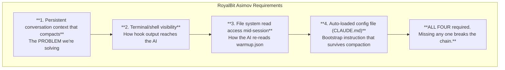
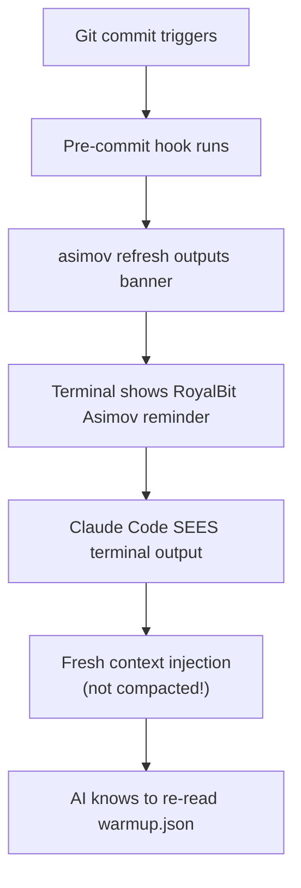

# Vendor Implementation Guide

> **AI Tool Compatibility Assessment**

## Executive Summary

**RoyalBit Asimov works with Claude Code. Due to architectural requirements, it is unlikely to work with other AI tools.**

This document provides a technical explanation of compatibility requirements and limitations.

## Core Requirements

### What RoyalBit Asimov Requires



### Why Other AI Tools Can't Do This

| AI Tool | Persistent Context | Terminal Visibility | File Re-read | Auto-config | Verdict |
|---------|-------------------|---------------------|--------------|-------------|---------|
| **Claude Code** | ✓ | ✓ | ✓ | ✓ | **Works** |
| **ChatGPT** | ✗ (resets) | ✗ | ✗ | ✗ | **Never** |
| **GitHub Copilot** | ✗ (no conversation) | ✗ | ✗ | ✗ | **Never** |
| **Cursor** | Partial | Partial | Limited | ✓ | **Unlikely** |
| **Gemini** | ✗ (resets) | ✗ | ✗ | ✗ | **Never** |
| **Cody** | ✗ | ✗ | Limited | ✗ | **Never** |

**"Never" indicates:** These tools would require fundamental architectural changes. Current product strategies do not align with these requirements.

### The Architecture Problem

**ChatGPT, Gemini, etc.:**
- No persistent filesystem access
- Context doesn't "compact" - it resets or truncates
- No way to execute hooks or see terminal output
- Cloud-based, sandboxed, no local integration

**GitHub Copilot:**
- Not a conversation - it's autocomplete
- No context to compact in the first place
- No session state, no memory
- Completely different use case

**Cursor:**
- Has `.cursorrules` (auto-config) ✓
- Has some file access ✓
- But: Does terminal output flow into AI context? **Unclear**
- But: Can it re-read files after compaction? **Unlikely**
- Even if partial, hook refresh mechanism probably won't work

### The Hook Refresh Mechanism (ADR-006)

This is the v2.1.0 innovation that makes RoyalBit Asimov resilient:



**Why this CAN'T work for other AIs:**

1. **No terminal visibility**: ChatGPT/Gemini can't see what your local terminal prints
2. **No local execution**: They can't run hooks because they're cloud-sandboxed
3. **No file re-read**: Even if they saw "re-read warmup.json", they can't do it

The hook mechanism exploits **Claude Code's unique architecture**: a local CLI that runs in your terminal with full filesystem access and persistent conversational context.

## What Other AIs CAN Use

### The Protocol Files (Universal)

Anyone can use these files - just paste them:

| File | How to Use | Limitation |
|------|------------|------------|
| `warmup.json` | Paste at session start | Must re-paste after context loss |
| `sprint.json` | Paste when asking about work | Manual sync |
| `roadmap.json` | Paste when planning | Manual sync |

**This works but is manual.** When context resets, you lose everything and start over.

### The Validation CLI (Universal)

```bash
# Download from GitHub Releases
curl -L https://github.com/royalbit/asimov/releases/latest/download/asimov-x86_64-unknown-linux-gnu.tar.gz | tar xz
sudo mv asimov /usr/local/bin/

asimov validate          # Works anywhere
asimov lint-docs         # Works anywhere
asimov init              # Works anywhere
```

The CLI is just a Rust binary. It doesn't need AI integration.

## Vendor Compatibility Analysis

### Q: Will other vendors implement these features?

**Unlikely.** Here's why:

1. **No business case**: Anthropic built Claude Code for autonomous coding. OpenAI/Google are focused on chat interfaces and API access. Different products, different goals.

2. **Architecture would need rebuild**: Adding persistent filesystem access and terminal integration to ChatGPT would require rebuilding from scratch. It's not a feature request - it's a different product.

3. **Security model conflicts**: ChatGPT's value is being sandboxed and safe. Giving it filesystem access creates liability.

4. **Market positioning**: Copilot is autocomplete. Cursor is IDE integration. Claude Code is autonomous agent. They solve different problems.

### Q: What if I prefer ChatGPT/Copilot?

Each tool has distinct strengths:
- **ChatGPT**: Brainstorming, research, explanations, one-off code generation
- **Copilot**: Autocomplete, inline suggestions, small completions
- **Claude Code**: Autonomous extended coding sessions

Different tools serve different purposes. RoyalBit Asimov is specifically designed for **autonomous development**, which currently only Claude Code supports.

### Q: Is this vendor lock-in?

**Yes, for the full RoyalBit Asimov system.**

The protocol files are vendor-neutral and can be used with any AI tool. The self-healing mechanism is exclusive to Claude Code due to architectural requirements.

If another vendor builds a tool with:
- Local CLI execution
- Terminal output visibility
- Persistent context with compaction
- Filesystem access mid-session
- Auto-loaded config files

...then RoyalBit Asimov would work there too. But as of November 2025, only Claude Code has all five.

### Q: Should I wait for other tools to add support?

**Not recommended.** Claude Code is available now and fully functional. Delaying adoption while waiting for uncertain future developments may impact productivity.

The protocol is designed for portability. If alternatives emerge, migration is straightforward (the protocol uses standard JSON files). However, there is currently no indication that other vendors are pursuing this architecture.

## Compatibility Matrix

| Feature | Claude Code | Other AI Tools |
|---------|-------------|----------------|
| Read warmup.json | Auto + re-read | Manual paste |
| Self-healing | ✓ Full | ✗ None |
| Hook refresh | ✓ Works | ✗ Can't |
| Checkpoints | ✓ Auto-written | ✗ Manual |
| Extended sessions | ✓ Yes | ✗ No |
| Quality gates | ✓ Enforced | ✗ Trust-based |
| Context recovery | ✓ Automatic | ✗ Start over |

## Summary

**RoyalBit Asimov has two layers:**

1. **Protocol Files** (warmup.json, sprint.json, roadmap.json)
   - Universal compatibility
   - Any AI can read them (via manual paste)
   - Useful but requires manual management

2. **RoyalBit Asimov System** (Self-healing, hooks, autonomous sessions)
   - Claude Code exclusive
   - Requires specific architectural capabilities
   - Other vendors would need significant architectural changes

**Recommendation:** Each tool is optimized for different use cases. For full RoyalBit Asimov functionality, Claude Code is currently required. For other AI tools, the protocol files remain usable with manual management and accepted limitations.

This assessment reflects current technical capabilities and architectural constraints.

---

## For Vendors

If you're a vendor interested in implementing RoyalBit Asimov compatibility, here are the technical requirements:

### Minimum Requirements

1. **Local CLI that runs in user's terminal**
   - Not a web interface
   - Not a cloud API
   - Actual local process with shell access

2. **Persistent conversational context**
   - That compacts/summarizes (not resets)
   - With detectable compaction events

3. **Terminal output flows into context**
   - AI sees stdout/stderr from commands
   - Including hook output

4. **Filesystem access mid-session**
   - Read files on demand
   - Not just at session start

5. **Auto-loaded config file**
   - Read before first user message
   - Re-read after compaction

### Implementation Notes

- The hook refresh works because hook output is **new input** that arrives after compaction
- "Re-read warmup.json" must be short enough to survive summarization
- Checkpoint files should be in `.gitignore` (session state, not code)

### Testing

If you implement this, test with:

```bash
# 1. Start session, read warmup.json
# 2. Work until context compacts (~15min heavy usage)
# 3. Make a commit (triggers hook)
# 4. Verify AI sees protocol refresh banner
# 5. Verify AI re-reads warmup.json
# 6. Verify rules are restored
```

If all six steps work, you have RoyalBit Asimov compatibility.

---

*Last updated: 2025-12-09*

*This document provides a technical assessment of vendor compatibility based on current architectural capabilities and design constraints. RoyalBit Asimov prioritizes accurate technical documentation over aspirational compatibility claims.*

---
