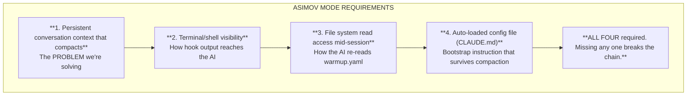
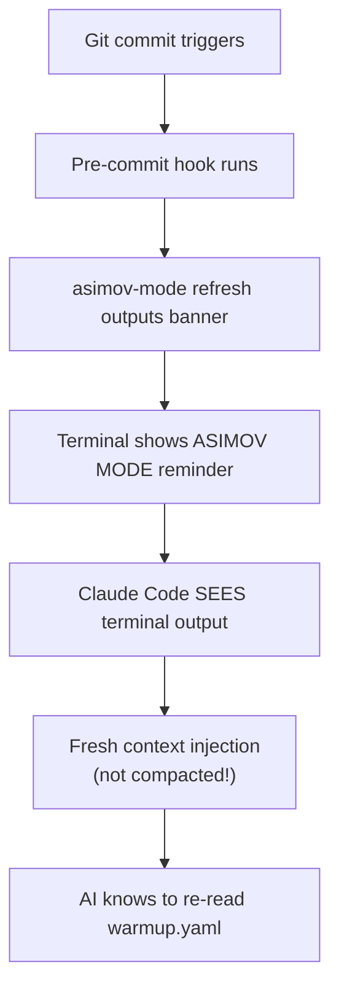

# Vendor Implementation Guide

> **The Hard Truth About AI Tool Compatibility**

## Executive Summary: The Uncomfortable Reality

**ASIMOV MODE works with Claude Code. It will probably never work with other AI tools.**

This document explains why, without the marketing-friendly spin.

## The Brutal Truth

### What ASIMOV MODE Requires



### Why Other AI Tools Can't Do This

| AI Tool | Persistent Context | Terminal Visibility | File Re-read | Auto-config | Verdict |
|---------|-------------------|---------------------|--------------|-------------|---------|
| **Claude Code** | ✓ | ✓ | ✓ | ✓ | **Works** |
| **ChatGPT** | ✗ (resets) | ✗ | ✗ | ✗ | **Never** |
| **GitHub Copilot** | ✗ (no conversation) | ✗ | ✗ | ✗ | **Never** |
| **Cursor** | Partial | Partial | Limited | ✓ | **Unlikely** |
| **Gemini** | ✗ (resets) | ✗ | ✗ | ✗ | **Never** |
| **Cody** | ✗ | ✗ | Limited | ✗ | **Never** |

**"Never" means:** These tools would need to fundamentally rebuild their architecture. There's no business case for this.

### The Architecture Problem

**ChatGPT, Gemini, etc.:**
- No persistent filesystem access
- Context doesn't "compact" - it resets or truncates
- No way to execute hooks or see terminal output
- Cloud-based, sandboxed, no local integration

**GitHub Copilot:**
- Not a conversation - it's autocomplete
- No context to compact in the first place
- No session state, no memory
- Completely different use case

**Cursor:**
- Has `.cursorrules` (auto-config) ✓
- Has some file access ✓
- But: Does terminal output flow into AI context? **Unclear**
- But: Can it re-read files after compaction? **Unlikely**
- Even if partial, hook refresh mechanism probably won't work

### The Hook Refresh Mechanism (ADR-006)

This is the v2.1.0 innovation that makes ASIMOV MODE resilient:



**Why this CAN'T work for other AIs:**

1. **No terminal visibility**: ChatGPT/Gemini can't see what your local terminal prints
2. **No local execution**: They can't run hooks because they're cloud-sandboxed
3. **No file re-read**: Even if they saw "re-read warmup.yaml", they can't do it

The hook mechanism exploits **Claude Code's unique architecture**: a local CLI that runs in your terminal with full filesystem access and persistent conversational context.

## What Other AIs CAN Use

### The Protocol Files (Universal)

Anyone can use these files - just paste them:

| File | How to Use | Limitation |
|------|------------|------------|
| `warmup.yaml` | Paste at session start | Must re-paste after context loss |
| `sprint.yaml` | Paste when asking about work | Manual sync |
| `roadmap.yaml` | Paste when planning | Manual sync |

**This works but is manual.** When context resets, you lose everything and start over.

### The Validation CLI (Universal)

```bash
cargo install asimov-mode
asimov-mode validate          # Works anywhere
asimov-mode lint-docs         # Works anywhere
asimov-mode init              # Works anywhere
```

The CLI is just a Rust binary. It doesn't need AI integration.

## The Uncomfortable Questions

### Q: Will other vendors implement these features?

**Probably not.** Here's why:

1. **No business case**: Anthropic built Claude Code for autonomous coding. OpenAI/Google are focused on chat interfaces and API access. Different products, different goals.

2. **Architecture would need rebuild**: Adding persistent filesystem access and terminal integration to ChatGPT would require rebuilding from scratch. It's not a feature request - it's a different product.

3. **Security model conflicts**: ChatGPT's value is being sandboxed and safe. Giving it filesystem access creates liability.

4. **Market positioning**: Copilot is autocomplete. Cursor is IDE integration. Claude Code is autonomous agent. They solve different problems.

### Q: What if I prefer ChatGPT/Copilot?

Use them for what they're good at:
- **ChatGPT**: Brainstorming, research, explanations, one-off code generation
- **Copilot**: Autocomplete, inline suggestions, small completions
- **Claude Code**: Autonomous multi-hour coding sessions

Different tools for different jobs. The Asimov Protocol is specifically designed for **autonomous development**, which currently only Claude Code supports.

### Q: Is this vendor lock-in?

**Yes, for ASIMOV MODE.** There's no sugarcoating this.

The protocol FILES are vendor-neutral. The SELF-HEALING mechanism is Claude Code exclusive.

If another vendor builds a tool with:
- Local CLI execution
- Terminal output visibility
- Persistent context with compaction
- Filesystem access mid-session
- Auto-loaded config files

...then ASIMOV MODE would work there too. But as of November 2025, only Claude Code has all five.

### Q: Should I wait for other tools to catch up?

**No.** Claude Code exists now and works. Waiting for hypothetical future competitors is leaving productivity on the table.

The protocol is designed so that IF alternatives emerge, migration is easy (it's just YAML files). But there's no indication that ChatGPT, Copilot, or others are building toward this architecture.

## Compatibility Matrix (Honest Version)

| Feature | Claude Code | Everyone Else |
|---------|-------------|---------------|
| Read warmup.yaml | Auto + re-read | Manual paste |
| Self-healing | ✓ Full | ✗ None |
| Hook refresh | ✓ Works | ✗ Can't |
| Checkpoints | ✓ Auto-written | ✗ Manual |
| Multiple 4hr sprints | ✓ Yes | ✗ No |
| Quality gates | ✓ Enforced | ✗ Trust-based |
| Context recovery | ✓ Automatic | ✗ Start over |

## The Bottom Line

**The Asimov Protocol has two layers:**

1. **Protocol Files** (warmup.yaml, sprint.yaml, roadmap.yaml)
   - Universal
   - Any AI can read them (if you paste them)
   - Useful but manual

2. **ASIMOV MODE** (Self-healing, hooks, autonomous sessions)
   - Claude Code exclusive
   - Requires specific architecture
   - No realistic path for other vendors

**Stop hoping other tools will "catch up."** They're building different products for different use cases. If you want ASIMOV MODE, use Claude Code. If you prefer other tools, use the protocol files manually and accept the limitations.

This isn't marketing. It's reality.

---

## For Vendors (If You're Actually Interested)

If you're a vendor and genuinely want to implement ASIMOV MODE compatibility, here's what you'd need to build:

### Minimum Requirements

1. **Local CLI that runs in user's terminal**
   - Not a web interface
   - Not a cloud API
   - Actual local process with shell access

2. **Persistent conversational context**
   - That compacts/summarizes (not resets)
   - With detectable compaction events

3. **Terminal output flows into context**
   - AI sees stdout/stderr from commands
   - Including hook output

4. **Filesystem access mid-session**
   - Read files on demand
   - Not just at session start

5. **Auto-loaded config file**
   - Read before first user message
   - Re-read after compaction

### Implementation Notes

- The hook refresh works because hook output is **new input** that arrives after compaction
- "Re-read warmup.yaml" must be short enough to survive summarization
- Checkpoint files should be in `.gitignore` (session state, not code)

### Testing

If you implement this, test with:

```bash
# 1. Start session, read warmup.yaml
# 2. Work until context compacts (~15min heavy usage)
# 3. Make a commit (triggers hook)
# 4. Verify AI sees protocol refresh banner
# 5. Verify AI re-reads warmup.yaml
# 6. Verify rules are restored
```

If all six steps work, you have ASIMOV MODE compatibility.

---

*Last updated: 2025-11-27*

*This document is intentionally blunt. The Asimov Protocol's value is in honest assessment of what's possible, not in marketing fiction about vendor-neutral futures that aren't coming.*
