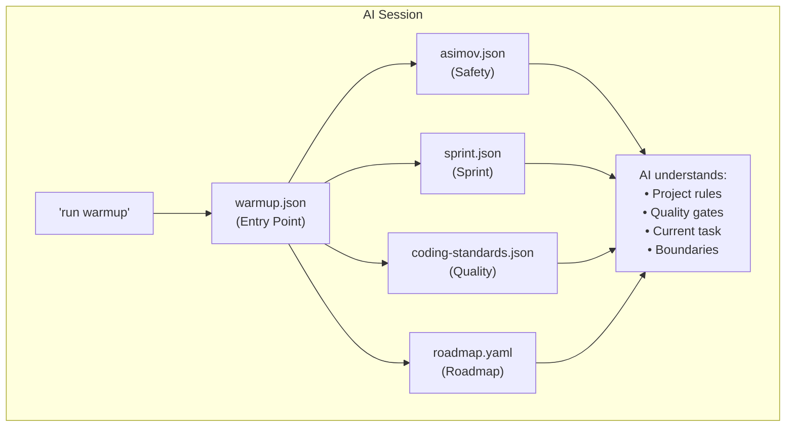

# Component 1: Protocol Files

> **The foundation of RoyalBit Asimov - JSON files that define everything**

## Overview

Protocol files are version-controlled JSON files that define:
- **HOW** to develop (quality standards, patterns, style)
- **WHAT** to build (milestones, features, roadmap)
- **WHEN** to stop (session boundaries)

```
project/.asimov/
├── warmup.json          # Entry point - loads all protocols
├── asimov.json          # Core safety rules (harm, veto words)
├── sprint.json          # Current sprint, boundaries
├── coding-standards.json # Quality gates, patterns
├── freshness.json       # Documentation freshness rules
├── green.json           # Test-first discipline
├── exhaustive.json      # Thoroughness standards
├── sycophancy.json      # Anti-yes-man rules
└── roadmap.yaml         # Milestones, versions, backlog (YAML)
```

## Core Protocol Files

### warmup.json (Required)

The entry point that loads all other protocols.

```json
{
  "protocol": "warmup",
  "description": "RoyalBit Asimov - Session warmup entry point",
  "on_start": [
    "load_protocols",
    "load_project",
    "validate",
    "read_roadmap",
    "present_milestone"
  ],
  "load": [
    "asimov.json",
    "freshness.json",
    "sycophancy.json",
    "green.json",
    "sprint.json",
    "exhaustive.json",
    "coding-standards.json"
  ]
}
```

### asimov.json (Required)

Core safety rules - harm prevention and veto words.

```json
{
  "harm": [
    "financial",
    "physical",
    "privacy",
    "deception"
  ],
  "veto": [
    "stop",
    "halt",
    "abort",
    "emergency stop"
  ]
}
```

### sprint.json (Required)

Tracks the current sprint and enforces session boundaries.

```json
{
  "current": "Add user authentication",
  "started": "2025-11-26",
  "status": "in_progress",
  "rules": {
    "must_ship": true
  },
  "tasks": [
    "[x] Design auth flow",
    "[x] Implement JWT tokens",
    "[ ] Add login endpoint",
    "[ ] Add logout endpoint"
  ],
  "blockers": [],
  "anti_patterns": [
    "While I'm here...",
    "Let me also...",
    "This would be better if..."
  ]
}
```

### coding-standards.json (Required)

Quality gates and coding patterns.

```json
{
  "quality_gates": {
    "tests": "cargo test",
    "warnings": "cargo clippy -- -D warnings",
    "formatting": "cargo fmt --check"
  },
  "patterns": {
    "error_handling": "Use Result<T, E> with custom error types",
    "async": "Use tokio for async runtime",
    "testing": "Write unit tests for all public APIs"
  }
}
```

### roadmap.yaml (YAML format)

Defines the version sequence and milestone priorities.

```yaml
metadata:
  current_version: "1.0.0"
  last_updated: "2025-11-26"

current:
  version: "1.1.0"
  status: in_progress
  summary: "Add user authentication"
  features:
    - "JWT token generation"
    - "Login/logout endpoints"
    - "Session management"

next:
  version: "1.2.0"
  status: planned
  summary: "Add OAuth providers"
  features:
    - "Google OAuth"
    - "GitHub OAuth"

backlog:
  - "Two-factor authentication"
  - "API rate limiting"
  - "Audit logging"
```

## Why JSON?

| Benefit | Explanation |
|---------|-------------|
| **AI-readable** | Every AI can parse JSON natively |
| **Human-readable** | Easy to review and edit |
| **Git-friendly** | Diffable, mergeable, reviewable |
| **Schema-validatable** | `asimov validate` |
| **No vendor lock-in** | Standard format, any tool can use |
| **Universally supported** | Built-in to all programming languages |

## File Generation

```bash
# Generate basic protocol files
asimov init --type rust

# Generate all protocol files
asimov init --type rust --full

# Full RoyalBit Asimov setup (files + CLAUDE.md + hooks)
asimov init --type rust --asimov
```

## Validation

```bash
# Validate all protocol files
asimov validate

# Validate specific file
asimov validate .asimov/warmup.json

# Output:
#   OK warmup.json (warmup)
#   OK sprint.json (sprint)
#   OK asimov.json (asimov)
#   OK roadmap.yaml (roadmap)
#
# Success: Multiple file(s) valid
```

## How AI Uses These Files

1. **Session Start**: AI reads all protocol files
2. **During Session**: AI references quality gates, boundaries
3. **Before Commit**: AI re-reads quality gates, runs checks
4. **After Compaction**: AI re-reads from disk (self-healing)
5. **Session End**: AI follows release discipline



## Best Practices

### Do

- Keep protocols focused (one concern per file)
- Update roadmap.yaml after each release
- Use sprint.json for multi-session work
- Commit protocol files to git
- Validate before committing (`asimov validate`)

### Don't

- Put secrets in protocol files
- Make protocol files too long (AI has context limits)
- Skip validation
- Forget to update version numbers

## Relationship to Other Components

| Component | How Protocol Files Support It |
|-----------|------------------------------|
| Sprint Autonomy | sprint.json defines boundaries |
| Quality Gates | coding-standards.json defines checks |
| Self-Healing | warmup.json orchestrates protocol loading |
| Release Discipline | roadmap.yaml tracks versions |

---

**Next:** [Component 2: Sprint Autonomy](2-SPRINT_AUTONOMY.md)

---
