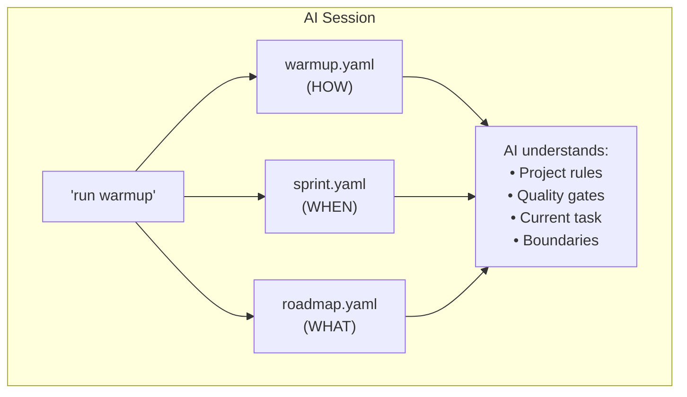

# Component 1: Protocol Files

> **The foundation of ASIMOV MODE - YAML files that define everything**

## Overview

Protocol files are version-controlled YAML files that define:
- **HOW** to develop (quality standards, patterns, style)
- **WHAT** to build (milestones, features, roadmap)
- **WHEN** to stop (session boundaries, time limits)

```
project/
├── warmup.yaml     # HOW - Quality, patterns, workflow
├── sprint.yaml     # WHEN - Current sprint, boundaries
└── roadmap.yaml    # WHAT - Milestones, versions, backlog
```

## The Three Files

### warmup.yaml (Required)

The master protocol file. Defines everything the AI needs to know about the project.

```yaml
# Identity
identity:
  project: "my-project"
  tagline: "What it does"
  version: "1.0.0"

# Mission
mission:
  problem: "What problem this solves"
  solution: "How it solves it"
  principles:
    - "Core principle 1"
    - "Core principle 2"

# Quality Gates
quality:
  tests: "cargo test"
  warnings: "cargo clippy -- -D warnings"
  formatting: "cargo fmt --check"

# Session Rules
session:
  start:
    - "Read warmup.yaml"
    - "git status"
    - "Run tests (verify baseline)"
  during:
    - "Track progress"
    - "Test frequently"
  end:
    - "All tests pass"
    - "Zero warnings"
    - "Update documentation"

# Self-Healing (for ASIMOV MODE)
self_healing:
  checkpoint_interval: "2 hours"
  checkpoint_file: ".claude_checkpoint.yaml"
  on_confusion: "Re-read warmup.yaml"
```

### sprint.yaml (Optional)

Tracks the current sprint and enforces session boundaries.

```yaml
sprint:
  current: "Add user authentication"
  started: "2025-11-26"
  status: in_progress  # planned | in_progress | blocked | done

  boundaries:
    max_duration: "4 hours"
    milestone_count: 1
    scope_creep: "reject"

  tasks:
    - "[x] Design auth flow"
    - "[x] Implement JWT tokens"
    - "[ ] Add login endpoint"
    - "[ ] Add logout endpoint"

  blockers: []

  anti_patterns:
    - "While I'm here..."
    - "Let me also..."
    - "This would be better if..."
```

### roadmap.yaml (Optional)

Defines the version sequence and milestone priorities.

```yaml
metadata:
  current_version: "1.0.0"
  last_updated: "2025-11-26"

current:
  version: "1.1.0"
  status: in_progress
  summary: "Add user authentication"
  features:
    - "JWT token generation"
    - "Login/logout endpoints"
    - "Session management"

next:
  version: "1.2.0"
  status: planned
  summary: "Add OAuth providers"
  features:
    - "Google OAuth"
    - "GitHub OAuth"

backlog:
  - "Two-factor authentication"
  - "API rate limiting"
  - "Audit logging"
```

## Why YAML?

| Benefit | Explanation |
|---------|-------------|
| **AI-readable** | Every AI can parse YAML |
| **Human-readable** | Easy to review and edit |
| **Git-friendly** | Diffable, mergeable, reviewable |
| **Schema-validatable** | `asimov-mode validate` |
| **No vendor lock-in** | Standard format, any tool can use |

## File Generation

```bash
# Generate just warmup.yaml
asimov-mode init --type rust

# Generate all three files
asimov-mode init --type rust --full

# Full ASIMOV MODE setup (files + CLAUDE.md + hooks)
asimov-mode init --type rust --asimov
```

## Validation

```bash
# Validate all protocol files
asimov-mode validate

# Validate specific file
asimov-mode validate warmup.yaml

# Output:
#   OK warmup.yaml (warmup)
#   OK sprint.yaml (sprint)
#   OK roadmap.yaml (roadmap)
#
# Success: 3 file(s) valid
```

## How AI Uses These Files

1. **Session Start**: AI reads all protocol files
2. **During Session**: AI references quality gates, boundaries
3. **Before Commit**: AI re-reads quality gates, runs checks
4. **After Compaction**: AI re-reads from disk (self-healing)
5. **Session End**: AI follows release discipline



## Best Practices

### Do

- Keep warmup.yaml focused (one project = one file)
- Update roadmap.yaml after each release
- Use sprint.yaml for multi-session work
- Commit protocol files to git
- Validate before committing (`asimov-mode validate`)

### Don't

- Put secrets in protocol files
- Make warmup.yaml too long (AI has context limits)
- Skip validation
- Forget to update version numbers

## Relationship to Other Components

| Component | How Protocol Files Support It |
|-----------|------------------------------|
| Sprint Autonomy | sprint.yaml defines boundaries |
| Quality Gates | warmup.yaml defines checks |
| Self-Healing | warmup.yaml contains rules to re-read |
| Release Discipline | roadmap.yaml tracks versions |

---

**Next:** [Component 2: Sprint Autonomy](2-SPRINT_AUTONOMY.md)
