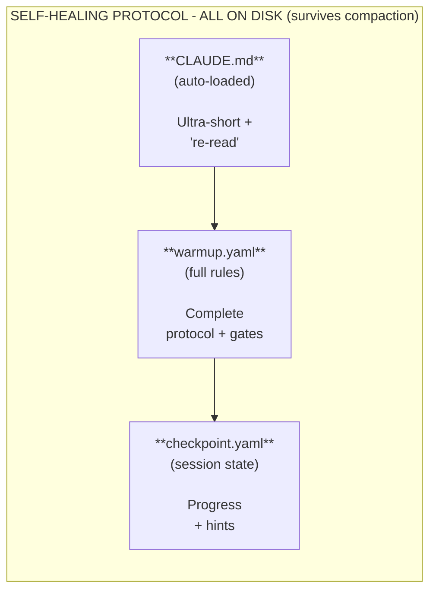

# Component 4: Self-Healing

> **Recover from context compaction - re-read rules from disk**

## Overview

Self-Healing solves a critical problem: **AI forgets rules after context compaction**.

During autonomous sessions, Claude Code compresses conversation history. Rules get summarized away. The AI "forgets" project conventions.

Self-Healing fixes this by **re-reading rules from disk** instead of trying to preserve them in memory.

## The Reality (ADR-003)

**v1.x assumed:** Checkpoint every 2 hours
**v2.0 research found:** Compaction happens every **10-20 minutes** with heavy reasoning

```
With MAX_THINKING_TOKENS=200000:
- Context window: 200k tokens
- Thinking budget: 200k tokens
- Context fills in: 1-3 heavy turns
- Compaction interval: ~10-20 minutes (not 2 hours!)
```

See [ADR-003](../adr/003-self-healing-real-compaction-data.md) for the full research.

## The Problem

```
Session Start                    After Compaction
─────────────                    ────────────────
Full rules loaded                Rules summarized
Quality gates clear       →      "There were some rules"
Patterns understood              Patterns forgotten
AI follows conventions           AI makes mistakes
```

As documented by DoltHub:
> "Claude Code is definitely dumber after the compaction. It doesn't know what files it was looking at and needs to re-read them."

## The Solution



## The Three Files

### 1. CLAUDE.md (Auto-loaded, Ultra-Short)

Must survive summarization. Single critical instruction:

```markdown
# Project Name

ON CONFUSION → re-read warmup.yaml + .claude_checkpoint.yaml

Rules: 4hr max, keep shipping, tests pass.
```

### 2. warmup.yaml (Full Rules)

Complete protocol on disk. Re-read when confused:

```yaml
self_healing:
  checkpoint_triggers:
    - "Every major task completion"
    - "Every 10-15 tool calls (~15 min)"
    - "Before any commit"
    - "On ANY confusion"

  on_confusion: "STOP → re-read warmup.yaml"
  core_rules: "4hr max, keep shipping, tests pass"
```

### 3. .claude_checkpoint.yaml (Session State)

Written during session. Contains progress and recovery hint:

```yaml
timestamp: "2025-11-27T10:30:00Z"
session_started: "2025-11-27T09:00:00Z"
tool_calls: 45

milestone: "Add user authentication"
completed:
  - "Created auth middleware"
  - "Added JWT generation"
in_progress: "Writing login tests"

on_confusion: "cat warmup.yaml"
```

## Checkpoint Triggers (v2.0)

Based on real compaction data, NOT time-based intervals:

| Trigger | Rationale |
|---------|-----------|
| Every major task | Natural breakpoint |
| Every 10-15 tool calls | ~15 min of work |
| Before file write >100 lines | Significant change |
| Before any commit | Quality gate |
| On ANY confusion | Recovery signal |

**NOT "every 2 hours"** - compaction happens every 10-20 minutes with heavy reasoning.

## Platform Requirement

**Self-Healing requires Claude Code.** Other AI tools lack:

| Capability | Required | ChatGPT | Copilot | Claude Code |
|------------|----------|---------|---------|-------------|
| Auto-load config | Yes | No | No | Yes |
| File system access | Yes | No | No | Yes |
| Re-read mid-session | Yes | No | No | Yes |

## Relationship to Other Components

| Component | Connection |
|-----------|------------|
| Protocol Files | warmup.yaml is the source of truth |
| Sprint Autonomy | Checkpoints align with task completion |
| Quality Gates | Re-read before running gates |
| Release Discipline | Checkpoint before release |

---

**Next:** [Component 5: Release Discipline](5-RELEASE_DISCIPLINE.md)
