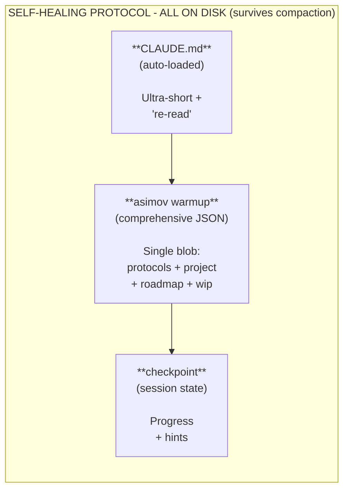

# Component 4: Self-Healing

> **Recover from context compaction - re-read rules from disk**

## Overview

Self-Healing solves a critical problem: **AI forgets rules after context compaction**.

During autonomous sessions, Claude Code compresses conversation history. Rules get summarized away. The AI "forgets" project conventions.

Self-Healing fixes this by **re-reading rules from disk** instead of trying to preserve them in memory.

## The Reality (ADR-003)

**Early assumption:** Checkpoint based on time intervals
**Research found:** Compaction happens every **10-20 minutes** with heavy reasoning

```
With MAX_THINKING_TOKENS=200000:
- Context window: 200k tokens
- Thinking budget: 200k tokens
- Context fills in: 1-3 heavy turns
- Compaction interval: ~10-20 minutes
```

See [ADR-003](../adr/003-self-healing-real-compaction-data.md) for the full research.

## The Problem

```
Session Start                    After Compaction
─────────────                    ────────────────
Full rules loaded                Rules summarized
Quality gates clear       →      "There were some rules"
Patterns understood              Patterns forgotten
AI follows conventions           AI makes mistakes
```

As documented by DoltHub:
> "Claude Code is definitely dumber after the compaction. It doesn't know what files it was looking at and needs to re-read them."

## The Solution



## The Three Files

### 1. CLAUDE.md (Auto-loaded, Ultra-Short)

Must survive summarization. Single critical instruction:

```markdown
# Project Name

ON CONFUSION → asimov warmup (loads everything as JSON)

Rules: run until done, keep shipping, tests pass.
```

### 2. asimov warmup (Full Context Loader - v9.16.0+)

Run `asimov warmup` to get everything in a single JSON blob. Re-run when confused:

**Output format:**
```json
{
  "version": "9.16.0",
  "protocols": {
    "asimov": { /* safety rules */ },
    "sprint": { /* current sprint */ },
    "coding-standards": { /* quality gates */ },
    /* all other protocols */
  },
  "project": { /* full project.yaml content */ },
  "roadmap": { /* full roadmap.yaml content */ },
  "wip": {
    "active": true,
    "item": "Current task",
    "progress": "Status"
  }
}
```

**Key benefit:** Single command loads everything. No need to read individual files.

### 3. Session State (WIP Continuity)

Written during session. Contains progress and recovery state. Format determined by implementation (may be checkpoint file or other mechanism).

## Recovery Triggers

Based on real compaction data, NOT time-based intervals:

| Trigger | Rationale |
|---------|-----------|
| Every major task | Natural breakpoint |
| Every 10-15 tool calls | ~15 min of work |
| Before file write >100 lines | Significant change |
| Before any commit | Quality gate |
| On ANY confusion | Recovery signal |

Compaction happens every 10-20 minutes with heavy reasoning, so recovery mechanisms are designed around task completion rather than time intervals.

## Platform Requirement

**Self-Healing requires Claude Code.** Other AI tools lack:

| Capability | Required | ChatGPT | Copilot | Claude Code |
|------------|----------|---------|---------|-------------|
| Auto-load config | Yes | No | No | Yes |
| File system access | Yes | No | No | Yes |
| Re-read mid-session | Yes | No | No | Yes |

## Relationship to Other Components

| Component | Connection |
|-----------|------------|
| Protocol Files | `asimov warmup` outputs comprehensive JSON (v9.16.0+) |
| Sprint Autonomy | Recovery aligns with task completion |
| Quality Gates | Re-read before running gates |
| Release Discipline | Recovery state before release |

---

**Next:** [Component 5: Release Discipline](5-RELEASE_DISCIPLINE.md)

---
