# Component 5: Release Discipline

> **Ship to everywhere, every time**

## Overview

Release Discipline ensures that every session ends with a **complete release**:

- **GitHub** - Commit, tag, push
- **Local** - Install and verify
- **Registry** - Publish (crates.io, npm, PyPI)

No partial releases. No "I'll publish later."

## The Triple Release

```mermaid
flowchart LR
    subgraph triple["TRIPLE RELEASE"]
        GH["**GitHub**<br/>git add<br/>git commit<br/>git tag<br/>git push<br/><br/>✓ Version controlled"]
        LO["**Local**<br/>make install-user<br/><br/>✓ Verified locally"]
        REG["**Registry**<br/>cargo publish<br/><br/>✓ Available publicly"]

        GH --> LO --> REG
    end
```



## Release Checklist

Before releasing, verify:

| Check | Command | Expected |
|-------|---------|----------|
| Tests pass | `cargo test` | All pass |
| No warnings | `cargo clippy -- -D warnings` | Zero |
| Formatted | `cargo fmt --check` | Clean |
| Version bumped | Check Cargo.toml | New version |
| Changelog updated | Check CHANGELOG.md | Entry exists |
| Docs updated | Check README.md | Accurate |

## Release Commands

### Rust
```bash
# 1. GitHub
git add -A
git commit -m "feat: Add feature X (vX.Y.Z)"
git tag vX.Y.Z
git push origin main
git push origin vX.Y.Z

# 2. Local
make install-user
cargo --version  # Verify

# 3. Registry
cargo publish
```

### Python
```bash
# 1. GitHub
git add -A && git commit -m "feat: Add feature X" && git tag vX.Y.Z
git push origin main --tags

# 2. Local
pip install -e .

# 3. Registry
python -m build && twine upload dist/*
```

### Node.js
```bash
# 1. GitHub
git add -A && git commit -m "feat: Add feature X" && git tag vX.Y.Z
git push origin main --tags

# 2. Local
npm link

# 3. Registry
npm publish
```

## Version Numbering

Follow [Semantic Versioning](https://semver.org/):

| Change Type | Version Bump | Example |
|-------------|--------------|---------|
| Bug fix | PATCH | 1.0.0 → 1.0.1 |
| New feature | MINOR | 1.0.0 → 1.1.0 |
| Breaking change | MAJOR | 1.0.0 → 2.0.0 |

## Commit Message Format

```
<type>: <description> (vX.Y.Z)

<body>

🤖 Generated with Claude Code
Co-Authored-By: Claude <noreply@anthropic.com>
```

Types: `feat`, `fix`, `docs`, `refactor`, `test`, `chore`

## Why Triple Release?

| Single Target | Problem |
|---------------|---------|
| GitHub only | Not installable |
| Local only | Not shared |
| Registry only | No source control |

**Triple release ensures:** Version controlled + Verified + Available

## Release Report

After release, AI reports:

```
✅ RELEASE COMPLETE: v2.1.0

Milestone: Add user authentication
Duration: 2 hours 45 minutes

Deliverables:
  ✅ JWT token generation
  ✅ Login/logout endpoints
  ✅ 23 unit tests

Release targets:
  ✅ GitHub: abc1234 tagged v2.1.0
  ✅ Local: myapp v2.1.0 installed
  ✅ crates.io: https://crates.io/crates/myapp/2.1.0

Tests: 193 passing, ZERO warnings
```

## Relationship to Other Components

| Component | Connection |
|-----------|------------|
| Protocol Files | roadmap.yaml tracks versions |
| Sprint Autonomy | Every session ends with release |
| Quality Gates | Must pass before release |
| Self-Healing | Checkpoint written before release |

---

**Back to:** [ASIMOV MODE Overview](../ASIMOV_MODE.md)
